# Holochart Architecture

This is a summary of the architecture. The full design, with every epic and story, lives in
[plan.md](plan.md) (sections 3 to 6). Decisions and their reasoning are recorded as ADRs in
[docs/adr/](docs/adr/); the index is at the end of this file.

Holochart is pre-alpha (milestone M0). Much of what follows is design intent, not yet code.

## Guiding principles

Summarized from [plan.md section 3](plan.md#3-guiding-principles):

1. **Schema is the source of truth.** Each attribute is declared once (type, default, validation,
   edit type, description); TS types, validators, defaults, and docs are generated from it.
   ([ADR-002](docs/adr/002-schema-first-attribute-dsl.md))
2. **Declarative first, imperative escape hatches always.** The JSON spec covers most needs;
   direct access to the three.js scene, materials, and render hooks covers the rest.
3. **Pure data pipeline, thin render layer.** Defaults, calc, and layout are pure functions,
   testable without a GPU and movable to a Web Worker.
   ([ADR-011](docs/adr/011-calc-in-web-worker.md))
4. **Minimal recompute.** Every attribute declares an `editType`, so updates re-run only the
   stages they affect.
5. **One renderer, many viewports.** One WebGL context per figure; subplots are scissored
   viewports. ([ADR-004](docs/adr/004-one-webgl-context-per-figure.md))
6. **GPU-native primitives.** Markers, lines, bars, and cells are instanced geometry with custom
   shaders, never one `Mesh` per data point (enforced by the `holochart/no-per-point-objects`
   lint rule).
7. **2D is a special case of 3D.** 2D subplots use a pixel-space orthographic camera, so the same
   primitives render in both modes.
   ([ADR-008](docs/adr/008-pixel-space-orthographic-2d-camera.md))
8. **Docs, examples, and tests are the same artifacts.** Every example is also a visual
   regression test and gallery thumbnail.
   ([ADR-018](docs/adr/018-visual-regression-harness.md))
9. **Progressive disclosure.** `newPlot(el, [{ x, y }])` works with no configuration.
10. **Accessible by default.** The canvas renders; a DOM mirror describes the chart for assistive
    technology. ([ADR-005](docs/adr/005-webgl-sdf-text-with-dom-mirror.md))

## Figure model

A figure is `{ data, layout, config, frames }`, following Plotly's semantics and attribute names
wherever reasonable ([ADR-001](docs/adr/001-figure-spec-plotly-semantics.md)). Functional style
accessors such as `(d, i) => color` are allowed but marked non-serializable, with a serializable
`styleRules` alternative ([ADR-012](docs/adr/012-functional-accessors-non-serializable.md)).

## Monorepo layout

See [plan.md section 4.1](plan.md#41-monorepo-layout). pnpm workspaces plus Turborepo; package
names are `@mk7s/holochart` and `@mk7s/holochart-*`
([ADR-017](docs/adr/017-mk7s-npm-scope.md)).

| Path                      | Purpose                                                             | Status  |
| ------------------------- | ------------------------------------------------------------------- | ------- |
| `packages/core`           | Figure model, schema, validation, defaults, calc, scales, layout    | Exists  |
| `packages/render`         | three.js renderer, viewports, cameras, primitives, picking, loop    | Exists  |
| `packages/components`     | Axes, legend, colorbar, annotations, shapes, hover labels, modebar  | Exists  |
| `packages/traces-basic`   | scatter, bar, pie, table                                            | Exists  |
| `packages/themes`         | Templates, palettes, colorscales, font presets                      | Exists  |
| `packages/holochart`      | Full bundle (re-exports and registers everything)                   | Exists  |
| `apps/sandbox`            | Vite dev sandbox with example picker and GPU stats                  | Exists  |
| `examples/`               | Canonical examples (sandbox, docs, gallery, visual tests)           | Exists  |
| `tools/schema-gen`        | Schema to TS types, JSON Schema, attribute reference docs           | Exists  |
| `packages/traces-stats`   | histogram(2d), box, violin, splom, parcoords, parcats               | Planned |
| `packages/traces-sci`     | heatmap, contour, image, polar, ternary, quiver, streamline, carpet | Planned |
| `packages/traces-finance` | ohlc, candlestick, waterfall, funnel, funnelarea, indicator         | Planned |
| `packages/traces-hier`    | sunburst, treemap, icicle, sankey                                   | Planned |
| `packages/traces-3d`      | scatter3d, surface, mesh3d, cone, streamtube, volume, isosurface    | Planned |
| `packages/traces-geo`     | Stretch: scattergeo, choropleth, globe, tile maps                   | Planned |
| `packages/express`        | High-level API (`hx.scatter(df, ...)`), faceting, trendlines        | Planned |
| `packages/compat-plotly`  | Plotly figure JSON importer and attribute mapper                    | Planned |
| `packages/react` etc.     | Framework wrappers: React, Vue, Svelte, web component               | Planned |
| `apps/docs`               | Documentation site (VitePress)                                      | Planned |
| `apps/playground`         | Live editor (Monaco + preview)                                      | Planned |
| `apps/bench`              | Performance benchmark harness                                       | Planned |
| `tools/gallery-gen`       | Playwright screenshot pipeline for thumbnails                       | Planned |
| `tools/mock-runner`       | Runs the plotly.js mock corpus through `compat-plotly`              | Planned |

`three` is a peer dependency of every package that touches it
([ADR-003](docs/adr/003-three-peer-dependency.md)).

## Rendering pipeline

See [plan.md section 4.2](plan.md#42-the-rendering-pipeline).

```mermaid
flowchart LR
    A[Figure input<br/>data · layout · config · frames] --> B[Validate & Coerce<br/>schema-driven]
    B --> C[Supply Defaults<br/>template merge → fullData / fullLayout]
    C --> D[Calc<br/>bins, stacks, stats, hierarchy,<br/>contours → calcdata]
    D --> E[Layout<br/>subplot domains, autorange,<br/>ticks, automargin]
    E --> F[Scene Build / Diff<br/>trace renderers produce<br/>keyed three.js objects]
    F --> G[Render<br/>on-demand loop, viewports,<br/>post-processing]
    G --> H[Interaction<br/>picking, hover, zoom,<br/>select → events]
    H -- relayout/restyle --> I[Update Planner<br/>editType → minimal stages]
    I --> C
```

| Stage             | Pure?                                               | Worker-able?         | Owner                               |
| ----------------- | --------------------------------------------------- | -------------------- | ----------------------------------- |
| Validate & coerce | Yes                                                 | Yes                  | `core/schema`                       |
| Supply defaults   | Yes                                                 | Yes                  | `core/defaults` + each trace module |
| Calc              | Yes                                                 | Yes                  | each trace module                   |
| Layout            | Yes (text measurement uses a cached metrics oracle) | Yes                  | `core/layout`                       |
| Scene build/diff  | No                                                  | No                   | `render` + each trace module        |
| Render            | No                                                  | OffscreenCanvas (P3) | `render`                            |

Related decisions:

- Frames render on demand, only when the scene is dirty; a continuous loop runs only during
  animation or interaction ([ADR-007](docs/adr/007-on-demand-rendering.md)).
- One WebGL context per figure, subplots as scissored viewports
  ([ADR-004](docs/adr/004-one-webgl-context-per-figure.md)).
- Text is SDF in WebGL (troika-three-text) with a hidden DOM mirror
  ([ADR-005](docs/adr/005-webgl-sdf-text-with-dom-mirror.md)).
- 2D hover uses CPU spatial indexes; 3D uses GPU ID picking
  ([ADR-010](docs/adr/010-cpu-spatial-hover-gpu-picking-3d.md)).
- Calc can move to a Web Worker for large data
  ([ADR-011](docs/adr/011-calc-in-web-worker.md)).

## Coordinate systems

See [plan.md section 4.3](plan.md#43-coordinate-systems).

| Space              | Description                                                      | Used by                              |
| ------------------ | ---------------------------------------------------------------- | ------------------------------------ |
| **Data**           | Raw values: numbers, dates (ms), categories (index)              | Traces, annotations with `xref: 'x'` |
| **Linearized**     | After the scale transform (log10, category to index, date to ms) | GPU vertex buffers                   |
| **Domain**         | 0 to 1 within a subplot's plotting area                          | `xref: 'x domain'`                   |
| **Paper**          | 0 to 1 within the whole figure's plot area (inside margins)      | Layout components, `xref: 'paper'`   |
| **Pixel / Screen** | CSS pixels from the container's top-left                         | Hover, picking, text layout          |
| **World (3D)**     | Scene units after `aspectmode` normalization                     | 3D scenes                            |

In 2D, one world unit equals one CSS pixel, so line widths and marker sizes are in pixels
([ADR-008](docs/adr/008-pixel-space-orthographic-2d-camera.md)).

**Precision rule (relative-to-center):** vertex buffers store values relative to a per-trace
origin, not absolute values. This keeps float32 precision for millisecond timestamps and large
offsets. Any new primitive or trace must follow it.

## Trace module contract

Every trace type is a module registered with the core (full spec in plan story E22.1; summary in
[plan.md section 4.4](plan.md#44-trace-module-contract-summary-full-spec-in-e221)):

| Member                                     | Role                                                          |
| ------------------------------------------ | ------------------------------------------------------------- |
| `type`, `categories`                       | Trace name (`'scatter'`) and capability flags (`'cartesian'`) |
| `schema`                                   | Attribute schema: the single source of truth                  |
| `supplyDefaults(input, full, layout, ctx)` | Fill `fullData` from input + template                         |
| `calc(fullTrace, fullLayout, ctx)`         | Pure; produces calcdata                                       |
| `crossTraceCalc?(calcdata[], fullLayout)`  | Stacking, grouping across traces                              |
| `plot`                                     | `TraceRenderer`: create / update / dispose GPU objects        |
| `hoverPoints?`, `selectPoints?`            | Hover and selection hit-testing                               |
| `legendIcon?`, `colorbar?`                 | Legend glyph and colorbar spec                                |
| `animatable?`                              | Attribute paths that support transitions                      |
| `meta`                                     | Description, docs page, Plotly equivalent                     |

## Technology stack

See [plan.md section 5](plan.md#5-technology-stack).

| Concern         | Choice                                                                                                                                                                                            |
| --------------- | ------------------------------------------------------------------------------------------------------------------------------------------------------------------------------------------------- |
| Language        | TypeScript 6.0 strict, `.ts` import extensions, erasable syntax only ([ADR-013](docs/adr/013-ts-import-extensions-native-type-stripping.md))                                                      |
| Rendering       | three.js as a peer dependency ([ADR-003](docs/adr/003-three-peer-dependency.md))                                                                                                                  |
| Shaders         | GLSL3 via `ShaderMaterial` in `*.glsl.ts` modules; TSL for prototyping ([ADR-009](docs/adr/009-glsl3-shaders-tsl-prototyping.md), [ADR-014](docs/adr/014-glsl-as-typescript-template-modules.md)) |
| Text            | troika-three-text (SDF) ([ADR-005](docs/adr/005-webgl-sdf-text-with-dom-mirror.md))                                                                                                               |
| Math and data   | d3 micro-libraries ([ADR-006](docs/adr/006-d3-micro-libraries.md)), `earcut`, `flatbush`                                                                                                          |
| Build           | pnpm 11 workspaces + catalog, Turborepo, tsup for JS and `tsc` for declarations ([ADR-015](docs/adr/015-tsup-js-tsc-declarations.md)), Vite 8 for apps                                            |
| Dependencies    | pnpm `minimumReleaseAge` policy for new dependency versions ([ADR-016](docs/adr/016-pnpm-minimum-release-age.md))                                                                                 |
| Unit tests      | Vitest 5 + `fast-check`                                                                                                                                                                           |
| Visual tests    | Playwright 1.63, Chromium + SwiftShader, `pixelmatch` ([ADR-018](docs/adr/018-visual-regression-harness.md))                                                                                      |
| Lint and format | ESLint 10 flat config + Prettier 3                                                                                                                                                                |
| Planned         | VitePress + TypeDoc docs, Changesets releases, `size-limit`, `tinybench` benchmarks                                                                                                               |

## ADR index

The canonical index is [docs/adr/README.md](docs/adr/README.md). Start new ADRs from
[000-template.md](docs/adr/000-template.md).

- [ADR-001: Figure spec with Plotly semantics](docs/adr/001-figure-spec-plotly-semantics.md)
- [ADR-002: Schema-first attribute DSL](docs/adr/002-schema-first-attribute-dsl.md)
- [ADR-003: three as a peer dependency](docs/adr/003-three-peer-dependency.md)
- [ADR-004: One WebGL context per figure](docs/adr/004-one-webgl-context-per-figure.md)
- [ADR-005: WebGL SDF text with a DOM mirror](docs/adr/005-webgl-sdf-text-with-dom-mirror.md)
- [ADR-006: d3 micro-libraries](docs/adr/006-d3-micro-libraries.md)
- [ADR-007: On-demand rendering](docs/adr/007-on-demand-rendering.md)
- [ADR-008: Pixel-space orthographic 2D camera](docs/adr/008-pixel-space-orthographic-2d-camera.md)
- [ADR-009: GLSL3 shaders, TSL for prototyping](docs/adr/009-glsl3-shaders-tsl-prototyping.md)
- [ADR-010: CPU spatial hover, GPU picking for 3D](docs/adr/010-cpu-spatial-hover-gpu-picking-3d.md)
- [ADR-011: Calc in a Web Worker](docs/adr/011-calc-in-web-worker.md)
- [ADR-012: Functional accessors are non-serializable](docs/adr/012-functional-accessors-non-serializable.md)
- [ADR-013: `.ts` import extensions and native type stripping](docs/adr/013-ts-import-extensions-native-type-stripping.md)
- [ADR-014: GLSL as TypeScript template modules](docs/adr/014-glsl-as-typescript-template-modules.md)
- [ADR-015: tsup for JS, tsc for declarations](docs/adr/015-tsup-js-tsc-declarations.md)
- [ADR-016: pnpm minimum release age](docs/adr/016-pnpm-minimum-release-age.md)
- [ADR-017: The `@mk7s` npm scope](docs/adr/017-mk7s-npm-scope.md)
- [ADR-018: Visual regression harness](docs/adr/018-visual-regression-harness.md)
