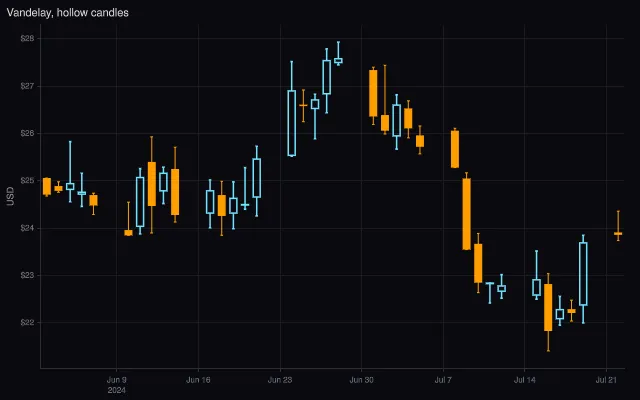
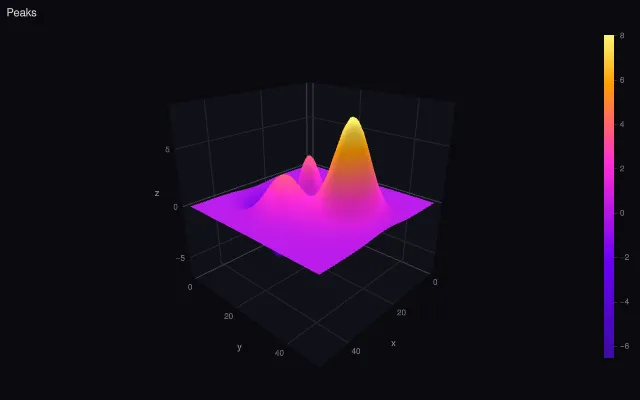
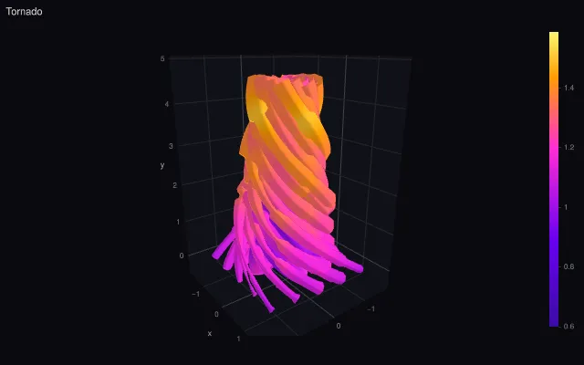
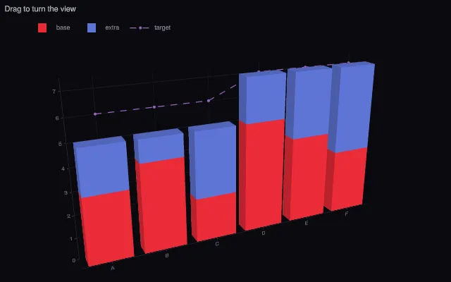

# Holochart

Declarative, GPU-rendered charts built on three.js.

You describe a chart as plain JSON (`{ data, layout, config }`) with Plotly's attribute names and
semantics, and Holochart draws it with one three.js/WebGL2 pipeline. There is no SVG/WebGL split:
markers, lines, bars and cells are instanced GPU primitives, never one object per data point, and
2D is a special case of 3D, so a 2D chart can be extruded, tilted and animated with the same
axes, legends, hover and themes. Every Plotly chart family is covered: basic, statistical,
scientific, financial, hierarchical and 3D, plus an Express API for tabular data.

<p>
  
  
  
  
</p>

> **Status: alpha.** Holochart is not on npm yet; the first release, `0.1.0-alpha`, will be
> published on the `alpha` dist-tag. APIs can change between 0.x releases (see the
> [versioning policy](docs/release/versioning.md)). Until then, run it
> [from source](#development).

## Install

```sh
pnpm add @mk7s/holochart@alpha three
# or: npm install @mk7s/holochart@alpha three
# or: yarn add @mk7s/holochart@alpha three
```

`three` is a peer dependency, so your app and Holochart share one copy of three.js. During the
alpha, `@alpha` installs the newest pre-release; drop it once a stable version is out.

The packages are **ESM-only** (ES2022). Use them with a bundler such as Vite, webpack or Rollup;
Node 22 and newer can also `require()` them. TypeScript types are included.

## Example

```ts
import { createChart } from '@mk7s/holochart';

const chart = createChart(document.getElementById('chart')!, {
  data: [
    { type: 'scatter', x: [1, 2, 3, 4], y: [3, 1, 4, 2], mode: 'lines+markers', name: 'Visits' },
    { type: 'bar', x: [1, 2, 3, 4], y: [2, 2, 3, 1], name: 'Signups' },
  ],
  layout: { title: { text: 'Hello Holochart' } },
});

chart.on('click', (event) => console.log(event.points));
await chart.relayout({ 'xaxis.range': [0, 5] });
```

The chart fills its container, so give `#chart` a size. Call `chart.destroy()` when you remove it
from the page. The Plotly-style functional API works too: `newPlot(el, data, layout)`,
`react`, `restyle`, `relayout`, `purge`. Start with [Your first chart][first-chart].

## Script tag

The IIFE build bundles three.js and exposes `window.Holochart`. The 3D add-on is a separate file,
so pages without 3D charts don't download it:

```html
<div id="chart" style="width: 640px; height: 400px"></div>
<script src="https://cdn.jsdelivr.net/npm/@mk7s/holochart@0.1/dist/holochart.iife.min.js"></script>
<!-- Optional: 3D scenes and traces. Same version, after the main script. -->
<script src="https://cdn.jsdelivr.net/npm/@mk7s/holochart@0.1/dist/holochart-3d.iife.min.js"></script>
<script>
  Holochart.newPlot(document.getElementById('chart'), [
    {
      type: 'surface',
      z: [
        [1, 2, 3],
        [2, 4, 2],
        [3, 2, 1],
      ],
    },
  ]);
</script>
```

These URLs work once the package is published. jsDelivr version ranges such as `@0.1` skip
pre-releases, so during the alpha pin the exact version (for example `@0.1.0-alpha.0`). See
[Installation][installation] for the trade-offs of the script-tag build.

## Python notebooks

[`holochart-py`](packages/holochart-py) lets existing Plotly figures draw with Holochart in
JupyterLab, Jupyter Notebook, and notebook editors with an ipywidgets manager. The Python
distribution is `holochart-py`; the import is `holochart`.

### Install and start JupyterLab

The package is not on PyPI yet. From a clone of this repository, use Python 3.10 or newer,
Node 22 or newer, and pnpm 11. Run these commands from the repository root on macOS or Linux:

```sh
# Build the browser assets that the Python package embeds.
pnpm install
pnpm build:packages

# Install the bridge and Jupyter in the same Python environment.
python3 -m venv packages/holochart-py/.venv
source packages/holochart-py/.venv/bin/activate
python -m pip install 'packages/holochart-py[plotly]' jupyterlab ipykernel
python -m ipykernel install --user --name holochart --display-name "Python (Holochart)"
jupyter lab
```

In JupyterLab's Launcher, create a notebook with the **Python (Holochart)** kernel. In an
existing notebook, select that kernel before running the examples. For VS Code, open an
`.ipynb` file and select the Python environment at `packages/holochart-py/.venv`.

### Draw your first chart

Run this in a notebook cell. Select the renderer once per kernel session; subsequent
`fig.show()` calls use Holochart:

```python
import holochart
import plotly.graph_objects as go

holochart.register_renderer(default=True)

fig = go.Figure(
    go.Scatter(
        x=[1, 2, 3, 4],
        y=[3, 1, 4, 2],
        mode="lines+markers",
        name="Visits",
    )
)
fig.update_layout(title="Hello Holochart")
fig.show(height=400)
```

This also works with existing Plotly Express figures. To use Holochart for just one output,
call `holochart.register_renderer()` and then `fig.show(renderer="holochart")`.

### Update a live widget

Use `HolochartWidget` directly for JSON dictionaries or a Plotly Figure. Run this in another
cell:

```python
from IPython.display import display
from holochart import HolochartWidget

chart = HolochartWidget(fig, height=400)
display(chart)
```

In a later cell, replace `figure` to redraw the same output:

```python
chart.figure = {"data": [{"type": "bar", "x": ["A", "B"], "y": [6, 2]}]}
chart.config = {"displayModeBar": False}
```

Assign a replacement dictionary to notify the widget; edits in place do not trigger a redraw.
The installed package includes the 2D and 3D browser bundles and default fonts. Charts require
WebGL2; characters missing from the default font can still trigger fallback font downloads.

If an import fails, check that the notebook uses the environment where the package was
installed, then restart the kernel and rerun the registration cell. If the output only shows a
widget representation, check that the notebook editor has widget support enabled.

See the [package README](packages/holochart-py/README.md) for build and compatibility details and the
[notebook guide](https://mk7s.dev/holochart/guides/notebooks).

## Packages

`@mk7s/holochart` is the full bundle and what most apps should install. For smaller bundles,
install the runtime and only the packages you use, and `register(...)` them
([partial bundles][partial]). All packages share one version.

| Package                                                     | Contents                                                                                   |
| ----------------------------------------------------------- | ------------------------------------------------------------------------------------------ |
| [`@mk7s/holochart`](packages/holochart)                     | Full bundle: everything below registered, 2D and 3D; script-tag builds                     |
| [`@mk7s/holochart-runtime`](packages/runtime)               | `createChart`, `newPlot`, the update API, events, and `register`                           |
| [`@mk7s/holochart-core`](packages/core)                     | Figure model, attribute schema, validation, defaults, colors, update planning              |
| [`@mk7s/holochart-render`](packages/render)                 | three.js engine: renderer, viewports, GPU primitives, text, picking                        |
| [`@mk7s/holochart-components`](packages/components)         | Axes, title, legend, colorbar, annotations, shapes, modebar, sliders, menus                |
| [`@mk7s/holochart-traces-basic`](packages/traces-basic)     | scatter, bar, pie, table                                                                   |
| [`@mk7s/holochart-traces-stats`](packages/traces-stats)     | histogram, histogram2d, histogram2dcontour, box, violin, splom, parcoords, parcats         |
| [`@mk7s/holochart-traces-sci`](packages/traces-sci)         | heatmap, contour, image, scatterpolar, barpolar                                            |
| [`@mk7s/holochart-traces-finance`](packages/traces-finance) | ohlc, candlestick, waterfall, funnel, funnelarea, indicator                                |
| [`@mk7s/holochart-traces-hier`](packages/traces-hier)       | sunburst, treemap, icicle, sankey                                                          |
| [`@mk7s/holochart-traces-3d`](packages/traces-3d)           | The 3D scene; scatter3d, surface, mesh3d, cone, streamtube, isosurface, volume, bar3d      |
| [`@mk7s/holochart-traces-geo`](packages/traces-geo)         | Maps: the geo subplot and scattergeo. Not in the full bundle: add `@mk7s/holochart/geo`    |
| [`@mk7s/holochart-traces-graph`](packages/traces-graph)     | Network graphs: the graph trace. Not in the full bundle: add `@mk7s/holochart/graph`       |
| [`@mk7s/holochart-themes`](packages/themes)                 | Built-in templates: `plotly_dark`, `seaborn`, `high-contrast`, …                           |
| [`@mk7s/holochart-express`](packages/express)               | Plotly Express-style charts from tabular data: grouping, facets, animation frames          |
| [`@mk7s/holochart-locales`](packages/locales)               | UI strings, month names, number and date formats, one module per locale (separate install) |

## Browser support

Any browser with **WebGL2**. Browsers without it are not supported: there is no SVG, Canvas 2D or
WebGL1 fallback.

| Browser                       | Status                                                                         |
| ----------------------------- | ------------------------------------------------------------------------------ |
| Chrome and Edge, desktop      | Tested on every PR (headless Chromium, software GL)                            |
| Firefox, desktop              | Tested nightly (Playwright's Firefox); two console-warning issues are open     |
| Safari, macOS                 | Engine tested nightly (Playwright's WebKit, not Safari itself); one issue open |
| Safari on iOS, Chrome Android | Expected to work; not tested yet                                               |

No minimum versions have been established. Safari cannot export WebP (its canvas has no encoder);
PNG and JPEG work. Details, known issues and the manual release checklist:
[docs/release/browser-support.md](docs/release/browser-support.md).

## Documentation

- [Documentation][docs]: guides, chart pages, the attribute and API reference
- [Gallery][gallery]: every example, live
- [Coming from Plotly][from-plotly] and the [Plotly compatibility][plotly-compat] list
- [Roadmap][roadmap] and [changelog][changelog]

## Development

Requires Node 22 or newer and pnpm 11 (via Corepack).

```sh
corepack enable
pnpm install
pnpm exec playwright install chromium   # for the browser tests
pnpm dev                                # sandbox with every example, e.g. ?example=scatter3d/basic
pnpm test && pnpm typecheck && pnpm lint
```

See [CONTRIBUTING.md](CONTRIBUTING.md) for the full command reference and the PR process,
[ARCHITECTURE.md](ARCHITECTURE.md) for how it fits together, and [docs/adr/](docs/adr/) for the
design decisions. Please follow the [code of conduct](CODE_OF_CONDUCT.md), and report security
problems privately as described in [SECURITY.md](SECURITY.md).

## License

[MIT](LICENSE). Third-party components and their licenses are listed in
[THIRD_PARTY_NOTICES.md](THIRD_PARTY_NOTICES.md).

[docs]: https://mk7s.dev/holochart/
[first-chart]: https://mk7s.dev/holochart/getting-started/first-chart
[installation]: https://mk7s.dev/holochart/getting-started/installation
[partial]: https://mk7s.dev/holochart/getting-started/installation#smaller-bundles-with-partial-packages
[gallery]: https://mk7s.dev/holochart/gallery/
[from-plotly]: https://mk7s.dev/holochart/getting-started/from-plotly
[plotly-compat]: https://mk7s.dev/holochart/reference/plotly-compat
[roadmap]: https://mk7s.dev/holochart/roadmap
[changelog]: https://mk7s.dev/holochart/changelog
