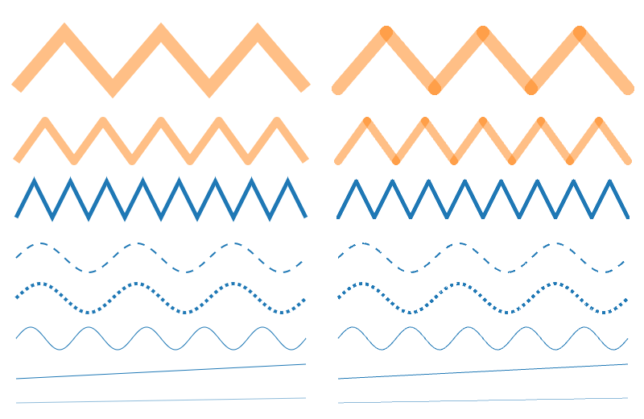
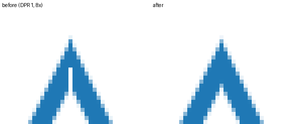

# Spike B: `LinePrimitive` vs three's `Line2`

- **Plan:** E0.7 spike B; informs the E2.5 line primitive.
- **Status:** Measured at full scale on 2026-09-23, after fixing the critical GPU-cost bug the first
  run found (details below).
- **Page:** [`examples/_spikes/b-lines.ts`](../../examples/_spikes/b-lines.ts)

## Setup

Same machine and runner as [spike A](a-markers.md): Apple M1 Max, Playwright Chromium headless,
ANGLE → Metal, 1024×640 canvas, DPR 1. Perf mode draws 10 random-walk series; `scale=1` is 100k
points each (1M segments), `scale=0.1` is 10k each. Peak browser RSS at full scale: 879 MB.

```bash
pnpm --filter @mk7s/holochart-sandbox exec vite --port 5197 --strictPort --host 127.0.0.1 &
node docs/spikes/scripts/run-spike.mjs --spike b-lines --params 'mode=perf&scale=0.1&reps=3' --out /tmp/spikes
node docs/spikes/scripts/run-spike.mjs --spike b-lines --params 'mode=quality' --dpr 2 --capture /tmp/spikes/q2.png --out /tmp/spikes
```

## The critical bug (found by this spike, now fixed)

The first perf run took **4.4 s of GPU per frame** (14.8 s dashed) at `scale=0.1`, against 0.31 ms
for `Line2`. Back-to-back frames like that stall macOS, because the GPU is shared with the window
server, and an earlier run inside the desktop app's embedded browser crashed the app.

**Root cause:** the perf harness added each line's mesh straight to a scene
(`vp.scene.add(line.object)`) instead of registering the primitive with the viewport, so
`setViewport()` was never called. The primitive's `uResolution` uniform kept its default of 1×1 CSS
px. The vertex shader works in screen px, so each segment's quad (±0.75 px half-width plus AA) was
computed in a 1×1 "screen" and covered the **entire canvas**: 100k full-canvas quads, roughly 65
billion fragments per frame, each running the join and dash logic. The quality card registered its
primitives properly, which is why it looked fine and the cost first seemed data-dependent. The same
trap existed in markers, rects, and arcs.

The first hypothesis (quads sized from the unclamped miter length at sharp turns) was wrong: the
shader already switches to a bevel beyond the miter limit, so join extents are bounded (now covered by
a property test).

**Fix:** every screen-space primitive (lines, rects, arcs, markers) syncs its viewport uniforms from
the renderer in `onBeforeRender` (`syncViewportUniforms` in `primitives/common.ts`): the GL viewport
in device px is always tracked, and on the canvas the CSS resolution and pixel ratio are derived from
it. Render targets (picking, export) keep the explicit `setViewport` size. A missed `setViewport` can
no longer blow up quad sizes.

## Performance

| Workload               | Variant | Before fix: GPU ms / frame | After fix: GPU ms / frame (fps) | `Line2`: GPU ms (fps) |
| ---------------------- | ------- | -------------------------- | ------------------------------- | --------------------- |
| 10 × 10k (`scale=0.1`) | solid   | 4,417                      | **1.67** (266)                  | 0.31 (465)            |
| 10 × 10k (`scale=0.1`) | dashed  | 14,826                     | **2.08** (217)                  | 0.32 (438)            |
| 10 × 100k (`scale=1`)  | solid   | not run (≈ 44 s est.)      | **14.1** (58)                   | 2.9 (185)             |
| 10 × 100k (`scale=1`)  | dashed  | not run                    | **28.7** (22)                   | 2.8 (183)             |

Build (construct + first synced frame) at full scale: 94 ms solid / 157 ms dashed, vs 69–73 ms for
`Line2`. CPU per frame is 0.2 ms in every case. Geometry: 110 MB vs 23–31 MB for `Line2`.

## Quality (DPR 1 and 2)



Left half: `LinePrimitive`. Right half: `Line2` / `LineMaterial`. DPR 2:
[after](img/b-quality-dpr2-after.png). Before the fixes: [DPR 1](img/b-quality-dpr1-before.png),
[DPR 2](img/b-quality-dpr2-before.png).

- **Translucent joins:** ours composite correctly (each pixel belongs to exactly one segment), so
  wide translucent lines show no darker overlap at joins. `Line2` double-blends every join.
- **Join styles:** ours draws true miter joins; `Line2` only offers round joins.
- **Join cracks (fixed):** sharp symmetric miter joins on opaque lines showed a one-pixel white
  crack down the join (third row). At a symmetric join the ownership boundary between the two
  segments is axis-aligned through the vertex, so it passed exactly through a column of pixel
  centers; the two segments compute the shared tangent independently, and a ±1e-8 rounding
  difference let both discard those pixels. The boundary is now offset by 1/512 px (`OWN_EPS`) so
  it never sits on pixel centers, and fragment positions come from `gl_FragCoord` instead of an
  interpolated varying, so both segments see bit-identical positions.

  

- **Dashes and thin lines:** comparable. Dash phase is continuous in both.

## Findings

1. The catastrophic cost was a setup trap, not the line algorithm, and it affected every
   screen-space primitive. Primitives now size themselves from the renderer on every draw.
2. After the fix, `LinePrimitive` is **~5× `Line2`'s GPU time solid and ~10× dashed** at 1M
   segments (58 fps solid at full scale). That's the price of exact per-pixel join ownership, AA
   evaluated in the shader, and the dash loop, plus about 4.8× more (mostly over-allocated) vertex
   data.
3. Quality is better than `Line2` for translucent and mitered lines, and the join crack is fixed.
   Keep the primitive.

## Regression guards

- Vitest: `primitives/viewport-sync.test.ts` (all four primitives size themselves without
  `setViewport`), and `line-join.test.ts` (join extents bounded by the miter limit; sub-pixel random
  walk quads stay a few px²; pixel-aligned symmetric joins give every pixel exactly one owner).
- Manual GPU budget (CI has no GPU timers): with the runner above, `mode=perf&scale=0.1` must stay
  **under 5 ms GPU per frame** for both solid and dashed `LinePrimitive` on the reference machine.

## Follow-ups (E16)

- Shrink the vertex stream. Most of the 110 MB is over-allocation: `buildLineLayout` sizes for the
  worst case of 2n vertices (a gap after every point) and rounds up to a power of two, so a 100k
  series gets 262,144 slots × 44 bytes (2.6× what it uses). Count first, then allocate; also pack
  colors as normalized uint8 and skip per-vertex colors when one color is used.
- Cheaper dashes: precompute the dash interval for the fragment's segment instead of looping over
  the whole pattern per fragment.
