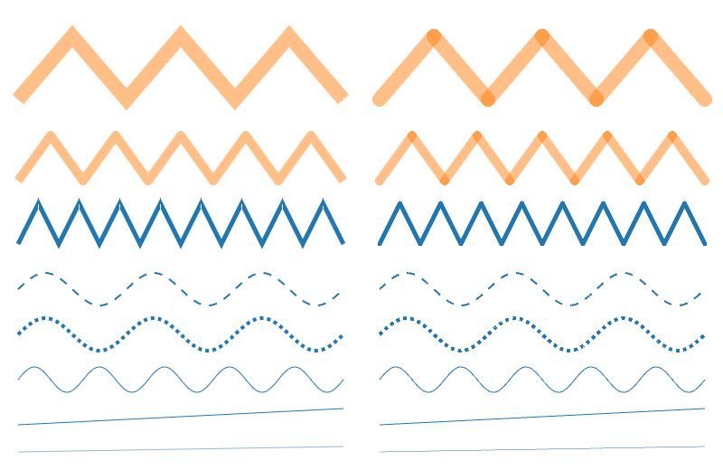

# Spike B: `LinePrimitive` vs three's `Line2`

- **Plan:** E0.7 spike B; informs the E2.5 line primitive.
- **Status:** Quality comparison done. Performance measured at 10% scale only, and it found a
  **critical GPU-cost bug** in `LinePrimitive`. Full-scale performance is deferred until the bug is
  fixed (and to the M7 benchmarking pass).
- **Page:** [`examples/_spikes/b-lines.ts`](../../examples/_spikes/b-lines.ts)

> ⚠️ **Do not run `mode=perf` at full scale until the bug below is fixed.** Each frame takes
> seconds of GPU time. On macOS the GPU is shared with the window server, so back-to-back frames
> make the whole machine lag, and running this inside an embedded app browser crashed that app.

## Setup

Same machine and runner as [spike A](a-markers.md): Apple M1 Max, Playwright Chromium headless,
ANGLE → Metal, DPR 1. Perf mode draws 10 series; at `scale=0.1` each has 10k points (100k segments
total). Peak browser RSS was 556 MB.

## Quality (DPR 1 and 2)

Left half: `LinePrimitive`. Right half: `Line2` / `LineMaterial`. DPR 2 version:
[b-quality-dpr2.png](img/b-quality-dpr2.png).

- **Translucent joins:** ours composite correctly (each pixel belongs to exactly one segment), so
  wide translucent lines show no darker overlap at joins. `Line2` double-blends every join.
- **Join styles:** ours draws true miter joins; `Line2` only offers round joins (its round caps
  double as joins).
- **Defect in ours:** small white notches at the outer tips of sharp miter joins on opaque lines
  (third row; crop: [b-join-seam-dpr1.png](img/b-join-seam-dpr1.png)). This is the one-pixel crack
  risk predicted for E2.5.
- **Dashes and thin lines:** comparable. Dash phase is continuous in both.

## Performance at 10% scale (10 × 10k points)

| Variant                 | Build (ms) | GPU per frame (ms) | fps | Geometry (MB) |
| ----------------------- | ---------- | ------------------ | --- | ------------- |
| `LinePrimitive`, solid  | 4,340      | **4,417**          | 0.2 | 13.8          |
| `Line2`, solid          | 92         | 0.31               | 642 | 2.3           |
| `LinePrimitive`, dashed | 4,688      | **14,826**         | 0.1 | 13.8          |
| `Line2`, dashed         | 56         | 0.32               | 673 | 3.1           |

CPU time per frame is under 6 ms in every case: the cost is on the GPU. The "build" figure includes
the first GPU-synced frame, which is why it tracks the frame time.

## Findings

1. **Critical: `LinePrimitive` costs about 14,000× `Line2`'s GPU time on dense, noisy series.** It
   draws the same number of segments, so the per-segment work or the area each segment's quad covers
   is pathological. Hypothesis: the data is a random walk with sub-pixel point spacing, so almost
   every vertex is a near-reversal. If a segment's quad is sized from the unclamped miter length
   (which grows as 1/sin(θ/2) at sharp turns) rather than the miter-limited or bevel extent, quads
   become enormous and overdraw explodes. The `lines-series` visual example (fewer, gentler
   series) renders fine, which fits a data-dependent cause.
2. Geometry is 4–6× larger than `Line2`'s. Worth revisiting once the quad sizing is fixed.
3. Quality is better than `Line2` for translucent and mitered lines, so the primitive is worth
   keeping once the cost bug and the join notches are fixed.

## Hand-offs

- **Fix before M1 line charts (E2.5 / E9.2):** bound each segment's quad to the miter-limited join
  extent; add a regression benchmark (this spike at `scale=0.1` must stay under a few ms of GPU per
  frame); fix the join-tip notches; then re-run this spike at full scale.
