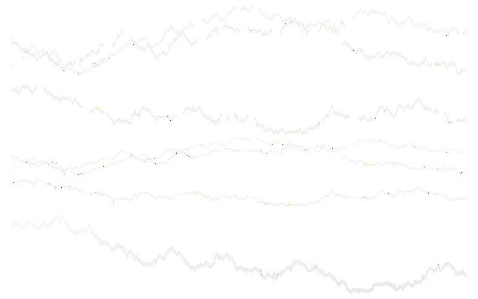
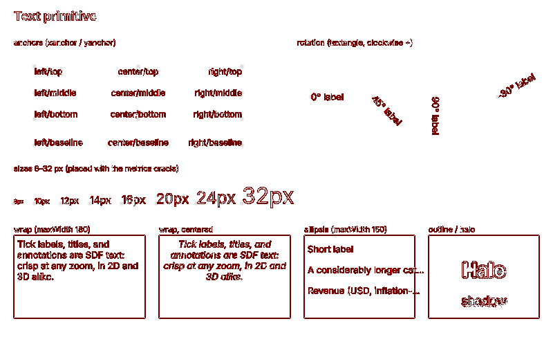

# Spike E: deterministic screenshots (SwiftShader vs ANGLE/Metal)

- **Story:** plan E0.7 (spike E); informs [ADR-018](../adr/018-visual-regression-harness.md) and
  risk R4
- **Date:** 2026-09-23
- **Script:** [`scripts/determinism.mjs`](scripts/determinism.mjs)

## Goal

Measure how stable the visual suite's screenshots are:

1. SwiftShader (the CI configuration) run-to-run, and against the committed baselines.
2. Hardware GPU (ANGLE on Metal) run-to-run, and against the committed baselines.
3. Metal vs SwiftShader, judged by the suite's own pass/fail rule (`meta.testTolerance`).
4. Whether the macOS-generated baselines match CI's Linux container.
5. Render time per backend.

## Setup

| Item                 | Value                                                                                                                                                  |
| -------------------- | ------------------------------------------------------------------------------------------------------------------------------------------------------ |
| Machine              | Apple M1 Max (10 cores), macOS 26.6.2                                                                                                                  |
| Browser              | Playwright 1.63.0, bundled Chromium 153.0.8010.12 (build 1243), `headless: true`                                                                       |
| SwiftShader GL       | `ANGLE (Google, Vulkan 1.3.0 (SwiftShader Device (LLVM 10.0.0) (0x0000C0DE)), SwiftShader driver)`                                                     |
| Metal GL             | `ANGLE (Apple, ANGLE Metal Renderer: Apple M1 Max, Unspecified Version)`                                                                               |
| SwiftShader GL flags | `--use-gl=angle --use-angle=swiftshader --enable-unsafe-swiftshader` (same as `playwright.config.ts`)                                                  |
| Metal GL flags       | `--use-gl=angle --use-angle=metal`                                                                                                                     |
| Other flags          | `--ignore-gpu-blocklist --force-color-profile=srgb --disable-lcd-text --font-render-hinting=none --hide-scrollbars`                                    |
| Page                 | 1280×800 viewport, DPR 1, light, `en-US`, UTC (same as `playwright.config.ts`)                                                                         |
| Runs                 | 1 untimed warm-up, then 5 renders per example per backend. Every render uses a new context and page. At most 2 pages at once.                          |
| Comparison           | `tests/visual/compare.ts` `comparePng` (pixelmatch, `threshold: 0.1`, anti-aliased pixels not counted), plus a strict per-channel comparison ("exact") |

The renderer strings come from `WEBGL_debug_renderer_info` (`UNMASKED_RENDERER_WEBGL`) in the
page. Each example opens at `/?example=<id>&test=1`. The script waits for
`window.__exampleReady` and screenshots `#example-root` with `scale: 'css'`, like
`tests/visual/visual.spec.ts`. Ten examples were measured. `_dev/markers-1m` is tagged
`no-visual-test` and was skipped. At run time the registry contained only `_dev/*` examples.

Reproduce from the repo root:

```sh
pnpm --filter @mk7s/holochart-sandbox exec vite --port 5197 --strictPort --host 127.0.0.1 &
node docs/spikes/scripts/determinism.mjs --port 5197 --runs 5 --out /tmp/spike-e
# then stop the dev server (kill the vite process; lsof -i :5197 should print nothing)
```

The script prints a summary. It writes `results.json`, every PNG, and the diff PNGs to `--out`.
Node 23 or later is required because the script imports `compare.ts` directly.

## Results

"pm" is the number of pixels pixelmatch counts, as in the suite. "exact" is the number of pixels
with any RGBA difference, with the largest channel delta Δ (0–255) in brackets. Run-to-run values
are the maximum over runs 2–5 compared with run 1. Metal vs SwiftShader compares every Metal run
with SwiftShader run 1.

### Stability and cross-backend diffs

| Example                   | Size    | Tol.  | SwiftShader run-to-run (pm / exact) | Metal run-to-run (pm / exact) | Metal vs SwiftShader pm (fraction) | Metal vs SwiftShader exact (fraction, max Δ) | Metal vs baseline |
| ------------------------- | ------- | ----- | ----------------------------------- | ----------------------------- | ---------------------------------- | -------------------------------------------- | ----------------- |
| `_dev/arcs-donut`         | 800×500 | 0.001 | 0 / 0                               | 0 / 0                         | 0 (0%)                             | 4,750 (1.19%, Δ8)                            | pass              |
| `_dev/fills-polygons`     | 640×400 | 0.001 | 0 / 0                               | 0 / 0                         | 0 (0%)                             | 4,885 (1.91%, Δ114)                          | pass              |
| `_dev/hello-cube`         | 640×400 | 0.001 | 0 / 0                               | 0 / 0                         | 0 (0%)                             | 537 (0.21%, Δ53)                             | pass              |
| `_dev/lines-joins-dashes` | 800×600 | 0.001 | 0 / 0                               | 0 / 0                         | 13 (0.0027%)                       | 11,721 (2.44%, Δ229)                         | pass              |
| `_dev/lines-series`       | 800×500 | 0.001 | 0 / 0                               | 0 / 0                         | 109 (0.0272%)                      | 17,686 (4.42%, Δ242)                         | pass              |
| `_dev/markers-colorscale` | 640×400 | 0.001 | 0 / 0                               | 0 / 0                         | 0 (0%)                             | 33,882 (13.2%, Δ10)                          | pass              |
| `_dev/markers-symbols`    | 720×400 | 0.001 | 0 / 0                               | 0 / 0                         | 0 (0%)                             | 25,705 (8.93%, Δ12)                          | pass              |
| `_dev/rects-bars`         | 800×500 | 0.001 | 0 / 0                               | 0 / 0                         | 26 (0.0065%)                       | 14,286 (3.57%, Δ238)                         | pass              |
| `_dev/text-labels`        | 800×500 | 0.004 | 0 / 13 px (Δ1, 1 of 5 runs)         | 0 / 0                         | 0 (0%)                             | 26,815 (6.70%, Δ34)                          | pass              |
| `_dev/viewports-grid`     | 720×480 | 0.001 | 0 / 0                               | 0 / 0                         | 0 (0%)                             | 57,501 (16.6%, Δ14)                          | pass              |

- **SwiftShader against the committed baselines:** pm = 0 for all 10 examples. The renders are
  pixel-identical to the baselines, except for the one `text-labels` render in the table (13 px,
  Δ1).
- **Metal against the committed baselines:** the same numbers as Metal vs SwiftShader, because
  SwiftShader matches the baselines. **10 of 10 pass** their tolerance. The worst case is
  `lines-series` at 0.0272%, which uses 27% of the 0.1% budget.
- **Earlier 10-run pass (same script, `--runs 10`):** every example produced a single distinct PNG
  per backend, with pm = 0 run-to-run. The cross-backend numbers were identical to this pass.

### Render time

"Ready" is the time from `page.goto` to the resolution of `__exampleReady`. It includes the page
load from the warm Vite server, example setup, and two frames. The screenshot is not included.

| Example                   | SwiftShader median (min), ms | Metal median (min), ms |
| ------------------------- | ---------------------------- | ---------------------- |
| `_dev/arcs-donut`         | 146 (123)                    | 142 (134)              |
| `_dev/fills-polygons`     | 138 (135)                    | 156 (134)              |
| `_dev/hello-cube`         | 172 (117)                    | 123 (104)              |
| `_dev/lines-joins-dashes` | 164 (134)                    | 142 (129)              |
| `_dev/lines-series`       | 449 (198)                    | 166 (152)              |
| `_dev/markers-colorscale` | 1,436 (181)                  | 157 (147)              |
| `_dev/markers-symbols`    | 2,116 (158)                  | 150 (130)              |
| `_dev/rects-bars`         | 147 (133)                    | 128 (121)              |
| `_dev/text-labels`        | 574 (453)                    | 250 (232)              |
| `_dev/viewports-grid`     | 1,485 (1,020)                | 160 (158)              |
| **Backend wall time**     | **56.4 s**                   | **9.7 s**              |

The backend wall time covers the warm-up plus 5 × 10 renders, 2 pages at once, including
screenshots. It is 5.8× longer on SwiftShader, and 6.4× in the 10-run pass (114.8 s vs 17.9 s).

These timings were measured under heavy load: other work on the machine kept the load average
between 100 and 145 on 10 cores. SwiftShader runs on the CPU, so its times are bimodal and noisy.
For example, `markers-symbols` took 158–2,281 ms. Metal stayed within about ±15%. On a quiet
machine SwiftShader should be faster. Its slowest examples were the ones with many instances or
several viewports.

CI's visual job ran the same 10 examples in 11.3 s with 2 workers. Each test took 0.95–3.7 s,
including page setup.

### Where the differences are

The diffs are not concentrated in one content type. Metal and SwiftShader differ across most
rasterized content:

- **Small deltas (Δ1–8) make up nearly all differing pixels.** They occur on SDF text glyph fills
  and edges, marker fills (`markers-colorscale`, `markers-symbols`), grid and viewport content, and
  even flat dark fills (Δ1–2 across the negative bars in `rects-bars`). These are rounding and
  interpolation differences. pixelmatch's 0.1 YIQ threshold hides them.
- **Large deltas (Δ > 32) are rare.** They sit on geometry edges: screen-space line edges and joins
  (`lines-series`, `lines-joins-dashes`), rect outlines, polygon edges (`fills-polygons`, Δ114), and
  cube edges (`hello-cube`). Here the two backends cover a different set of edge pixels. pixelmatch
  usually classifies these pixels as anti-aliasing and ignores them. Its counted pixels are isolated
  single pixels along line edges and joins, plus one rect edge in `rects-bars`.
- **Text is not a hot spot for pixelmatch.** `text-labels` has 26,815 exact diffs, all Δ ≤ 34, and
  pm = 0.





## CI (Linux container) vs macOS baselines

The PR #1 CI run passed its visual job:
[run 35869654412](https://github.com/holochart/holochart/actions/runs/35869654412) (job
`visual`, ID 107210090979, commit `72df838`).

- The job ran in `mcr.microsoft.com/playwright:v1.63.0-noble`, as step "Visual regression tests
  (Chromium + SwiftShader)".
- The log shows `Running 12 tests using 2 workers`, then `11 passed (11.3s)` and `1 skipped`. The 11
  passing tests are the registry cross-check plus all 10 examples. `_dev/markers-1m` was skipped
  (`no-visual-test`).
- So SwiftShader in the Linux container reproduced the macOS-generated baselines within tolerance.
  A passing test does not print its diff count, so it is not known whether the output was
  bit-exact. Getting that number would need a CI artifact or a Docker run. Neither was done here.

## Findings

1. **SwiftShader is deterministic in practice.** There were 0 pixelmatch diffs over 15 renders per
   example (5 + 10), and nearly all renders were pixel-identical to the macOS baselines. The one
   exception was a single `text-labels` render with 13 pixels off by 1/255. It happened on the first
   render after warm-up, is invisible to pixelmatch, and did not recur.
2. **Metal is also deterministic run-to-run on one machine.** Every render produced byte-identical
   PNGs.
3. **Metal and SwiftShader are not bit-compatible.** Between 0.2% and 17% of pixels differ, with a
   largest channel delta of Δ242. These differences are absorbed only because the suite uses
   `threshold: 0.1` and ignores anti-aliased pixels. With that rule, all 10 examples pass against
   the SwiftShader baselines, the worst at 27% of the default tolerance (`lines-series`).
4. **The counted cross-backend differences are edge coverage on thin geometry:** lines, joins, and
   outlines. Line-heavy examples will use up the tolerance first as the suite grows.
5. **Linux container SwiftShader matches macOS SwiftShader within tolerance** (CI pass above), so
   baselines can be generated on either platform today.
6. **SwiftShader is 6× slower on the CPU** in wall time on this machine, and far more
   load-sensitive.

## Recommendation for ADR-018 and risk R4

- **Keep SwiftShader in the pinned container as the only blocking gate.** It is the only
  configuration with evidence of bit-level reproducibility across machines (macOS and Linux). Keep
  generating baselines in the container, as ADR-018 says. macOS SwiftShader matches today, but that
  is not guaranteed across Chromium or SwiftShader updates.
- **Do not gate on hardware GPU screenshots.** Metal happened to pass on this M1 Max, but only
  because of the anti-aliasing exclusion and the YIQ threshold. The measured margin is about 3.7×
  for line-heavy content, and this is a single GPU and driver. Other vendors, and Linux Mesa on CI
  runners, are untested and likely to differ more at edges.
- **If a hardware-GPU check is wanted, run it as a non-blocking smoke check.** A suitable use is
  the E20.5 cross-browser matrix or local runs on developer GPUs. Use the same pixelmatch settings
  with a looser tolerance: about **0.005 (0.5%)** per example, or 0.01 for text- and line-heavy
  examples. That leaves about 18× headroom over the worst measured case while still catching
  missing or misplaced geometry.
- **Keep the pixelmatch settings as they are** (`threshold: 0.1`, anti-aliased pixels ignored).
  Exact comparison would fail every example across backends. The current settings add no flakiness
  on SwiftShader.
- **Update R4:** the likelihood of flaky SwiftShader screenshots is low on this evidence. The
  remaining risk is cross-backend drift and baseline churn on Chromium upgrades. Mitigate it by
  pinning the container tag and regenerating baselines in the Chromium upgrade PR.
