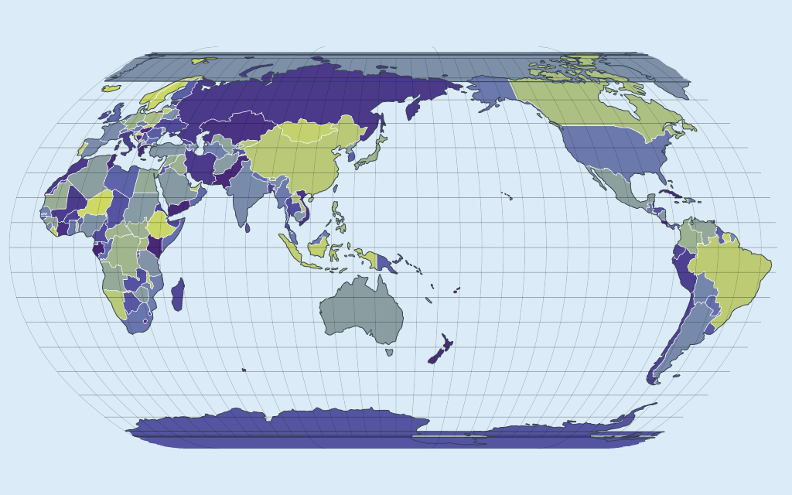
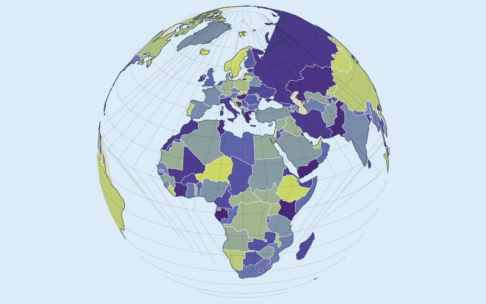
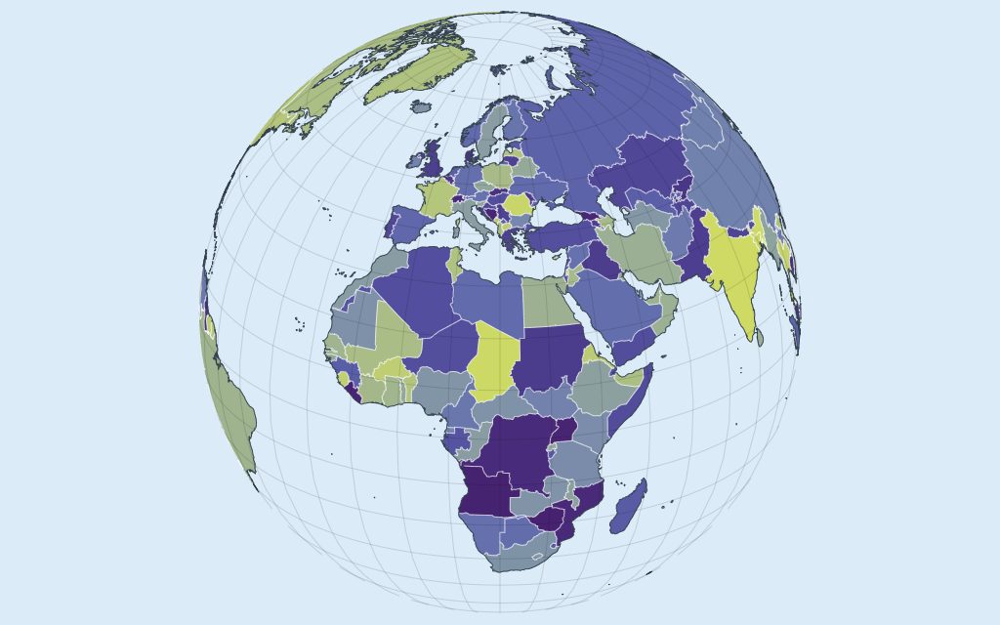
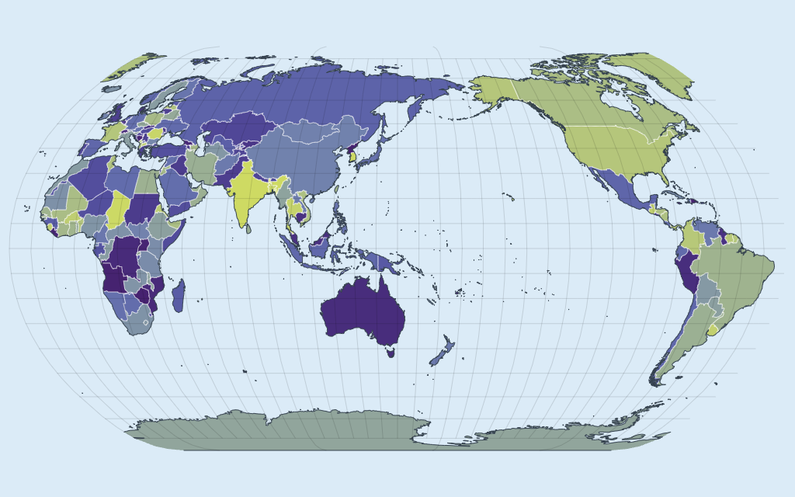

# Spike F: geo projection on the CPU or the GPU

- **Backlog:** GEO1 ("Decisions and spikes"), second spike. Informs the projection-pipeline ADR
  and the stories GEO2, GEO5 and GEO8.
- **Status:** Measured on 2026-10-04. Every table is the median of 3 runs, each in its own
  browser.
- **Page:** [`examples/_spikes/f-geo-projection.ts`](../../examples/_spikes/f-geo-projection.ts)

## Question

Can a 50m Natural Earth world (land, countries, coastlines, graticule) be reprojected on every
frame of a drag, on the CPU through `d3-geo`, at 60 fps? If not, which fallback does: 110m while
dragging and 50m on release, cheaper CPU strategies, or a projection in the vertex shader?

## Short answer

No. Through `d3-geo` a 50m world costs 89 to 95 ms per frame (11 fps). The lines alone cost 18 to
23 ms.

| Strategy                                               | 50m frame, ms | Holds 60 fps          | Left of 16.7 ms |
| ------------------------------------------------------ | ------------- | --------------------- | --------------- |
| A. Everything through `d3-geo`, every frame            | 89–95         | No                    | 0               |
| B. The same at 110m while dragging                     | 11.7–12.3     | Yes                   | 26–30%          |
| B. The swap to 50m on release (one frame)              | 89–93         | 5 to 6 frames dropped | —               |
| C. Best CPU strategy measured (`smart`, own fast path) | 32            | No (31 fps)           | 0               |
| C at 110m                                              | 5.9–6.3       | Yes                   | 62–65%          |
| D. Projection in the vertex shader                     | 2.3–3.1       | Yes                   | 81–86%          |

The cost is not where it was expected. `d3-geo` takes 56 to 74% of a frame and earcut 18 to 32%.
Buffer upload and drawing are 5 to 7%.

## Setup

| Item    | Value                                                                                                   |
| ------- | ------------------------------------------------------------------------------------------------------- |
| Machine | Apple M1 Max (10 cores), 64 GB, macOS 26.6.2                                                            |
| Browser | Playwright 1.63.0, Chromium 153.0.8010.12, headless                                                     |
| GPU     | `ANGLE (Apple, ANGLE Metal Renderer: Apple M1 Max, Unspecified Version)`, WebGL 2                       |
| Canvas  | 1024×640 CSS px (the harness default), DPR 1 and DPR 2                                                  |
| Runner  | [`scripts/run-spike.mjs`](scripts/run-spike.mjs), one browser per run                                   |
| Data    | `world-atlas` 2.0.2 (`countries-110m.json`, `countries-50m.json`), decoded with `topojson-client` 3.1.0 |
| Library | `d3-geo` 3.1.1, `d3-geo-projection` 4.0.0 (`geoProject` only)                                           |

The workload is the five layers a `geo` subplot draws, through the real primitives of
`@mk7s/holochart-render`: two batched fills (`LazyFillPrimitive`: land in one color, countries
colored per country as a choropleth would) and three `LinePrimitive`s (country borders, coastlines,
graticule).

| Source vertices | Land   | Countries | Borders | Coastlines | Graticule | Polygons (land, countries) |
| --------------- | ------ | --------- | ------- | ---------- | --------- | -------------------------- |
| 110m            | 5,002  | 10,301    | 2,807   | 5,127      | 2,573     | 124, 285                   |
| 50m             | 59,406 | 97,910    | 19,439  | 60,835     | 2,573     | 1,427, 1,616               |

A frame of the 50m world draws 99,000 triangles and 53,000 line vertices in the orthographic
projection (half the globe is hidden), 151,000 and 83,000 in the flat ones.

### What a frame measures

A scripted drag of 240 frames turns the view once around the globe: 1.5° of longitude per frame,
and for the orthographic projection the view centre also swings between 5° and 35° north. Each
frame is timed in stages:

- **d3-geo:** projection, clipping and adaptive resampling, and writing the result into the
  primitives' input arrays.
- **Fill build:** `FillPrimitive.update` (earcut triangulation, encoding positions and colors).
- **Line build:** `LinePrimitive.update` (the vertex stream).
- **Draw CPU:** `renderNow()`: buffer uploads and draw calls.
- **GPU wait:** a blocking 1-pixel `readPixels` after the frame. **GPU time** is the same frame
  through `EXT_disjoint_timer_query_webgl2`.

Total is the sum of the stages and the GPU wait. Frames run back to back, so fps is throughput, not
capped by vsync. "Budget left" is `(16.7 − median total) / 16.7`: what remains for the traces on
top. `performance.now()` has a resolution of 0.1 ms in this browser, so stages under half a
millisecond are rough.

### Pipelines

- **`geojson`:** `geoProject` builds projected GeoJSON, which is flattened into the primitives'
  arrays. The obvious implementation.
- **`stream`:** the projection's stream writes into preallocated typed arrays. Same pixels as
  `geojson` (0 pixels differ at 8 rotations).
- **`smart`:** every polygon and every 64-point piece of a line has a bounding cap. Pieces behind
  the horizon are skipped. Pieces wholly inside the clip region are projected point by point,
  without clipping or resampling, and polygons keep a triangulation made once. Only pieces the
  clip edge cuts go through d3's stream and earcut. The point-by-point path is either a d3 stream
  with clipping and resampling off (`fast=d3`) or closed-form math over precomputed arrays
  (`fast=own`, within 3·10⁻¹³ px of d3).
- **`shader`:** longitude and latitude are uploaded once and projected in the vertex shader. A
  frame sets uniforms.

## Results

Milliseconds per frame at DPR 1, median of 3 runs. The range after a total is the lowest and
highest of the 3 run medians; p95 is the median of the 3 p95s.

### A. 50m, everything through d3-geo every frame

| Projection      | Configuration         | d3-geo | Fill build | Line build | Draw CPU | GPU wait | GPU time | Total                | p95   | fps | Budget left |
| --------------- | --------------------- | ------ | ---------- | ---------- | -------- | -------- | -------- | -------------------- | ----- | --- | ----------- |
| Orthographic    | `geojson`, all layers | 73.1   | 16.9       | 2.5        | 0.4      | 4.8      | 3.0      | **98.5 (96.8–98.6)** | 108.4 | 10  | 0%          |
|                 | `stream`, all layers  | 70.0   | 16.7       | 2.6        | 0.3      | 4.7      | 3.0      | **94.6 (92.2–94.7)** | 104.7 | 11  | 0%          |
|                 | `stream`, lines only  | 16.6   | 0.0        | 2.5        | 0.2      | 3.9      | 2.8      | **23.1 (23.0–23.5)** | 25.6  | 43  | 0%          |
|                 | `stream`, fills only  | 52.6   | 16.6       | 0.0        | 0.2      | 1.7      | 0.2      | **71.2 (70.3–71.7)** | 79.7  | 14  | 0%          |
| Natural Earth   | `geojson`, all layers | 56.1   | 28.2       | 4.2        | 0.4      | 5.7      | 3.6      | **95.4 (94.8–96.1)** | 102.8 | 10  | 0%          |
|                 | `stream`, all layers  | 50.3   | 28.3       | 4.2        | 0.4      | 5.7      | 3.6      | **89.2 (88.9–89.8)** | 94.7  | 11  | 0%          |
|                 | `stream`, lines only  | 9.8    | 0.0        | 4.2        | 0.2      | 4.4      | 3.2      | **18.5 (18.2–18.9)** | 19.7  | 54  | 0%          |
|                 | `stream`, fills only  | 40.0   | 28.1       | 0.0        | 0.3      | 2.1      | 0.2      | **71.2 (70.5–71.3)** | 77.0  | 14  | 0%          |
| Equirectangular | `geojson`, all layers | 55.8   | 27.8       | 4.2        | 0.4      | 5.7      | 3.6      | **94.7 (93.7–95.7)** | 101.7 | 11  | 0%          |
|                 | `stream`, all layers  | 50.2   | 27.8       | 4.2        | 0.4      | 5.7      | 3.6      | **88.6 (88.0–88.8)** | 94.8  | 11  | 0%          |
|                 | `stream`, lines only  | 9.7    | 0.0        | 4.2        | 0.2      | 4.3      | 3.2      | **18.5 (18.4–18.8)** | 19.7  | 54  | 0%          |
|                 | `stream`, fills only  | 40.5   | 27.8       | 0.0        | 0.3      | 2.1      | 0.2      | **70.8 (70.0–71.2)** | 75.7  | 14  | 0%          |

- No configuration is near the budget. With all layers, every frame of every run is over 16.7 ms.
- `d3-geo` is the largest stage: 70 ms of 95 in the orthographic projection, 50 of 89 in the flat
  ones. Polygons cost it 0.25 to 0.35 µs per source vertex and lines 0.1 to 0.2 µs: for every
  polygon, d3's clip also runs a point-in-polygon pass over all its rings.
- earcut is second, not first: 17 ms for 99,000 triangles, 28 ms for 151,000.
- Lines need no triangulation but still miss the budget on d3 alone (10 to 17 ms), plus 2.5 to 4 ms
  to rebuild the line primitives' vertex streams and about 3 ms of GPU time.
- Writing straight into typed arrays (`stream`) instead of building GeoJSON saves 4 to 6 ms of 95.

### B. 110m while dragging, 50m on release

| Projection      | Configuration         | d3-geo | Fill build | Line build | Draw CPU | GPU wait | GPU time | Total                | p95  | fps | Budget left |
| --------------- | --------------------- | ------ | ---------- | ---------- | -------- | -------- | -------- | -------------------- | ---- | --- | ----------- |
| Orthographic    | `geojson`, all layers | 8.9    | 1.5        | 0.4        | 0.2      | 1.7      | 0.7      | **12.8 (12.6–13.2)** | 14.2 | 78  | 23%         |
|                 | `stream`, all layers  | 8.5    | 1.5        | 0.4        | 0.2      | 1.7      | 0.7      | **12.3 (12.2–12.6)** | 14.0 | 81  | 26%         |
|                 | `stream`, lines only  | 2.6    | 0.0        | 0.4        | 0.1      | 1.5      | 0.6      | **4.6 (4.6–4.8)**    | 5.4  | 217 | 72%         |
|                 | `stream`, fills only  | 5.9    | 1.4        | 0.0        | 0.1      | 1.1      | 0.1      | **8.6 (8.4–8.9)**    | 9.5  | 116 | 48%         |
| Natural Earth   | `geojson`, all layers | 7.2    | 2.4        | 0.6        | 0.2      | 1.9      | 0.9      | **12.4 (12.2–12.9)** | 13.1 | 81  | 26%         |
|                 | `stream`, all layers  | 6.7    | 2.4        | 0.5        | 0.2      | 1.9      | 0.8      | **11.8 (11.7–12.2)** | 12.4 | 85  | 29%         |
|                 | `stream`, lines only  | 1.9    | 0.0        | 0.6        | 0.1      | 1.5      | 0.7      | **4.1 (4.1–4.4)**    | 4.5  | 244 | 75%         |
|                 | `stream`, fills only  | 4.9    | 2.4        | 0.0        | 0.1      | 1.1      | 0.1      | **8.6 (8.5–8.9)**    | 9.1  | 116 | 48%         |
| Equirectangular | `geojson`, all layers | 7.1    | 2.4        | 0.6        | 0.2      | 1.9      | 0.8      | **12.2 (12.1–12.6)** | 12.9 | 82  | 27%         |
|                 | `stream`, all layers  | 6.6    | 2.4        | 0.5        | 0.2      | 1.9      | 0.8      | **11.7 (11.6–11.7)** | 12.4 | 86  | 30%         |
|                 | `stream`, lines only  | 1.8    | 0.0        | 0.6        | 0.1      | 1.6      | 0.7      | **4.0 (4.0–4.1)**    | 4.5  | 250 | 76%         |
|                 | `stream`, fills only  | 4.8    | 2.4        | 0.0        | 0.1      | 1.1      | 0.1      | **8.5 (8.3–8.6)**    | 9.0  | 118 | 49%         |

- 110m holds 60 fps with plain d3: 11.7 to 12.3 ms, p95 12.4 to 14.0 ms, and at most 0.8% of
  frames over the budget in any run. What is left for the traces is 4.4 to 5 ms.
- The swap back to 50m is one frame of the cost in table A:

| Projection      | Configuration         | d3-geo | Fill build | Line build | Draw + GPU wait | Total                 | Worst | First swap | Frames at 60 Hz |
| --------------- | --------------------- | ------ | ---------- | ---------- | --------------- | --------------------- | ----- | ---------- | --------------- |
| Orthographic    | `geojson`, all layers | 73.2   | 17.2       | 2.7        | 5.1             | **97.5 (95.3–100.7)** | 108.9 | 113.4      | 5.9             |
|                 | `stream`, all layers  | 68.3   | 16.9       | 2.6        | 5.1             | **92.6 (91.9–92.7)**  | 103.1 | 106.8      | 5.6             |
|                 | `stream`, lines only  | 16.6   | 0.0        | 2.6        | 4.3             | **23.3 (23.0–24.3)**  | 25.8  | 24.8       | 1.4             |
|                 | `stream`, fills only  | 52.3   | 16.7       | 0.0        | 2.0             | **70.7 (70.0–73.0)**  | 79.7  | 79.9       | 4.2             |
| Natural Earth   | `geojson`, all layers | 55.0   | 28.5       | 4.5        | 6.6             | **94.9 (93.6–100.4)** | 103.9 | 106.0      | 5.7             |
|                 | `stream`, all layers  | 50.6   | 28.6       | 4.5        | 6.5             | **90.9 (89.4–92.8)**  | 98.4  | 95.5       | 5.5             |
|                 | `stream`, lines only  | 9.8    | 0.0        | 4.4        | 5.1             | **19.3 (19.1–19.7)**  | 20.8  | 19.7       | 1.2             |
|                 | `stream`, fills only  | 41.1   | 28.9       | 0.0        | 2.4             | **72.0 (70.8–73.9)**  | 76.8  | 75.9       | 4.3             |
| Equirectangular | `geojson`, all layers | 55.1   | 28.3       | 4.4        | 6.4             | **94.5 (93.5–97.4)**  | 101.2 | 100.0      | 5.7             |
|                 | `stream`, all layers  | 50.2   | 28.2       | 4.5        | 6.5             | **89.2 (88.2–90.8)**  | 94.4  | 95.0       | 5.4             |
|                 | `stream`, lines only  | 9.6    | 0.0        | 4.4        | 5.0             | **18.9 (18.9–19.1)**  | 20.3  | 19.0       | 1.1             |
|                 | `stream`, fills only  | 40.7   | 28.3       | 0.0        | 2.4             | **71.4 (69.7–71.7)**  | 73.0  | 75.3       | 4.3             |

- A synchronous swap is a visible hitch of 5 to 6 frames at 60 Hz. Lines alone would be 1 to 1.4
  frames. Spreading the swap over frames by layer, or building it in a worker, was not measured.

### C. Cheaper CPU strategies, 50m

| Projection      | Configuration                 | d3-geo | Fill build | Line build | Draw CPU | GPU wait | GPU time | Total                | p95  | fps | Budget left |
| --------------- | ----------------------------- | ------ | ---------- | ---------- | -------- | -------- | -------- | -------------------- | ---- | --- | ----------- |
| Orthographic    | `stream`, `precision(0)`      | 57.9   | 16.6       | 2.5        | 0.4      | 4.7      | 3.0      | **81.9 (81.0–83.4)** | 90.2 | 12  | 0%          |
|                 | `stream`, horizon culling     | 51.8   | 16.7       | 2.5        | 0.3      | 4.7      | 3.0      | **75.7 (74.8–77.5)** | 90.2 | 13  | 0%          |
|                 | `smart`, fast path through d3 | 35.1   | 6.4        | 2.5        | 0.3      | 4.8      | 3.0      | **48.8 (48.2–49.5)** | 56.9 | 20  | 0%          |
|                 | `smart`, own fast path        | 18.2   | 6.4        | 2.5        | 0.3      | 4.7      | 3.0      | **32.1 (31.4–32.5)** | 36.0 | 31  | 0%          |
|                 | `smart` own, lines only       | 1.8    | 0.0        | 2.5        | 0.2      | 3.8      | 2.8      | **8.3 (8.3–8.6)**    | 9.6  | 120 | 50%         |
|                 | `smart` own, fills only       | 16.2   | 6.4        | 0.0        | 0.2      | 1.8      | 0.2      | **24.7 (24.6–24.9)** | 28.2 | 40  | 0%          |
| Natural Earth   | `stream`, `precision(0)`      | 36.2   | 27.2       | 4.0        | 0.4      | 5.6      | 3.6      | **73.6 (73.4–75.5)** | 77.5 | 14  | 0%          |
|                 | `smart`, fast path through d3 | 23.8   | 9.6        | 4.2        | 0.3      | 5.7      | 3.7      | **43.8 (43.0–43.8)** | 46.9 | 23  | 0%          |
|                 | `smart`, own fast path        | 12.4   | 9.7        | 4.2        | 0.3      | 5.6      | 3.7      | **32.4 (32.2–33.0)** | 35.4 | 31  | 0%          |
|                 | `smart` own, lines only       | 0.7    | 0.0        | 4.3        | 0.2      | 4.3      | 3.2      | **9.3 (9.3–9.4)**    | 10.5 | 108 | 44%         |
|                 | `smart` own, fills only       | 11.8   | 9.7        | 0.0        | 0.2      | 2.1      | 0.2      | **23.8 (23.4–24.1)** | 27.2 | 42  | 0%          |
| Equirectangular | `stream`, `precision(0)`      | 35.7   | 27.0       | 4.1        | 0.4      | 5.7      | 3.6      | **72.8 (72.2–75.2)** | 77.5 | 14  | 0%          |
|                 | `smart`, fast path through d3 | 23.3   | 9.2        | 4.3        | 0.3      | 5.7      | 3.7      | **42.8 (42.7–43.6)** | 45.9 | 23  | 0%          |
|                 | `smart`, own fast path        | 12.3   | 9.3        | 4.3        | 0.3      | 5.7      | 3.7      | **31.8 (31.5–32.4)** | 35.3 | 31  | 0%          |
|                 | `smart` own, lines only       | 0.7    | 0.0        | 4.2        | 0.2      | 4.2      | 3.2      | **9.4 (8.8–9.6)**    | 10.7 | 106 | 44%         |
|                 | `smart` own, fills only       | 11.8   | 9.5        | 0.0        | 0.2      | 2.1      | 0.2      | **23.7 (23.0–23.8)** | 27.0 | 42  | 0%          |

- **`projection.precision(0)`** saves 13 to 16 ms of 89 to 95 and is not usable alone. The
  graticule's meridians are two-point lines that only d3's resampling bends, so they turn into
  straight chords: 0.9 to 1.9% of all canvas pixels differ visibly from the resampled frame
  (0% in the equirectangular projection, where they are straight anyway).
- **Skipping what is behind the horizon** saves 19 ms in the orthographic projection and nothing
  elsewhere.
- **`smart`** is the best CPU result: 32 ms, 31 fps. It does not hold 60 fps. Lines alone do (8.3
  to 9.4 ms, 44 to 50% of the budget left); fills alone take 24 to 25 ms.
- What is left is a handful of very large polygons. In the orthographic view 30 polygons are cut by
  the horizon in a typical frame, and 29,000 vertices come out of d3 for them (Afro-Eurasia, the
  Americas and Antarctica in the land layer; Russia, Canada, the United States and others in the
  countries layer). The fill layers then cost 16 ms in the d3 stage and 6 ms in earcut. In the
  flat projections 22 polygons cross the antimeridian with 42,000 vertices: 12 ms and 10 ms.
- Leaving d3 for the unclipped vertices is worth as much as the cached triangulation: the same
  pipeline with d3 as the point-by-point path takes 43 to 49 ms.
- The cached triangulation has to be checked. It is made on the sphere (gnomonic coordinates
  around the polygon's cap centre) and can fold over once projected. Unchecked (`verify=0`), up to
  383 triangles (836 px²) of a frame are flipped in the orthographic view and 420 (469 px²) in
  Natural Earth. Opaque fills hide it (at most 0.01% of pixels differ visibly); translucent fills
  would blend twice there. The measured pipeline checks every cached triangle each frame and
  re-triangulates a polygon with a flipped triangle thicker than 0.25 px: 2 to 5 polygons per
  frame, 1.3 to 3 ms in total. With the check, the fills match the `stream` pipeline in every
  pixel at all 8 rotations, 50m.

The same strategies at 110m, where they are not needed to hold 60 fps but more than double the
budget left:

| Projection      | Configuration                 | d3-geo | Fill build | Line build | Draw CPU | GPU wait | GPU time | Total                | p95  | fps | Budget left |
| --------------- | ----------------------------- | ------ | ---------- | ---------- | -------- | -------- | -------- | -------------------- | ---- | --- | ----------- |
| Orthographic    | `stream`, `precision(0)`      | 6.3    | 1.5        | 0.3        | 0.2      | 1.6      | 0.7      | **10.1 (10.1–10.4)** | 11.2 | 99  | 39%         |
|                 | `stream`, horizon culling     | 7.0    | 1.4        | 0.4        | 0.2      | 1.7      | 0.7      | **10.8 (10.6–10.8)** | 12.5 | 93  | 36%         |
|                 | `smart`, fast path through d3 | 5.1    | 0.7        | 0.4        | 0.2      | 1.7      | 0.7      | **8.0 (8.0–8.1)**    | 9.3  | 125 | 52%         |
|                 | `smart`, own fast path        | 3.4    | 0.7        | 0.4        | 0.1      | 1.6      | 0.7      | **6.3 (6.2–6.4)**    | 7.1  | 159 | 62%         |
|                 | `smart` own, lines only       | 1.3    | 0.0        | 0.4        | 0.1      | 1.4      | 0.6      | **3.2 (3.0–3.3)**    | 3.7  | 312 | 81%         |
|                 | `smart` own, fills only       | 2.1    | 0.7        | 0.0        | 0.1      | 1.0      | 0.1      | **4.0 (3.8–4.0)**    | 4.6  | 250 | 76%         |
| Natural Earth   | `stream`, `precision(0)`      | 4.0    | 2.4        | 0.5        | 0.2      | 1.9      | 0.8      | **9.0 (9.0–9.2)**    | 9.8  | 111 | 46%         |
|                 | `smart`, fast path through d3 | 3.4    | 1.0        | 0.7        | 0.2      | 1.9      | 0.8      | **7.2 (7.2–7.3)**    | 7.8  | 139 | 57%         |
|                 | `smart`, own fast path        | 2.2    | 1.1        | 0.7        | 0.1      | 1.8      | 0.8      | **5.9 (5.9–6.0)**    | 6.6  | 170 | 65%         |
|                 | `smart` own, lines only       | 0.3    | 0.0        | 0.6        | 0.1      | 1.4      | 0.7      | **2.5 (2.2–2.5)**    | 2.9  | 400 | 85%         |
|                 | `smart` own, fills only       | 1.9    | 1.0        | 0.0        | 0.1      | 1.0      | 0.1      | **4.0 (4.0–4.2)**    | 4.6  | 250 | 76%         |
| Equirectangular | `stream`, `precision(0)`      | 4.0    | 2.4        | 0.5        | 0.2      | 1.8      | 0.8      | **8.9 (8.8–8.9)**    | 9.6  | 112 | 47%         |
|                 | `smart`, fast path through d3 | 3.4    | 1.0        | 0.7        | 0.1      | 1.9      | 0.8      | **7.2 (7.1–7.2)**    | 7.8  | 139 | 57%         |
|                 | `smart`, own fast path        | 2.2    | 1.0        | 0.7        | 0.1      | 1.8      | 0.8      | **5.9 (5.8–5.9)**    | 6.5  | 170 | 65%         |
|                 | `smart` own, lines only       | 0.3    | 0.0        | 0.6        | 0.1      | 1.4      | 0.7      | **2.5 (2.4–2.5)**    | 2.9  | 400 | 85%         |
|                 | `smart` own, fills only       | 1.8    | 1.0        | 0.0        | 0.1      | 1.0      | 0.1      | **4.0 (4.0–4.1)**    | 4.5  | 250 | 76%         |

### D. Projection in the vertex shader, 50m

Measured twice. With the machine otherwise idle (the tables below) the GPU times are about 1 ms
higher than in an earlier session while another spike was using the GPU (1.1 to 2.2 ms total at
DPR 1, 1.7 to 3.3 ms at DPR 2). Most likely an idle GPU runs at a lower clock; that was not
verified. The CPU-bound tables A to C changed by 3% or less between the two sessions.

DPR 1:

| Projection      | Configuration | Draw CPU | GPU wait | GPU time | Total             | p95 | fps | Budget left |
| --------------- | ------------- | -------- | -------- | -------- | ----------------- | --- | --- | ----------- |
| Orthographic    | all layers    | 0.1      | 2.2      | 1.5      | **2.3 (2.3–2.5)** | 2.7 | 435 | 86%         |
|                 | lines only    | 0.1      | 1.7      | 1.0      | **1.7 (1.7–1.8)** | 2.1 | 588 | 90%         |
|                 | fills only    | 0.0      | 1.1      | 0.5      | **1.2**           | 1.5 | 833 | 93%         |
| Equirectangular | all layers    | 0.1      | 2.9      | 2.1      | **3.0 (2.9–3.2)** | 4.4 | 333 | 82%         |
|                 | lines only    | 0.1      | 2.3      | 1.6      | **2.3 (2.2–2.4)** | 2.8 | 435 | 86%         |
|                 | fills only    | 0.0      | 2.4      | 1.6      | **2.5 (2.3–2.7)** | 3.2 | 400 | 85%         |
| Mercator        | all layers    | 0.1      | 2.6      | 2.0      | **2.7 (2.7–3.0)** | 3.4 | 370 | 84%         |
|                 | lines only    | 0.1      | 2.2      | 1.5      | **2.2 (2.2–2.3)** | 2.6 | 454 | 87%         |
|                 | fills only    | 0.0      | 2.4      | 1.7      | **2.5 (1.9–2.8)** | 3.2 | 400 | 85%         |
| Natural Earth   | all layers    | 0.1      | 3.1      | 2.3      | **3.1 (2.9–3.5)** | 4.1 | 323 | 81%         |
|                 | lines only    | 0.1      | 2.4      | 1.6      | **2.4 (2.2–2.5)** | 2.9 | 417 | 86%         |
|                 | fills only    | 0.1      | 2.6      | 1.8      | **2.7 (2.4–2.8)** | 3.3 | 370 | 84%         |

DPR 2:

| Projection      | Configuration | Draw CPU | GPU wait | GPU time | Total             | p95 | fps | Budget left |
| --------------- | ------------- | -------- | -------- | -------- | ----------------- | --- | --- | ----------- |
| Orthographic    | all layers    | 0.1      | 2.7      | 1.5      | **2.9 (2.8–2.9)** | 3.4 | 345 | 83%         |
|                 | lines only    | 0.1      | 2.2      | 1.0      | **2.3 (2.3–2.4)** | 2.7 | 435 | 86%         |
|                 | fills only    | 0.1      | 1.9      | 0.8      | **2.0 (1.9–2.0)** | 2.3 | 500 | 88%         |
| Equirectangular | all layers    | 0.1      | 3.4      | 2.5      | **3.5 (3.4–3.9)** | 4.3 | 286 | 79%         |
|                 | lines only    | 0.1      | 2.6      | 1.5      | **2.6 (2.4–2.8)** | 3.3 | 385 | 84%         |
|                 | fills only    | 0.1      | 3.2      | 2.3      | **3.3 (3.1–3.6)** | 4.3 | 303 | 80%         |
| Mercator        | all layers    | 0.1      | 3.7      | 2.8      | **3.8 (3.6–4.2)** | 4.5 | 263 | 77%         |
|                 | lines only    | 0.1      | 2.8      | 1.7      | **2.9 (2.7–3.1)** | 3.3 | 345 | 83%         |
|                 | fills only    | 0.1      | 3.7      | 2.6      | **3.8 (3.3–4.1)** | 4.6 | 263 | 77%         |
| Natural Earth   | all layers    | 0.1      | 3.8      | 2.8      | **3.9 (3.7–4.1)** | 4.8 | 256 | 77%         |
|                 | lines only    | 0.1      | 2.8      | 1.6      | **2.9 (2.8–3.0)** | 3.6 | 351 | 83%         |
|                 | fills only    | 0.1      | 3.8      | 2.7      | **3.9 (3.8–4.1)** | 4.8 | 256 | 77%         |

- A drag frame is 0.1 ms of CPU and 1.5 to 2.8 ms of GPU time at DPR 2. At least 77% of the frame
  is left in every case.
- The mesh is built once: cut at the antimeridian, split so that no edge is longer than 2.5° of
  arc, triangulated, subdivided to 5°. That takes 106 to 114 ms warm (184 to 200 ms as the first
  thing a page does) and gives 241,000 vertices and 318,000 triangles for 157,000 source
  vertices, in 7.2 MB of buffers. Without the subdivision it is 157,000 vertices, 151,000
  triangles and 4.4 MB.
- The flat projections draw 8 calls, not 5: every line layer is drawn twice for the antimeridian,
  and the fills are drawn as three instances. The untreated version (`wrap=0`) is about 0.8 ms
  cheaper and wrong (below).
- Fills match d3 closely: at most 0.03% of pixels differ visibly in the orthographic projection,
  0.05% in equirectangular and Mercator, 0.12% in Natural Earth. The prototype's lines are plain
  quads without joins and are not comparable pixel by pixel (0.8 to 2.1% differ visibly).

### Pan and zoom without rotation; Albers USA

Geometry is projected once and only the data transform changes (ADR-008). A scripted pan with a
zoom from 1× to 4× and back, 50m, all five layers. Idle machine, as for D; the earlier session
gave 0.8 to 1.5 ms at DPR 1 and 1.1 to 2.5 ms at DPR 2.

DPR 1:

| Projection      | Frame          | Draw CPU | GPU wait | GPU time | Total             | p95 | fps | Budget left |
| --------------- | -------------- | -------- | -------- | -------- | ----------------- | --- | --- | ----------- |
| Mercator        | transform only | 0.1      | 2.4      | 1.6      | **2.6 (2.3–3.0)** | 3.7 | 385 | 84%         |
| Equirectangular | transform only | 0.1      | 2.0      | 1.3      | **2.1 (2.0–2.3)** | 4.0 | 465 | 87%         |
| Natural Earth   | transform only | 0.1      | 2.1      | 1.2      | **2.2 (1.8–2.4)** | 3.9 | 454 | 87%         |
| Albers USA      | transform only | 0.1      | 1.1      | 0.3      | **1.1 (1.0–1.2)** | 1.9 | 909 | 93%         |

DPR 2:

| Projection      | Frame          | Draw CPU | GPU wait | GPU time | Total             | p95 | fps | Budget left |
| --------------- | -------------- | -------- | -------- | -------- | ----------------- | --- | --- | ----------- |
| Mercator        | transform only | 0.1      | 3.0      | 1.8      | **3.1 (2.9–3.2)** | 4.5 | 323 | 81%         |
| Equirectangular | transform only | 0.1      | 2.6      | 1.5      | **2.7 (2.7–2.9)** | 4.4 | 370 | 84%         |
| Natural Earth   | transform only | 0.1      | 2.6      | 1.4      | **2.7 (2.6–2.8)** | 4.3 | 370 | 84%         |
| Albers USA      | transform only | 0.1      | 1.8      | 0.5      | **1.9 (1.8–1.9)** | 2.3 | 526 | 89%         |

- Confirmed: pan and zoom need no reprojection in any of the four. With resampling off, scaling
  the base geometry by 8 and projecting at 8× the scale agree to 7·10⁻¹³ px (2·10⁻⁵ px for Albers
  USA, whose three parts and their inset frames scale together).
- **Line widths** do not break: `LinePrimitive` widths are screen pixels and the transform is in
  uniforms. Dashed lines recompute their phase after a zoom, as on any axis.
- **Resampling precision** breaks slowly. d3 resamples to 0.7 px at the scale it projects at, so
  after a zoom of 8 the error can reach 5.7 px. Measured: the Natural Earth graticule, reprojected
  at 8×, has 4,209 vertices against 3,083 and lies up to 5.66 px from the scaled one. Fills and
  coastlines gained at most 8 vertices (50m is dense already). Mercator, equirectangular and
  Albers USA showed no difference. A reprojection when a zoom settles, or projecting once at a
  finer precision, removes it; neither was measured.
- **Clip extent:** nothing to do. The viewport's scissor clips; d3's own clip extents (Mercator's
  ±85°, the Albers USA insets) scale with the geometry.
- **Float precision:** not measured. By the numbers, float32 positions of ±512 px resolve
  3·10⁻⁵ px, so a zoom of 1,000 keeps 0.03 px.
- **This is not Plotly's drag on a world map.** As far as I remember plotly.js (its source was
  not at hand to check), dragging a world-scope flat projection changes `rotation.lon` and
  `center.lat`, which is table A, not this one. Transform-only pan covers scoped maps, Albers USA,
  and zoom everywhere. For the cylindrical projections a rotation in longitude is a shift with
  wrap-around and could be drawn as two transformed copies; that was not measured. Natural Earth
  cannot: its x depends on latitude.
- **Albers USA first draw:** the composite streams every point through three conic projections.
  The 50m _world_ takes 207 to 224 ms to project for the 25,000 vertices that survive (27 to 36 ms
  at 110m). A US-only source would cost a fraction of that; one was not installed, so it was not
  measured.

### First draw and memory

One resolution per page load, orthographic unless noted. "Cold" is the first draw of a fresh page,
"warm" the median of the next three in the same page. The fetch is from the local dev server and
is left out of the totals.

| Stage, ms                                 | 110m cold | 110m warm | 50m cold | 50m warm |
| ----------------------------------------- | --------- | --------- | -------- | -------- |
| `JSON.parse`                              | 0.5       | 0.6       | 3.5      | 3.6      |
| TopoJSON decode (`feature`, `mesh`)       | 3.1       | 2.4       | 14.1     | 8.4      |
| Flatten to typed arrays                   | 2.3       | 1.1       | 7.8      | 6.1      |
| Render root                               | 13.6      | 8.0       | 15.1     | 7.9      |
| Primitives (cold: loading the fill chunk) | 13.6      | 0.8       | 13.7     | 0.8      |
| d3-geo                                    | 15.5      | 13.3      | 102.6    | 68.4     |
| Fill build                                | 9.9       | 3.3       | 41.9     | 29.0     |
| Line build                                | 1.9       | 0.7       | 6.5      | 2.9      |
| First frame (draw CPU + GPU wait)         | 8.8       | 9.4       | 27.4     | 17.2     |
| **Total without fetch**                   | **70**    | **41**    | **234**  | **142**  |

Totals for other configurations, without fetch (cold, warm): Natural Earth 50m 218 and 146 ms;
Albers USA on the world data 318 and 255 ms at 50m, 81 and 49 ms at 110m; `smart` 238 and 150 ms
at 50m (117 and 77 ms of it building the caps and the cached triangulation), 74 and 40 ms at 110m;
`shader` 259 and 169 ms at 50m (200 and 127 ms building the mesh), 84 and 52 ms at 110m. The
spread over the 3 runs is under 10% for every total.

| Memory                                              | 110m   | 50m     |
| --------------------------------------------------- | ------ | ------- |
| TopoJSON text                                       | 105 KB | 739 KB  |
| Source typed arrays (longitude, latitude, offsets)  | 0.4 MB | 3.8 MB  |
| Primitive buffers, orthographic                     | 0.9 MB | 8.6 MB  |
| Primitive buffers, flat projections                 | 1.4 MB | 13.3 MB |
| Scratch arrays the projection writes into           | 2.1 MB | 3.2 MB  |
| `shader` pipeline buffers                           | 2.3 MB | 7.2 MB  |
| Peak RSS of the browser's process tree (first draw) | 562 MB | 759 MB  |

The same runner on the empty `env` page peaks at 435 MB. The JS heap was **not measured**:
`performance.memory` did not change between samples in this browser, and the runner does not
expose `gc()`. The typed-array sizes are exact. The extra arrays of the `smart` pipeline (unit
vectors, caps, the cached triangulation) were not counted.

### DPR 2

The CPU-bound cases barely move, because the fills have no overdraw and the lines are thin. 50m
through d3 is 88 to 94 ms (`stream`, all layers; 120 frames per run), `smart` 31 to 33 ms, and
110m through d3 12.4 to 13.2 ms (p95 13.1 to 14.5 ms, 21 to 26% of the budget left). GPU time for
the five layers goes from 3.0–3.6 ms to 2.8–4.0 ms at 50m. These three sweeps were measured
while the other spike was finishing, so their GPU waits may be up to 1 ms low.

## What the shader prototype showed

The prototype projects four projections (orthographic, equirectangular, Mercator, Natural Earth)
with the rotation as uniforms. Fills are one indexed mesh per layer; lines are one instanced quad
per segment. The problems, in the order they appeared:

1. **The data is not cut at the antimeridian.** `world-atlas` stitches Natural Earth's polygons
   across ±180° and around the poles, which is what a sphere wants and what a triangulation in
   longitude and latitude cannot take: Russia, Fiji and Antarctica triangulated into bands across
   the whole map. The prototype runs every polygon once through d3's antimeridian clip (an
   unrotated equirectangular stream) before triangulating. So the shader path still needs d3 at
   build time.
2. **Triangles that cross the antimeridian after rotation** stretch across the map. A vertex
   shader sees one vertex, so it cannot tell. The prototype draws fills as three instances
   (principal longitude, +360°, −360°) and discards in the fragment shader by two interpolated
   flags; lines are drawn in two passes. It costs three times the vertex work and about 0.8 ms.
   It relies on triangles being small, which the subdivision provides. Untreated, 15% of pixels
   differ visibly from d3 (36% at worst):

   

3. **Long edges do not curve.** d3 resamples every edge adaptively on every frame; a shader draws
   straight between projected vertices. The mesh has to be dense before upload: edges split along
   their great arcs (2.5° here) and triangles subdivided (5°), which adds 53% to the vertices and
   doubles the triangles. Without both, the graticule's meridians are chords, fills miss the limb,
   and 2.5% of pixels differ visibly at 50m (3.1% at worst). A fixed density is right for one zoom
   range only.

   

4. **The horizon** of the orthographic projection is a per-fragment discard on the interpolated
   depth. That is exact for a flat triangle, so with small triangles the fills are within 0.03% of
   d3's pixels. Other azimuthal projections with a clip angle (stereographic, gnomonic) send
   vertices beyond the clip circle far away or to infinity and need real clipping; not prototyped.
5. **Poles.** With `rotation.lat` = 0 the shader keeps the data's longitudes, so the pole edge d3
   adds to Antarctica stays an edge. With any other `rotation.lat` or a roll, a flat projection's
   new pole falls inside some triangle, whose three vertices then land around the whole map. The
   prototype has no answer; d3's clip handles it by construction. The orthographic projection is
   not affected.
6. **Line joins.** One quad per segment has no joins; at 0.5 to 1 px that is invisible, at 4 px
   it is not. The real `LinePrimitive` computes joins from four points per vertex and would do
   them correctly if it could project (below).
7. **Dashes** are laid out on the CPU from screen lengths. A projected line would need the
   projection mirrored on the CPU to place them, or dashes that drift during a drag.

### Which projections fit a vertex shader

From the raw functions in `d3-geo` and `d3-geo-projection`. Only the first four were built; the
rest is a reading of the formulas, and the list of names was not checked against plotly.js.

| Fit                                     | Projections                                                                                                                                                                                                                                                                                              |
| --------------------------------------- | -------------------------------------------------------------------------------------------------------------------------------------------------------------------------------------------------------------------------------------------------------------------------------------------------------- |
| Built in the prototype                  | Orthographic, equirectangular, Mercator, Natural Earth                                                                                                                                                                                                                                                   |
| Closed form, a few elementary functions | Miller, transverse Mercator, sinusoidal, equal earth, Natural Earth 2, Patterson, Kavrayskiy 7, Eckert 1, 2, 3 and 5, Wagner 6, cylindrical equal area, Hammer, Aitoff, Winkel tripel, conic equal area (Albers), conic conformal, conic equidistant, azimuthal equal area, azimuthal equidistant, Times |
| Closed form, but clipped to a circle    | Stereographic, gnomonic, satellite: the formula fits, the clip does not (point 4)                                                                                                                                                                                                                        |
| Iteration in the forward function       | Mollweide and what builds on it (Boggs, Bromley, Wagner 4, sinu-Mollweide, homolosine), Eckert 4 and 6, Hill, Hufnagel, McBryde–Thomas flat-polar quartic and sinusoidal, Bertin 1953: a fixed number of Newton steps in float32, untested                                                               |
| Table, integral or elliptic functions   | Robinson (interpolated table: a small lookup texture or uniform array), hyperelliptical (numerical integration), Guyou and Peirce quincuncial (elliptic functions)                                                                                                                                       |
| Composite                               | Albers USA: three projections with inset frames. It never rotates, so it is projected once on the CPU and panned by transform                                                                                                                                                                            |

A shader path therefore covers a list of projections, never all of them. The CPU path through d3
has to exist for the rest, for clipped polygons at build time, for the first draw and for hover.

## Gaps in the render primitives

Found while building the page. Nothing under `packages/` was changed.

1. **`FillPrimitive` cannot take a prebuilt triangulation and cannot move vertices without
   re-triangulating.** `update({ x, y })` always runs `triangulateFills` for every polygon. The
   `smart` and `shader` pipelines had to use their own mesh. Wanted: an update that keeps indices
   and rewrites positions, and one that re-triangulates a range of polygons (`vertexStarts` and
   `indexStarts` already describe the ranges).
2. **`triangulateFills` allocates on every call:** float64 `xyz` builders, slices, and a
   per-polygon `holes` array. Fine for a restyle, a steady source of garbage at 60 calls a second.
3. **The fill's input wants rings grouped, outer ring first.** d3's clip emits the rings of a
   polygon in any order, several of them outer rings, and now and then a ring with no area on the
   clip edge. The page regroups them by signed area, as `geoProject` does. Left ungrouped, one
   degenerate ring doubled the earcut time at 110m (1.4 to 2.9 ms). GEO2 needs this as tested code
   in the geo package, or a fill rule that accepts ungrouped rings (`'evenodd'` does, through the
   slow arrangement path).
4. **Fill buffers are float32 for everything:** 36 bytes per vertex (position 3, color 4,
   gradient 2) even for a flat 2D fill in solid colors. The page's own mesh uses 12 (position 2
   floats, color 4 bytes).
5. **`LinePrimitive.update({ x, y, starts })` rebuilds the whole vertex stream:** 2.5 to 4.2 ms
   for 54,000 to 85,000 vertices, which is the largest remaining cost of lines once d3 is out of
   the way. `splice` only serves a single polyline. Wanted: a positions-only update when the
   topology is unchanged.
6. **`LinePrimitive` costs 2.8 to 3.2 ms of GPU time** for the 50m lines at 0.5 to 1 px, against
   1.0 to 1.6 ms for the prototype's plain quads on the same segments (which the flat projections
   draw twice). Joins and caps are the difference; a hairline mode could skip them.
7. **No hook for a projection.** `TRANSFORM_GLSL`'s `hcDataToWorld` is an affine map. A projection
   chunk needs: a replaceable function from data to world (the line's vertex shader already calls
   `hcDataToClip` four times per vertex, so joins would come out right), its uniforms, a varying
   and a `discard` for the horizon and the antimeridian, and for fills the instanced drawing of
   point 2 above. `MeshShaderHooks` and the pattern code's `// @pattern-…` markers are the
   existing patterns to follow. Dashes are the part that does not fit (point 7 above).
8. A geometry whose `position` has two components makes three.js log a NaN error from
   `computeBoundingSphere()` on every sort, even with `frustumCulled = false`; set
   `geometry.boundingSphere`. Not a primitive's fault, but the next custom mesh will hit it.

## Findings

1. **A 50m world cannot be reprojected through d3-geo at 60 fps.** 89 to 95 ms per frame, and no
   single stage is small enough to fix it: d3 alone is 3 to 4 budgets, earcut 1 to 1.7.
2. **d3's clip is the bottleneck, not earcut.** The assumption in the brief was that fills fail
   because of re-triangulation. They fail on d3 first: 40 to 53 ms for the two fill layers against
   17 to 28 ms of earcut.
3. **110m through d3 holds 60 fps** with about a quarter of the frame left, and needs nothing new.
   The price is coarser coastlines while the view moves and a 90 ms frame when it stops.
4. **The CPU can be made 3 times faster at 50m and that is still half of 60 fps.** The remainder
   is 20 to 30 polygons with tens of thousands of vertices that the clip edge always crosses.
   Cutting those into tiles in advance, or clipping without d3, are the next steps on that road;
   neither was measured, and both mean owning clipping code that d3 has had right for years.
5. **Only the shader draws 50m at 60 fps during a rotation**, with more than three quarters of the
   frame left. It does so for a list of projections, at `rotation.lat` = 0 for the flat ones, with
   a mesh that is 1.5 to 2 times larger, and it needs d3 anyway to build that mesh.
6. **Pan and zoom are free** in every projection, Albers USA included. Rotation is the only
   expensive gesture.

## Verdict

The numbers contradict the standing recommendation as it is written: "CPU through `d3-geo` for
every projection" does not hold 60 fps at 50m, so by its own condition the shader path is on the
table.

They support two designs, and the ADR has to choose between them or stage them:

- **CPU only, lower resolution while moving.** d3 for every projection. 110m during a rotation
  (12 ms; 6 ms with the `smart` pipeline), 50m when it settles (a 90 ms frame, to be split or
  moved off the main thread). No shader work, one code path, every Plotly projection and every
  `rotation` value. During a drag a choropleth's own polygons are in the same position as the
  basemap: a 50m-sized trace costs what the 50m basemap costs, so user GeoJSON of that size drags
  at 11 fps unless it is simplified too.
- **Shader for the common projections, d3 for the rest.** 50m at 60 fps while rotating, for the
  projections in the first two rows of the projection table. Needs the hooks in gap 7, the mesh
  build (d3 cut, densify, subdivide), the antimeridian instancing, and a fallback to the CPU path
  for `rotation.lat` ≠ 0 on flat projections and for every projection outside the list. Two code
  paths that must agree in pixels.

What the spike does not support is the middle road of a cleverer CPU pipeline at 50m: 32 ms after
all the measured tricks.

One order the numbers allow: build GEO2 on the CPU path with 110m while moving, which both
designs need, and decide on the shader path for the orthographic projection first, because there
it is the 3D globe of GEO8 seen through an orthographic camera.

## What it means for GEO2, GEO5 and GEO8

**GEO2 (`geo` subplot)**

- Keep projected geometry in pixel space and drive pan and zoom through the data transform. Rotate
  is the only gesture that reprojects.
- Reproject on rotation at 110m, whatever `resolution` says, and swap on settle. Budget the swap:
  90 ms at once, or by layer (lines 19 to 23 ms, fills 71 to 72 ms).
- Use a stream sink into typed arrays, not `geoProject`; it is the same output and 4 to 6 ms less
  at 50m. `d3-geo-projection` is then needed only for projections, not for `geoProject`.
- Reproject, or resample finer, when a zoom settles: a factor of 8 leaves the Natural Earth
  graticule 5.7 px off.
- Albers USA: project once, never per frame. Its first draw is dominated by d3 (three projections
  per point).
- First draw of a 50m world is 234 ms cold on this machine, 70 ms at 110m. Drawing 110m first and
  50m when idle would get a map on screen three times sooner; not measured as a sequence.

**GEO5 (geometry correctness)**

- The basemap data is stitched, not cut. Anything that triangulates in longitude and latitude
  must cut first.
- Ring grouping after clipping needs its own tests: several outer rings, holes before their outer
  ring, rings with no area on the clip edge (gap 3).
- A triangulation is only valid in the projection it was made in. Reusing one across rotations
  needs the flip check, and it matters for translucent fills.
- `precision(0)` is not a drag-time shortcut unless the source was densified: the graticule shows
  it first.
- Property tests worth having from this page: `stream` against `geoProject` pixel for pixel, and
  the closed-form projections against d3 point for point.

**GEO8 (3D globe)**

- Spherical meshes are affordable: 241,000 vertices and 318,000 triangles for land and countries
  at 50m, 7.2 MB, built in 106 to 200 ms, drawn in 0.5 to 0.8 ms of GPU time (the fills of the
  orthographic rows in table D). This favours meshes over a draped texture as far as cost goes;
  the texture was not measured.
- The build is the one the shader prototype uses (cut through d3, densify to 2.5°, triangulate in
  longitude and latitude, subdivide to 5°). GEO8 can take it as is.
- The orthographic projection is this globe under an orthographic camera, with depth doing the
  horizon. If GEO8 is built, the most expensive CPU case of GEO2 can be drawn by it.

## Not measured

- The JS heap (see Memory). A US-only source for Albers USA. Low-end and integrated GPUs, and any
  machine other than this one.
- The swap from 110m to 50m spread over frames or done in a worker. Cutting large polygons into
  tiles. Clipping without d3.
- Projections beyond the five named in the brief, on either path. `rotation.lat` on the flat
  projections and `rotation.roll` anywhere.
- Traces on top (markers, great-circle lines, text), hover and picking under a shader projection.
- Wide or dashed lines under a shader projection.

## Reproduce

The sandbox dev server must be running on port 5197 (see [README](README.md)). `$OUT` is any
directory. Every command is one browser; the tables are 3 runs of each.

```bash
run() { node docs/spikes/scripts/run-spike.mjs --spike f-geo-projection --out "$OUT" "$@"; }

# Smoke test first (scale multiplies the frame count)
run --params 'scale=0.1&res=110m&sweep=cpu' --timeout 120

# A: 50m through d3 (about 3.5 minutes)        B: 110m and the swap to 50m
run --params 'res=50m&sweep=cpu' --timeout 900
run --params 'res=110m&sweep=cpu&release=1' --timeout 300

# C: cheaper CPU strategies (50m: about 3 minutes)
run --params 'res=50m&sweep=cheap' --timeout 900
run --params 'res=110m&sweep=cheap' --timeout 300
run --params 'res=50m&proj=orthographic&pipe=smart&verify=0' --timeout 300

# D: vertex shader, and the pictures of its problems
run --params 'res=50m&sweep=shader' --timeout 300
run --params 'res=50m&sweep=shader' --dpr 2 --timeout 300
run --params 'res=50m&proj=orthographic&pipe=shader&maxEdge=0&dens=0' --timeout 300
run --params 'res=110m&proj=naturalEarth1&pipe=shader&wrap=0&frames=24&check=0' --capture $OUT/seam.png
run --params 'res=110m&proj=orthographic&pipe=shader&maxEdge=0&dens=0&frames=24&check=0' --capture $OUT/edges.png

# Pan and zoom without rotation, Albers USA
run --params 'res=50m&sweep=pan' --timeout 300
run --params 'res=50m&sweep=pan' --dpr 2 --timeout 300

# First draw and memory (one resolution and pipeline per page)
run --params 'mode=first&res=50m&proj=orthographic&pipe=stream'
run --params 'mode=first&res=110m&proj=orthographic&pipe=stream'
run --params 'mode=first&res=50m&proj=albersUsa&pipe=stream'

# DPR 2 for the CPU cases
run --params 'res=50m&sweep=cpu&frames=120' --dpr 2 --timeout 900
run --params 'res=50m&sweep=cheap&frames=120' --dpr 2 --timeout 900
run --params 'res=110m&sweep=cpu&release=1' --dpr 2 --timeout 300

# A picture of one projection
run --params 'res=50m&proj=naturalEarth1&pipe=stream&frames=24&check=0' --capture $OUT/natural-earth.png
```

`proj` is `orthographic`, `equirectangular`, `mercator`, `naturalEarth1` or `albersUsa`; `pipe` is
`geojson`, `stream`, `smart` or `shader`. The page's header comment lists the other parameters.





The page needs `examples/_spikes/d3-geo-projection.d.ts`, a three-line declaration of `geoProject`,
because `@types/d3-geo-projection` is not installed. Delete it with the page, or when the types
are added.
