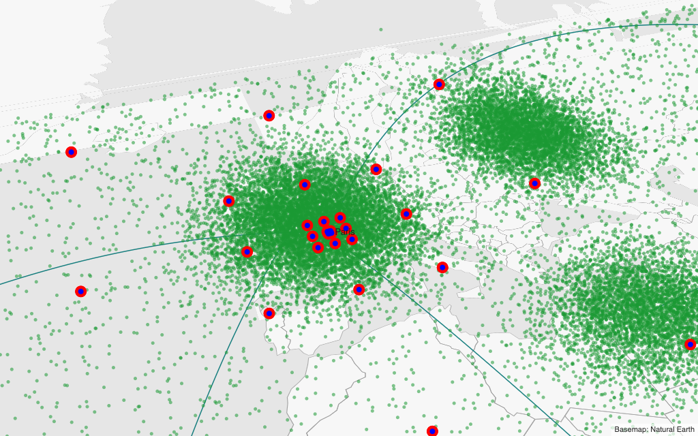

# Spike G: a Holochart layer over MapLibre GL, two ways

- **Backlog:** GEO1 ("Decisions and spikes" of the geographic-charts epic); informs the "map
  renderer integration" ADR for the `traces-map` package (`scattermap`, `choroplethmap`,
  `densitymap`, GEO9).
- **Status:** Measured on 2026-10-03 and 2026-10-04. What was not measured is listed at the end.
- **Page:** [`examples/_spikes/g-maplibre.ts`](../../examples/_spikes/g-maplibre.ts)

## Question

Holochart's primitives have to draw on a MapLibre GL map. There are two ways to do it:

1. **Custom layer.** A MapLibre `CustomLayerInterface` whose `render` draws Holochart primitives
   into MapLibre's own WebGL context: a three `WebGLRenderer` built on the map's canvas and
   context, `resetState()` around every draw, no clear, the camera from MapLibre's matrix.
2. **Overlay canvas.** A normal `RenderRoot` canvas above the map, transparent, pointer events
   passing through, the camera copied from the map.

Which one should `traces-map` use, and what does each cost?

## Setup

|          |                                                                                              |
| -------- | -------------------------------------------------------------------------------------------- |
| Machine  | Apple M1 Max, 64 GB, macOS                                                                   |
| Browser  | Playwright Chromium 153 headless: ANGLE → Metal, and ANGLE → SwiftShader for the CI check    |
| Canvas   | 1024×640 CSS px, DPR 1 and 2                                                                 |
| Versions | MapLibre GL JS 6.11.2, three 0.186                                                           |
| Runner   | [`scripts/run-spike.mjs`](scripts/run-spike.mjs), one run per browser, peak RSS 0.7–1.5 GB   |
| Data     | 100,000 markers (5 px) at lon/lat, 8 great-circle lines (776 vertices), 57 reference points  |
| Basemap  | A local style object: a background layer and GeoJSON sources from world-atlas 110m. No tiles |

Both ways draw the same scene with Holochart's real primitives (`MarkerSet`, `LinePrimitive`,
`TextPrimitive`). Positions are web-mercator coordinates in the unit square, and the camera's
`projectionMatrix` is MapLibre's `defaultProjectionData.mainMatrix`. Markers and lines already
size themselves in screen px under any clip matrix, so no shader was changed.

**How alignment was measured.** MapLibre draws the reference points as red circles (a `circle`
layer), Holochart draws the same points as blue markers, and everything else on the page is grey
or green. After each frame the canvases are read back and the coverage-weighted centroid of red
and of blue is taken around each point. "Drift" is the distance between the two centroids, so it
is what is on screen, not what two APIs report. The floor of the method is MapLibre's circle
against `map.project`: 0.01–0.10 px.

**How frame cost was measured.** As in spikes A and B: frames are drawn back to back, each
followed by a GPU sync on every context involved, so the time is throughput and is not capped by
vsync. The camera moves centre, zoom, bearing and pitch (0–50°) on every frame. A second run uses
a real `easeTo` under `requestAnimationFrame`.

Reproduce (the sandbox dev server on port 5197, as in the [README](README.md)):

```bash
# alignment, contexts, picking, export; add --dpr 2 or --gl swiftshader
node docs/spikes/scripts/run-spike.mjs --spike g-maplibre --out /tmp/spikes \
  --params 'mode=custom&test=contexts,diag,sync,pick,export&scale=1' --capture /tmp/spikes/custom.png
node docs/spikes/scripts/run-spike.mjs --spike g-maplibre --out /tmp/spikes \
  --params 'mode=overlay&test=contexts,diag,sync,pick,export&scale=1&cam=steep' --capture /tmp/spikes/overlay.png
# frame cost: mode=map | custom | overlay | overlay&shared=1 | native, each at --dpr 1 and 2
node docs/spikes/scripts/run-spike.mjs --spike g-maplibre --out /tmp/spikes --dpr 2 \
  --params 'mode=overlay&test=perf&scale=1'
node docs/spikes/scripts/run-spike.mjs --spike g-maplibre --out /tmp/spikes \
  --params 'mode=custom&test=perf&points=1000000&scale=1'
# frame order under a real animation
node docs/spikes/scripts/run-spike.mjs --spike g-maplibre --out /tmp/spikes \
  --params 'mode=overlay&sync=raf&ownloop=1&test=lag&scale=0.05'
# float32 origin, world copies, globe
node docs/spikes/scripts/run-spike.mjs --spike g-maplibre --out /tmp/spikes \
  --params 'mode=both&rtc=far&test=sync&scale=0.05'
node docs/spikes/scripts/run-spike.mjs --spike g-maplibre --out /tmp/spikes \
  --params 'mode=custom&proj=globe&test=sync&scale=0.1&cam=far' --capture /tmp/spikes/globe.png
# events, context loss, destroy order, a dashboard of maps
node docs/spikes/scripts/run-spike.mjs --spike g-maplibre --out /tmp/spikes \
  --params 'mode=overlay&test=events,loss,destroy&scale=0.02'
node docs/spikes/scripts/run-spike.mjs --spike g-maplibre --out /tmp/spikes \
  --params 'mode=overlay&shared=auto&test=dashboard&maps=5&scale=0.05'
```

Start at `scale=0.05`. Every step has a time limit, and a watchdog (`&watchdog=` seconds, default 150) ends the run with the name of the step it was in.

## Comparison

| Criterion                                 | Custom layer (map's context)                                                                                                                | Overlay canvas (`RenderRoot` above the map)                                                                       |
| ----------------------------------------- | ------------------------------------------------------------------------------------------------------------------------------------------- | ----------------------------------------------------------------------------------------------------------------- |
| Works with `RenderRoot` today             | No. `RenderRoot` owns its canvas, clears it, runs its own loop and loses the context on destroy. The spike assembled its own root.          | Yes, unchanged: a 2D viewport with a `ViewportProjector` whose camera carries the map's matrix.                   |
| WebGL contexts, one map (layer alone)     | 2: map, troika                                                                                                                              | 3: map, chart, troika                                                                                             |
| WebGL contexts, 6 maps                    | 7                                                                                                                                           | 13 dedicated, 12 with `shared: 'auto'`, 8 all shared                                                              |
| 9 maps                                    | 10, none lost                                                                                                                               | 19 dedicated: the browser dropped 3, among them the first map                                                     |
| Drift, zoom 1.5–8.6, bearing, pitch ≤ 60° | median 0.03 px, max 0.10 px                                                                                                                 | median 0.05 px, max 0.13 px                                                                                       |
| Drift, pitch 70–85°                       | median 0.04 px, max 0.08 px                                                                                                                 | median 0.05 px, max 0.13 px                                                                                       |
| Drift, zoom 12–19                         | median 0.04 px, max 0.06 px (origin near the view); 0.45 px at zoom 19 with a world-wide origin                                             | the same numbers                                                                                                  |
| Frames behind during `easeTo`             | 0 of 90, by construction                                                                                                                    | 0 of 90 when drawn in the map's `render` event; 46 of 91 (or all 91) when the chart schedules its own frame       |
| World copies (zoom 0.6, antimeridian)     | 8 of 16 with one draw; 16 of 16 with one draw per copy (three lines in the layer)                                                           | 8 of 16; `RenderRoot` draws a viewport once                                                                       |
| Globe projection                          | Lines up (≤ 0.09 px) with unit-sphere positions while the globe is shown; draws the far side; nothing right once MapLibre goes to mercator. | The same                                                                                                          |
| Frame, 100k markers, DPR 1 (median / p95) | 1.6 / 2.6 ms (map alone 1.0 / 1.5)                                                                                                          | 2.9 / 4.2 ms; shared renderer 2.7 / 3.9 ms                                                                        |
| Frame, 100k markers, DPR 2                | 1.8 / 2.8 ms (map alone 1.4 / 1.9)                                                                                                          | 2.8 / 4.4 ms; shared renderer 3.4 / 3.9 ms                                                                        |
| Frame, 1M markers, DPR 1 / DPR 2          | 5.8 / 6.1 ms                                                                                                                                | 6.8 / 7.9 ms (7.5 ms at DPR 2 without MSAA)                                                                       |
| Marker size under pitch                   | constant: 50.5–50.6 px² for an 8 px marker at every pitch                                                                                   | the same                                                                                                          |
| Anti-aliasing                             | The map's: no MSAA by default. Markers and lines are anti-aliased in the shader; fills are not.                                             | The chart's own: 4× MSAA by default                                                                               |
| Layer order                               | Anywhere in the map's layer stack (the spike draws markers under MapLibre's circles and reference marks above them)                         | Always above every map layer                                                                                      |
| Export, one PNG                           | `map.redraw()` then `toDataURL` in the same task: map and chart, 23 ms. The attribution is DOM and still has to be drawn on a 2D canvas.    | Redraw both, `drawImage` both onto a 2D canvas, write the attribution: 18 ms                                      |
| Export at another size or scale           | The layer cannot be drawn anywhere but the map's canvas: resize the map, redraw, put it back (64 ms at 2×)                                  | The same for the map (83 ms at 2×); the chart layer could also go through the shared renderer as other exports do |
| CPU hover (index in mercator)             | 4–5 µs per pointer move at pitch ≤ 60°, 0.45 ms at pitch 80°; 0 wrong of 200                                                                | the same code, the same numbers                                                                                   |
| GPU ID picking                            | Has to draw inside the map's `prerender`: 16 ms per pick (it waits for a map frame)                                                         | `GpuPicker` unchanged: 5 ms per pick                                                                              |
| Pointer events                            | The map's canvas is the only target                                                                                                         | `pointer-events: none` on the overlay; `elementFromPoint` returns the map's canvas, drag and wheel work           |
| Resize                                    | One canvas; three is told the new size in `prerender`                                                                                       | Two observers; both canvases 778×432 for a 777.5×431.5 container, drift 0.05 px after                             |
| Map context lost and restored             | MapLibre removes the custom layers (calls `onRemove`) and does not restore them: the layer and all its GPU state are rebuilt and re-added   | The chart keeps its context and its buffers. Only the matrix probe layer has to be re-added.                      |
| Chart context lost                        | Cannot happen separately                                                                                                                    | The map keeps drawing; the chart redraws on restore                                                               |
| Destroy                                   | Layers first, then the map. `map.remove()` alone never calls `onRemove`.                                                                    | Either order. 0 contexts left after 4 rounds in both ways.                                                        |
| GL state                                  | Shared: 62 GL calls when three starts, 178 per frame for `resetState()` (16 µs), and every draw outside `render`/`prerender` is a hazard    | Not shared                                                                                                        |
| SwiftShader (10k markers)                 | Lines up (≤ 0.10 px), export correct, 248 ms per frame                                                                                      | Lines up (≤ 0.11 px), export correct, 315 ms per frame                                                            |



Custom layer at pitch 50°. Red discs are MapLibre's, the blue marks on them are Holochart's. The
overlay at pitch 80°: [capture](img/g-overlay-canvas-pitch80.png).

## Numbers

### Camera sync

Seventeen camera states, reached with `jumpTo`, measured after `idle`. Drift in px between
MapLibre's circle and Holochart's marker, 8 reference points per state:

| Camera states                        | Custom layer: median / max | Overlay: median / max |
| ------------------------------------ | -------------------------- | --------------------- |
| zoom 1.5, 3, 5.25, 8.6               | 0.03 / 0.09                | 0.05 / 0.10           |
| bearing 30°, 137°, −75°              | 0.03 / 0.10                | 0.05 / 0.09           |
| pitch 30°, 45°, 60° with bearing     | 0.03 / 0.07                | 0.06 / 0.13           |
| pitch 70°, 80°, 85°                  | 0.04 / 0.08                | 0.05 / 0.13           |
| zoom 12, 16, 16 at pitch 50°, 19     | 0.04 / 0.06                | 0.04 / 0.06           |
| the same 17 states at DPR 2          | 0.02 / 0.07                | 0.02 / 0.07           |
| the same 17 states under SwiftShader | 0.04 / 0.10                | 0.05 / 0.11           |

At pitch 85° only 6 of 8 points could be measured: the others were too close to a neighbour on
screen.

**Frame order.** During a 1.5 s `easeTo` over centre, zoom, bearing and pitch, the matrix the
map drew with was compared with the one the chart drew with after every frame's callbacks:

| How the overlay is drawn                                       | Frames behind | Offset on those frames   |
| -------------------------------------------------------------- | ------------- | ------------------------ |
| In the map's `render` event (`root.renderNow()`)               | 0 of 90       | 0 px                     |
| The same, while the chart's own loop is animating              | 0 of 90       | 0 px                     |
| `move` → `root.invalidate()`, the chart draws in its own frame | 46 of 91      | median 3 px, max 109 px  |
| The same, while the chart's own loop was already animating     | 91 of 91      | median 15 px, max 127 px |
| Custom layer                                                   | 0 of 90       | 0 px                     |

A frame requested from inside the map's frame runs one frame later, so the naive overlay shows
every other frame late; if the chart's loop is already running, its callback is queued ahead of
the map's and every frame is late. Drawing inside the map's `render` event removes the question.
Both ways held 60 Hz in this run (frame interval median 16.7 ms, p95 16.7–16.8 ms, at 100k
markers and DPR 1 and 2).

**Where the matrix comes from.** MapLibre 6 has no public accessor for the camera transform
outside a custom layer (`map.transform` of earlier versions is gone; the spike reached it through
`map._camera` for the naive case only). The public source is the argument of a custom layer's
`render`. The overlay therefore adds a custom layer that draws nothing and copies
`defaultProjectionData.mainMatrix` each frame. `map.project` per point is the other public way:
15.2 ms for 100k points per frame, against 2.2–2.9 ms for the same points through the matrix in
JS, and nothing on the CPU when the matrix goes to the shader.

**Float32 positions.** Primitives upload positions relative to a float64 origin
([`precision.ts`](../../packages/render/src/precision.ts)). The spike translates the camera matrix
to the view centre in float64, so the error left is that of the float32 delta from the origin:

| Origin of the reference markers                 | Drift at zoom 16 | Drift at zoom 19 |
| ----------------------------------------------- | ---------------- | ---------------- |
| Their own centre (the points are near the view) | 0.03 px          | 0.06 px          |
| The centre of the world (a world-wide trace)    | 0.10 px          | 0.45 px          |
| Re-encoded at the view centre                   | 0.03 px          | 0.06 px          |

The point measured is 0.15 of the world from the origin; one at the far side would be about
three times worse. Re-encoding 100k markers around a new origin took 4.5–6.2 ms including the
upload and the next frame. Both ways are affected equally.

**World copies.** At zoom 0.6 across the antimeridian MapLibre draws every reference point twice
(16 discs). One draw of the Holochart scene covers 8. The custom layer draws the scene once per
visible copy with a shifted matrix and gets 16; under `RenderRoot` a viewport is drawn once.

**Globe.** With `projection: { type: 'globe' }` the matrix projects the unit sphere. With
positions converted to MapLibre's sphere convention both ways line up while the globe is shown
(median 0.03 px, max 0.09 px, zoom 1.5 to 8.6, pitch 0 and 40°). Two things are wrong:

- MapLibre hides what is behind the horizon; Holochart drew all 17 of the 17 far-side reference
  points ([capture](img/g-globe-far-side.png)). The horizon plane is in the same projection data
  (`clippingPlane`) but the primitives have nowhere to use it.
- At zoom 12 MapLibre has switched to mercator (`projectionTransition` 0) and the sphere
  positions land nowhere: 0 of 8 drawn in place. In between, MapLibre blends the two projections
  in its vertex shader.

So the honest scope for a first version is mercator. The globe needs MapLibre's projection code
in Holochart's vertex shaders (the custom layer arguments carry it as `shaderData`) and a clip
against the horizon.

### Frame cost

Median and p95 of the GPU-synced frame, in ms, Metal:

| 100k markers                               | DPR 1: median / p95 | DPR 2: median / p95 | CPU per frame |
| ------------------------------------------ | ------------------- | ------------------- | ------------- |
| MapLibre alone                             | 1.0 / 1.5           | 1.4 / 1.9           | 0.3–0.4       |
| Custom layer                               | 1.6 / 2.6           | 1.8 / 2.8           | 0.6           |
| Overlay canvas                             | 2.9 / 4.2           | 2.8 / 4.4           | 0.7           |
| Overlay canvas through the shared renderer | 2.7 / 3.9           | 3.4 / 3.9           | 0.8           |
| The points as a MapLibre `circle` layer    | 1.5 / 2.5           | 1.2 / 2.0           | 0.3–0.4       |

| 1M markers                  | DPR 1: median / p95 | DPR 2: median / p95 |
| --------------------------- | ------------------- | ------------------- |
| Custom layer                | 5.8 / 8.4           | 6.1 / 8.8           |
| Overlay canvas              | 6.8 / 9.5           | 7.9 / 10.5          |
| Overlay canvas without MSAA | not run             | 7.5 / 10.0          |

- The overlay costs 1.0–1.8 ms more per frame than the custom layer on this machine. Part of that
  is the measurement: the overlay run syncs two contexts per frame. What the browser's compositor
  pays for one more full-size layer is not in these numbers.
- In the custom layer, `resetState()` is 0.016 ms per frame (four resets: two layers, before and
  after) and the three draw calls 0.11 ms of CPU. A whole frame is 561 GL calls against 244 for
  the map alone; 178 of the difference are the resets.
- Under SwiftShader the marker shader is the cost in both ways: 248 ms (custom) and 315 ms
  (overlay) per frame with 10k markers, against 28 ms for the map alone. It is not the
  integration: spike A's page draws 10k markers in 390 ms per frame under SwiftShader without any
  map.

### Export

Every image was decoded again and its pixels counted (land, sea, MapLibre's red, Holochart's
green and blue), at 1024×640:

| What was captured                                     | Map | Chart (custom layer) | Chart (overlay) |
| ----------------------------------------------------- | --- | -------------------- | --------------- |
| Map canvas, `toDataURL` right after `map.redraw()`    | yes | yes                  | no              |
| Map canvas inside the `render` event                  | yes | yes                  | no              |
| Map canvas two frames later                           | no  | no                   | no              |
| Redraw, then both canvases onto a 2D canvas           | yes | yes                  | yes             |
| The same at 2× (`map.setPixelRatio`, redraw, restore) | yes | yes                  | yes             |
| The same with a tile source that never answers        | yes | yes                  | yes             |

- `preserveDrawingBuffer` is not needed in either way: redraw and read in the same task. Without
  the redraw the canvas reads back empty.
- The attribution control is a DOM element. Neither canvas contains it, so the export has to
  write its text onto the 2D canvas in both ways. That removes the one-canvas advantage of the
  custom layer as soon as attribution is required, and GEO9 requires it.
- With a raster source that never answers, `idle` never fires. Waiting for `idle` with a 1.5 s
  limit and exporting anyway gave a complete image (`areTilesLoaded()` was false).
- An export larger than the screen means resizing the live map and waiting for it. A second,
  hidden map would avoid the flicker and costs one more context; not tried.

### Picking

100k points, 2,000 pointer positions, radius 8 px, checked against a brute-force pass over every
point:

| Camera               | Index in mercator, refined on screen | Candidates per query | One fixed radius in mercator (ADR-010 as is) | Brute force | `queryRenderedFeatures` (points as a MapLibre layer) |
| -------------------- | ------------------------------------ | -------------------- | -------------------------------------------- | ----------- | ---------------------------------------------------- |
| flat, zoom 3         | 4.3 µs, 0 wrong of 200               | 7.6                  | 2–3 µs, 0 wrong                              | 0.5–0.7 ms  | 0.12 ms                                              |
| pitch 60°, zoom 3    | 5.0 µs, 0 wrong                      | 17.7                 | 0.9 µs, 51 wrong of 200                      | 0.8 ms      | 0.10 ms                                              |
| pitch 80°, zoom 5.25 | 0.45 ms, 0 wrong                     | 2,150                | 0.8 µs, 76 wrong of 200                      | 1.1 ms      | 0.42 ms                                              |

- The index (`PointIndex`, 29 ms to build) holds mercator coordinates. A query unprojects the
  four corners of the pointer's box with `map.unproject`, searches that rectangle, and measures
  the candidates on screen through the matrix. That is exact at every pitch.
- Under pitch a pixel covers more ground the further away it is, so one radius in data units
  (what a flat axis uses) is wrong: 51 and 76 of 200 answers at pitch 60° and 80°.
- Near the horizon the pointer's box covers a large part of the map and the index returns
  thousands of candidates. At pitch 80° the query costs as much as half a brute-force pass. It
  still fits a pointer move; `maxPitch` is 60° by default.
- GPU ID picking (`GpuPicker`) works with the map's matrix in both ways. It agreed with the
  nearest centre in 31–34 of 40 picks on this dense data: it returns what is drawn on top, the
  index returns the nearest centre. In the overlay's context a pick takes 5 ms. In the map's
  context it has to draw during `prerender`, so it waits for a map frame: 16 ms, and every pick
  repaints the map. A pick drawn outside the map's frame, with `resetState()` before and after,
  did not disturb the next map frame in this style; MapLibre caches GL state and only
  invalidates it after a custom layer callback, so this is not something to rely on.
- `queryRenderedFeatures` only knows MapLibre's own layers. It is of use for the basemap
  ("which country is under the pointer"), not for Holochart's traces.

### Events and ownership

- **Pointer.** The map owns drag, scroll, pinch and keyboard. With `pointer-events: none` on the
  overlay (placed inside the map's container, under its controls) the element under the pointer
  is the map's canvas. A synthetic drag moved the centre by 9.8° and fired `movestart`,
  `dragstart`, `dragend`, `moveend`; a wheel event zoomed by 0.40 and fired `movestart`,
  `zoomstart`, `zoomend`, `moveend`. Hover comes from the map's `mousemove`, in both ways.
- **`relayout`.** A drag fired 21 `move` events and one `moveend`. One `relayout` per `moveend`
  with `map.center`, `map.zoom`, `map.bearing` and `map.pitch` matches what Plotly emits; `move`
  would be the `relayouting` stream.
- **Context loss.** When the map's context is lost MapLibre destroys its style, calls `onRemove`
  on custom layers and warns that they "cannot be restored". After the restore the map draws
  again without them. A custom-layer integration has to rebuild its renderer and primitives and
  add the layers again (it then drew 8 of 8). The overlay kept its context and its buffers, and
  only the probe layer had to be added again. Losing the overlay's own context left the map
  drawing; the chart redrew on restore.
- **Destroy.** `map.remove()` loses the context but does not call `onRemove`. If the layers are
  removed first, three reports 0 geometries and 0 programs left (1 texture, not traced); if the
  map is removed first, nothing of Holochart's is disposed (4 geometries, 2 textures, 3 programs
  still counted), which only matters for the JS objects since the context is gone. Four create
  and destroy rounds left 0 live contexts in both ways.
- **Initialisation trap (custom layer).** three sets GL state when its renderer is constructed
  (62 calls). MapLibre does not know, and draws its next layers with a stale state cache unless
  that happens inside `prerender` or `render`, after which MapLibre marks its cache dirty. The
  same holds for resizing three's idea of the canvas. In Chromium, assigning the canvas its own
  size did not clear the frame.
- **Invalidation trap (custom layer).** Primitives call `context.invalidate()` when a uniform
  changes, and the camera offset changes on every frame. If `invalidate` is wired to
  `map.triggerRepaint()` the map repaints forever; invalidations raised during the layer's own
  draw have to be dropped.
- **Depth and stencil (custom layer).** MapLibre disables the stencil test and gives a 2D custom
  layer a read-only depth mode; three's `resetState()` then turns the depth test off. With the
  depth test on in Holochart's materials nothing changed in the 17 measured states. The spike
  draws with it off. Terrain and `fill-extrusion` layers write real depth; not tried.
- **Alpha.** Both canvases are premultiplied. Holochart's materials blend straight-alpha colours
  with separate factors, which is what MapLibre's documentation asks of a custom layer. No
  change was needed.

### Contexts and ADR-023

The census wraps `getContext` and counts live contexts:

| Page                                | Custom layer | Overlay, own context | Overlay, `shared: 'auto'` | Overlay, all shared |
| ----------------------------------- | ------------ | -------------------- | ------------------------- | ------------------- |
| 1 map                               | 2            | 3                    | not run                   | 3                   |
| 6 maps                              | 7            | 13                   | 12                        | 8                   |
| 9 maps                              | 10           | 19 → 16, 3 lost      | not run                   | not run             |
| The 5 small maps, one frame of each | 8.2 ms       | 10.8 ms              | 11.3 ms                   | 8.9 ms              |

One of the contexts is troika's, in every column. The overlay works through the shared renderer
without any change (drift the same, one `drawImage` per frame).

Two things follow for ADR-023:

- Every MapLibre map is a context that the budget (4 dedicated + 1 shared + 1 text) does not
  see. With `'auto'`, six maps give 12 contexts, which is over the mobile limit of 8 and close to
  the desktop limit of 16. A page with maps has to count them: either charts over a map always
  use the shared renderer (8 contexts for six maps), or the budget is told about foreign
  contexts.
- These counts are for the map layer alone. A Holochart figure also draws its legend, colorbar,
  title and any other subplot in WebGL, on the figure's canvas. So a real figure with a map has
  the figure's root in both ways, and the custom layer saves a context only for a figure that
  draws nothing but the map layer. The overlay canvas _is_ the figure's canvas, with the map
  behind one of its viewports.

### MapLibre 6 as an optional peer dependency

- **Format.** ESM only (`exports["."].import`); the `dist` folder has no UMD or CommonJS file.
  `maplibre-gl.mjs` is 590 kB (149.5 kB gzip) and imports `maplibre-gl-shared.mjs`, 516 kB
  (146.9 kB gzip), which the worker loads as well. The worker entry is 19 kB (6.1 kB gzip). The
  CSS is 83 kB (10.5 kB gzip).
- **Worker.** MapLibre looks for `maplibre-gl-worker.mjs` next to `import.meta.url`. Under the
  Vite dev server the main file is pre-bundled, the worker is not next to it, and the map never
  fires `load`. It does not throw: the spike's 15 s limit is what reported it. Importing
  `maplibre-gl/dist/maplibre-gl-worker.mjs?worker&url` and passing it to `setWorkerUrl()` fixed
  it from the spike file, with no change to `apps/sandbox/vite.config.ts`. A production build was
  not tried. `traces-map` should take the worker URL as configuration and put a limit on `load`.
- **Workers and maps.** One worker by default (up to three in Safari), shared by every map on
  the page: `getWorkerCount()` was 1 with seven maps.
- **CSS.** Required for the canvas position and the controls. The spike imports it with
  `?inline` and adds a `<style>` element, which a strict `style-src` refuses; a linked stylesheet
  from the same origin does not have that problem.
- **CSP.** `worker-src 'self'` when the worker file is on the page's origin. For a worker URL on
  another origin MapLibre wraps it in a blob, which needs `worker-src blob:`. No `eval` or
  `new Function` in the three files, so no `unsafe-eval`. `connect-src` is needed for whatever
  the style fetches (tiles, glyphs, sprites); the offline style fetches nothing.
- **Import side effects.** `import('maplibre-gl')` in Node took 55 ms and touched no DOM;
  constructing a `Map` throws there (`document is not defined`). In the browser the import took
  60–200 ms from the dev server, and a map with the offline style reached `idle` 260–530 ms later.
- **Changes from earlier versions that matter here.** `render(gl, options)` has the matrices in
  `options.defaultProjectionData`; `map.transform` is no longer public; a mouse drag ends on
  `mouseup` at the map element, not at the document.
- **SwiftShader.** MapLibre works and draws the same positions (drift ≤ 0.11 px). It logs
  ReadPixels stall warnings, and the first frame with 10k Holochart markers took 3–10 s.
- **A keyless, offline style** can show a background, GeoJSON fills, lines and circles (also
  extrusions and heatmaps, not tried). It cannot show place names or road labels (symbol layers
  need glyph files from a URL), icons (sprites), raster or vector tiles, or terrain. world-atlas
  110m land shows slivers near the poles at pitch (visible at the top of the first capture).

## Findings

1. **Both ways line up with MapLibre to about a tenth of a pixel** at every zoom, bearing and
   pitch tried, at DPR 1 and 2, on Metal and SwiftShader, with marker sizes constant under
   pitch, and without changing a shader. Alignment does not separate them.
2. **`RenderRoot` cannot be hosted in another library's context today.** It appends and sizes
   the canvas, clears colour, depth and stencil at the start of every frame, schedules its own
   frames, and forces a context loss on destroy. The custom layer needs a second kind of root in
   `packages/render`, and three shared-state rules that are easy to break (initialise in
   `prerender`, drop invalidations raised while drawing, draw nothing outside the map's
   callbacks).
3. **The overlay needed nothing from `packages/render`.** The 2.5D projector hook on `Viewport`
   takes a full 4×4, the shared renderer works, `GpuPicker` works, context loss is independent.
4. **The overlay must be drawn from the map's `render` event.** Scheduling its own frame on
   `move` leaves it a frame behind on half of the frames or on all of them.
5. **The custom layer is cheaper per frame** by 1.0–1.8 ms here, has no MSAA of its own, and can
   sit between map layers. The overlay is always on top.
6. **The context count favours the custom layer only for the layer alone.** A figure has its own
   canvas for everything else it draws. What matters more is that maps are outside ADR-023's
   budget in both ways.
7. **Export is a 2D composite in both ways** once the attribution has to be in the image, and it
   must not wait for `idle` without a limit.
8. **Hover needs a projected refinement.** A CPU index in mercator space is exact and takes
   microseconds up to pitch 60°; a fixed radius is wrong under pitch.
9. **Shared by both ways, and not solved by either:** world copies, the globe, and float32
   precision past zoom 16 for world-wide traces.

## Recommendation

**Use the overlay canvas, drawn synchronously from the map's `render` event.** In a figure that
means: the MapLibre map is a DOM layer behind the figure's canvas, and the map subplot is a
viewport of the figure's `RenderRoot` whose camera is the map's matrix.

Reasons:

- It is what the renderer already is. One canvas per figure (ADR-004), the shared renderer and
  its budget (ADR-023), picking (ADR-010), export and context loss all keep working, and the
  spike changed nothing in `packages/render` to get there.
- The figure needs its canvas anyway for the legend, colorbar and title, so the custom layer
  would add a second way to draw rather than remove a context.
- Its failures are contained. A lost map context does not take the chart's buffers with it, and
  nothing Holochart does can corrupt MapLibre's GL state.
- The frame cost is small against a 16.7 ms frame: about 3 ms for 100k markers and 7–8 ms for 1M
  on this machine, with 60 Hz held.

What it gives up:

- **Layer order.** Chart layers cannot go under map labels or between map layers. Plotly's
  `below` attribute on map traces cannot be honoured.
- **1–2 ms per frame** and one more full-size compositor layer.
- **A probe.** The matrix comes from a no-op custom layer, which has to be re-added after a
  context restore, or from a private field.
- **World copies** need a change in `RenderRoot` that the custom layer does not.

**The strongest argument against it** is layer order together with MapLibre's own design: the
custom layer is the interface MapLibre provides for exactly this, it is the only way to draw
beneath the basemap's labels, it is the cheapest per frame, and a map without labels above the
data looks worse than Plotly's. If `below` or labels over data turn out to matter, the hosted
root described below is the price, and it can be added later as an option without changing how
traces are written, since both ways draw the same primitives through the same matrix.

Not chosen, but measured: drawing the points as MapLibre layers, as Plotly's `scattermap` does,
costs the same per frame as the custom layer (1.5 ms at 100k) and gets labels and world copies
for free. It gives up Holochart's markers, colorscales, picking and export paths, and 100k points
as GeoJSON raised the browser's memory from 0.75 to 1.45 GB.

## Changes in `packages/render`

For the recommended way (overlay):

1. **A viewport with an external camera.** It works today through `Viewport.projector`
   ([`core/viewport.ts`](../../packages/render/src/core/viewport.ts)), a hook written for the
   2.5D view and typed as `OrthographicCamera | PerspectiveCamera`. Make it a supported input: a
   camera whose `projectionMatrix` is set from outside, with `project` and `unproject` for
   pointers.
2. **More than one pass per viewport.** `RenderRoot.#render`
   ([`core/render-root.ts`](../../packages/render/src/core/render-root.ts)) calls
   `renderer.render(vp.scene, vp.camera)` once. World copies need the scene drawn once per
   visible copy with a shifted matrix (or the wrap done in the vertex shader).
3. **The origin has to follow the view.** `MarkerSet` accepts `origin` and re-encodes;
   `LinePrimitive` has no such input (`LineGeometryInput` in
   [`primitives/line-buffers.ts`](../../packages/render/src/primitives/line-buffers.ts) computes
   the origin from the data). Either add it and re-encode when the view centre moves far at high
   zoom, or do the hi/lo split that [`precision.ts`](../../packages/render/src/precision.ts)
   defers.
4. **Foreign contexts in the budget.** `trackDedicatedContext` in
   [`core/shared-renderer.ts`](../../packages/render/src/core/shared-renderer.ts) is internal, so
   `shared: 'auto'` cannot know about maps. Export a way to reserve a context, or make map
   figures share by default.
5. **Text.** Billboard and screen sizing in
   [`primitives/text.ts`](../../packages/render/src/primitives/text.ts) derive px sizes from a
   standard projection matrix (`worldPerPixel`), which the map's matrix is not. The spike
   projects label anchors on the CPU and draws the text in a second, pixel-space viewport. That
   needs no change, but it is the pattern `traces-map` has to follow.
6. **Globe, if wanted.** A hook in `hcDataToClip`
   ([`primitives/common.glsl.ts`](../../packages/render/src/primitives/common.glsl.ts)) and in the
   marker vertex shader ([`markers/markers.glsl.ts`](../../packages/render/src/markers/markers.glsl.ts))
   for MapLibre's projection code and horizon plane.

For the custom layer, all of the above except item 2, and in addition:

7. **A hosted root.** `RenderRoot`'s constructor, `#applySize`, `#render` and `destroy` assume
   ownership: `container.appendChild(canvas)`, `renderer.setSize(…, true)`,
   `renderer.clear(true, true, true)`, an own `RenderLoop`, `forceContextLoss()` and
   `canvas.remove()`. `createRenderer` lets a caller supply the renderer but changes none of
   that. A hosted root takes a renderer on a foreign canvas, never clears, never schedules
   (`invalidate` goes to the host, and is dropped while drawing), exposes a draw call wrapped in
   `resetState()`, takes its size from the host, and disposes resources without touching the
   context.
8. **Depth test as an option on every primitive.** `createPrimitiveMaterial`
   ([`primitives/common.ts`](../../packages/render/src/primitives/common.ts)) turns it on;
   `MarkerSet` has an option, `LinePrimitive` does not (the spike set it on the material).
9. **Fill edges.** The fill fragment shader has no anti-aliasing of its own
   ([`primitives/fill.glsl.ts`](../../packages/render/src/primitives/fill.glsl.ts)); it relies on
   MSAA, which the map's context does not have unless the map is created with `antialias: true`.
10. **Picking and export.** `GpuPicker` has to be driven from `prerender`, and image export
    cannot redraw the map layer through the shared renderer.

## Not measured

- Firefox and Safari; a real mobile device; context limits other than Chromium's 16.
- What the compositor pays for the second canvas, and power use.
- A production build with MapLibre as an external peer (worker URL, chunking). Bundle sizes are
  in `docs/release/bundle-size.md`.
- A style with tiles, glyphs or sprites; terrain; `fill-extrusion`; `densitymap` (a float render
  target) in either context.
- `choroplethmap` fills, so the missing MSAA in the map's context was read from the shader, not
  seen.
- Touch gestures, and real (not synthetic) pointer input.
- GPU picking and context loss with the overlay on the shared renderer.
- Fractional device pixel ratios, where MapLibre rounds the canvas size and three floors it.
- MapLibre's `setFontFaces` as a way to get labels without a glyph URL.
