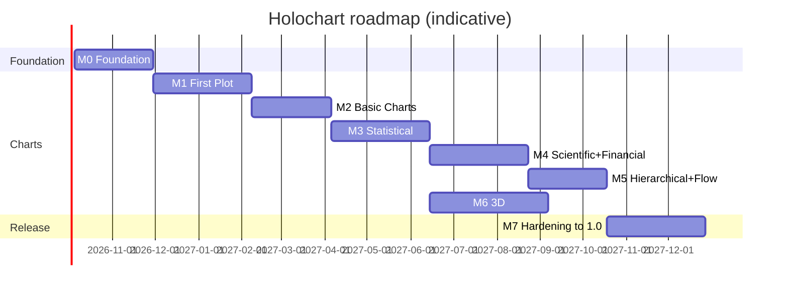
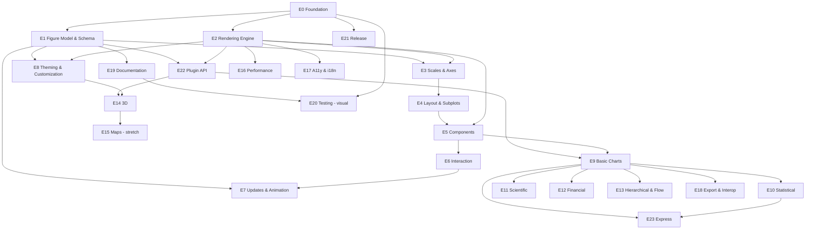

# Holochart — A Declarative Charting Toolkit Built on three.js

> **Name:** Holochart · npm `@mk7s/holochart` (sub-packages `@mk7s/holochart-*`, published from the `mk7s` npm org), global `Holochart`, Express shorthand `hx`
> **Home:** [mk7s.dev/holochart](https://mk7s.dev/holochart) (docs, gallery, playground) · GitHub [github.com/holochart](https://github.com/holochart)
> **Status:** Planning · **Plan version:** 1.1 · **Last updated:** 2026-09-23
> **Goal in one sentence:** Plotly-level chart coverage and d3-level control, rendered entirely on the GPU with three.js, so every chart can be 2D, 3D, or anything in between.

---

## Table of Contents

1. [Vision & Goals](#1-vision--goals)
2. [Scope](#2-scope)
3. [Guiding Principles](#3-guiding-principles)
4. [Architecture Overview](#4-architecture-overview)
5. [Technology Stack](#5-technology-stack)
6. [Architecture Decision Records (ADRs)](#6-architecture-decision-records-adrs)
7. [Public API Design](#7-public-api-design)
8. [The Customization Model](#8-the-customization-model)
9. [Planning Conventions](#9-planning-conventions)
10. [Epics & Stories](#10-epics--stories)
    - [E0 — Project Foundation & Tooling](#e0--project-foundation--tooling)
    - [E1 — Figure Model, Schema & Validation](#e1--figure-model-schema--validation)
    - [E2 — Rendering Engine](#e2--rendering-engine)
    - [E3 — Scales, Axes & Cartesian Coordinates](#e3--scales-axes--cartesian-coordinates)
    - [E4 — Layout Engine & Subplots](#e4--layout-engine--subplots)
    - [E5 — Chart Components](#e5--chart-components)
    - [E6 — Interaction](#e6--interaction)
    - [E7 — Updates, Transitions & Animation](#e7--updates-transitions--animation)
    - [E8 — Theming & Deep Customization](#e8--theming--deep-customization)
    - [E9 — Basic Charts](#e9--basic-charts)
    - [E10 — Statistical Charts](#e10--statistical-charts)
    - [E11 — Scientific Charts](#e11--scientific-charts)
    - [E12 — Financial Charts](#e12--financial-charts)
    - [E13 — Hierarchical & Flow Charts](#e13--hierarchical--flow-charts)
    - [E14 — 3D Charts](#e14--3d-charts)
    - [E15 — Maps & Geo (Stretch)](#e15--maps--geo-stretch)
    - [E16 — Performance & Scalability](#e16--performance--scalability)
    - [E17 — Accessibility & Internationalization](#e17--accessibility--internationalization)
    - [E18 — Export & Interoperability](#e18--export--interoperability)
    - [E19 — Documentation System & Site](#e19--documentation-system--site)
    - [E20 — Testing & Quality Assurance](#e20--testing--quality-assurance)
    - [E21 — Packaging, Release & Distribution](#e21--packaging-release--distribution)
    - [E22 — Plugin & Extensibility API](#e22--plugin--extensibility-api)
    - [E23 — Express API (High-Level Charts)](#e23--express-api-high-level-charts)
11. [Milestones & Roadmap](#11-milestones--roadmap)
12. [Plotly Parity Matrix](#12-plotly-parity-matrix)
13. [Dependency Graph](#13-dependency-graph)
14. [Definition of Done](#14-definition-of-done)
15. [Risks & Mitigations](#15-risks--mitigations)
16. [Open Questions](#16-open-questions)
17. [Glossary](#17-glossary)

---

## 1. Vision & Goals

### 1.1 Vision

Plotly.js gives developers a huge catalogue of chart types behind a declarative JSON spec. d3.js gives developers control over every pixel. Both are built mainly on SVG and DOM, and each uses WebGL only for certain trace types (`scattergl`, `scatter3d`, `surface`, etc.).

**Holochart** keeps the declarative model and aims for the same chart coverage, but puts everything on one GPU rendering path built on three.js. That brings three benefits:

- **Performance by default:** every trace is instanced or batched GPU geometry. There's no separate "SVG vs GL" split for users to learn.
- **Dimensional freedom:** every 2D chart can be extruded, tilted, lit, and animated in 3D. Every 3D chart uses the same axes, legend, hover, and theming as the 2D charts.
- **Deep customization:** users can change styles through themes and templates, per-point data, style functions, materials, shader hooks, post-processing, or entirely new trace types.

### 1.2 Goals

| # | Goal | Measure of success |
|---|------|--------------------|
| G1 | Cover every Plotly "basic" chart type, then statistical, scientific, financial, hierarchical, and 3D types | Parity matrix (§12) ≥ 90% of P0/P1 rows complete by v1.0 |
| G2 | A declarative, serializable figure spec (`data`, `layout`, `config`, `frames`) that is familiar to Plotly users | Plotly JSON importer renders ≥ 80% of the plotly.js image mock corpus without errors |
| G3 | Customizable at every level | Every visual attribute can be set by theme, trace, per point, or function; material and shader hooks documented |
| G4 | Documentation generated from the source of truth | 100% of schema attributes have generated reference docs; every trace has ≥ 5 live examples |
| G5 | Fast | 1M-point scatter pans at ≥ 50 fps on an M1-class laptop; 100k points first render < 300 ms |
| G6 | Production-grade | Visual regression suite, typed API, accessibility baseline, no memory leaks across create/destroy |

### 1.3 Non-Goals (for v1.0)

- Full pixel-for-pixel replication of Plotly's look. We match Plotly's *semantics* and use our own default look.
- Server-side Python/R/Julia APIs. A Jupyter bridge is a stretch goal (E18).
- Supporting browsers without WebGL2.
- Plotly's deprecated `transforms` API (replaced by data helpers in E23).
- Dash-style app framework.

---

## 2. Scope

### 2.1 Chart Families in Scope

| Family | Chart types | Priority |
|---|---|---|
| **Basic** | Scatter, Line, Bubble, Dot, Filled Area / Stacked Area, Bar (vertical/horizontal/grouped/stacked/relative), Pie / Donut, Table, Gantt / Timeline, Error Bars | **P0** |
| **Statistical** | Histogram, 2D Histogram, 2D Density Contour, Box, Violin, Strip, ECDF, Distplot, Marginal Plots, SPLOM, Parallel Coordinates, Parallel Categories | **P1** |
| **Scientific** | Heatmap, Annotated Heatmap, Contour, Image / imshow, Log axes, Polar / Radar / Wind Rose, Ternary, Quiver, Streamline, Dendrogram, Carpet | **P1–P3** |
| **Financial** | Time Series, OHLC, Candlestick, Waterfall, Funnel, Funnel Area, Indicator (number/delta/gauge/bullet), Range Slider/Selector, Range Breaks | **P1** |
| **Hierarchical & Flow** | Sunburst, Treemap, Icicle, Sankey | **P1** |
| **3D** | Scatter3D, Line3D, Surface, Mesh3D, Cone, Streamtube, Volume, Isosurface, *Bar3D (holochart-exclusive)* | **P1** |
| **Maps** | Scatter Geo, Choropleth, 3D Globe, Tile maps, Density map | **P3 (stretch)** |

### 2.2 Cross-Cutting Capabilities in Scope

Axes (linear, log, date, category, multicategory), subplots and grids, legends, colorbars, annotations, shapes, images, hover labels and templates, zoom/pan/select/lasso, modebar, range sliders, update menus and sliders, transitions and frame animation, themes and templates, export, accessibility, i18n, framework wrappers, a plugin API, and a high-level "Express" API.

---

## 3. Guiding Principles

1. **Schema is the source of truth.** Every attribute is declared once, with its type, default, validation, edit type, and description. TypeScript types, runtime validation, defaults, and docs are all generated from that declaration.
2. **Declarative first, imperative escape hatches always.** The JSON spec covers most use cases. For everything else, users get direct access to the three.js scene, materials, and render hooks.
3. **Pure data pipeline, thin render layer.** Steps that don't touch three.js (defaults → calc → layout) are pure functions, so they can be tested without a GPU and moved to a Web Worker.
4. **Minimal recompute.** Every attribute declares an `editType`, so an update re-runs only the pipeline stages it affects.
5. **One renderer, many viewports.** A figure uses one WebGL context. Subplots are scissored viewports, not separate canvases.
6. **GPU-native primitives.** Markers, lines, bars, and cells are instanced geometry with custom shaders. We never create one `Mesh` per data point.
7. **2D is a special case of 3D.** 2D subplots use a pixel-space orthographic camera, so the same primitives render in both modes and a 2D chart can be "lifted" into 3D.
8. **Docs, examples, and tests are the same artifacts.** Every docs example is also a visual regression test and a gallery thumbnail.
9. **Progressive disclosure.** `newPlot(el, [{x, y}])` should work with no configuration. Advanced options are available but never required.
10. **Accessible by default.** The canvas renders the chart, and a DOM mirror describes it for assistive technology.

---

## 4. Architecture Overview

### 4.1 Monorepo Layout

```
holochart/
├── packages/
│   ├── core/            # Pure, renderer-free: figure model, schema system, validation, defaults,
│   │                    # templates, scales/autorange/ticks, update planner, figure diffing
│   ├── render/          # three.js layer: renderer, viewports, cameras, primitives
│   │                    # (markers, lines, fills, text, meshes), picking, render loop, export
│   ├── runtime/         # createChart / newPlot: pipeline orchestration (defaults → calc → layout →
│   │                    # plot), layout engine, update API, events, registry, interaction dispatch,
│   │                    # and the trace-render / component contracts traces-* and components
│   │                    # implement (ADR-019)
│   ├── components/      # Axes, legend, colorbar, title, annotations, shapes, images,
│   │                    # hover labels, modebar, range slider/selector, updatemenus, sliders
│   ├── traces-basic/    # scatter, bar, pie, table
│   ├── traces-stats/    # histogram(2d), box, violin, splom, parcoords, parcats
│   ├── traces-sci/      # heatmap, contour, image, polar, ternary, quiver, streamline, carpet
│   ├── traces-finance/  # ohlc, candlestick, waterfall, funnel, funnelarea, indicator
│   ├── traces-hier/     # sunburst, treemap, icicle, sankey
│   ├── traces-3d/       # scatter3d, surface, mesh3d, cone, streamtube, volume, isosurface, bar3d
│   ├── traces-geo/      # (stretch) scattergeo, choropleth, globe, tile maps
│   ├── themes/          # built-in templates, palettes, colorscales, font presets
│   ├── express/         # high-level API (hx.scatter(df, {...})), faceting, trendlines
│   ├── compat-plotly/   # Plotly figure JSON importer / attribute mapper
│   ├── react/ vue/ svelte/ web-component/   # framework wrappers
│   └── holochart/        # full bundle (re-exports + registers everything)
├── apps/
│   ├── docs/            # documentation site (VitePress)
│   ├── playground/      # live editor (Monaco + preview + JSON/TS toggle)
│   └── bench/           # performance benchmark harness
├── examples/            # canonical examples: docs + gallery + visual tests (single source)
├── tools/
│   ├── schema-gen/      # schema → TS types, JSON Schema, attribute reference docs
│   ├── gallery-gen/     # Playwright screenshot pipeline → thumbnails + baselines
│   └── mock-runner/     # runs plotly.js mock corpus through compat-plotly
└── plan.md
```

### 4.2 The Rendering Pipeline

```mermaid
flowchart LR
    A[Figure input<br/>data · layout · config · frames] --> B[Validate & Coerce<br/>schema-driven]
    B --> C[Supply Defaults<br/>template merge → fullData / fullLayout]
    C --> D[Calc<br/>bins, stacks, stats, hierarchy,<br/>contours → calcdata]
    D --> E[Layout<br/>subplot domains, autorange,<br/>ticks, automargin]
    E --> F[Scene Build / Diff<br/>trace renderers produce<br/>keyed three.js objects]
    F --> G[Render<br/>on-demand loop, viewports,<br/>post-processing]
    G --> H[Interaction<br/>picking, hover, zoom,<br/>select → events]
    H -- relayout/restyle --> I[Update Planner<br/>editType → minimal stages]
    I --> C
```



| Stage | Pure? | Worker-able? | Owner |
|---|---|---|---|
| Validate & coerce | ✅ | ✅ | `core/schema` |
| Supply defaults | ✅ | ✅ | `core/defaults` + each trace module |
| Calc | ✅ | ✅ | each trace module |
| Layout | ✅ (except text measurement, which uses a cached font-metrics oracle) | ✅ | `core/layout` |
| Scene build/diff | ❌ | ❌ | `render` + each trace module |
| Render | ❌ | OffscreenCanvas (P3) | `render` |

### 4.3 Coordinate Systems

| Space | Description | Used by |
|---|---|---|
| **Data** | Raw values: numbers, dates (ms), categories (index) | Traces, annotations with `xref: 'x'` |
| **Linearized** | Data after the scale transform (log10, category → index, date → ms relative to origin) | GPU vertex buffers |
| **Domain** | 0–1 within a subplot's plotting area | `xref: 'x domain'` |
| **Paper** | 0–1 within the whole figure's plot area (inside margins) | Layout components, `xref: 'paper'` |
| **Pixel / Screen** | CSS pixels from the top-left of the container | Hover, picking, text layout |
| **World (3D)** | Scene units after `aspectmode` normalization | 3D scenes |

**Precision rule:** vertex buffers store values *relative to a per-trace origin* (relative-to-center encoding). This keeps float32 precision for dates in ms and large offsets (see E16.4).

### 4.4 Trace Module Contract (summary; full spec in E22.1)

```ts
interface TraceModule<Attrs, Calc> {
  type: string;                       // 'scatter'
  categories: TraceCategory[];        // ['cartesian', 'symbols', 'showLegend', 'errorBarsOK', ...]
  schema: AttributeSchema<Attrs>;     // single source of truth
  supplyDefaults(input, full, layout, ctx): void;
  calc(fullTrace, fullLayout, ctx): Calc;                 // pure
  crossTraceCalc?(calcdata[], fullLayout): void;          // stacking, grouping
  plot: TraceRenderer<Calc>;                              // create / update / dispose
  hoverPoints?(calc, cursor, hovermode): HoverPoint[];
  selectPoints?(calc, selection): number[];
  legendIcon?(fullTrace): LegendGlyph;
  colorbar?(fullTrace): ColorbarSpec | null;
  animatable?: string[];              // attribute paths that support transitions
  meta: { description: string; docsPage: string; plotlyEquivalent?: string };
}
```

---

## 5. Technology Stack

| Concern | Choice | Rationale |
|---|---|---|
| Language | **TypeScript 5.x** (strict) | Types are generated from the schema; users get great DX |
| Rendering | **three.js** (peer dependency, r170+) | Mature scene graph, materials, instancing, WebGPU path via `WebGPURenderer` |
| Shaders | GLSL3 via `ShaderMaterial`, with a migration path to **TSL** | TSL targets both WebGL2 and WebGPU (see ADR-009) |
| Text | **troika-three-text** (SDF, runtime glyph generation from any font) | Crisp at any scale, any web font, works in 3D |
| Math & data utilities | d3 micro-libraries: `d3-scale`, `d3-array`, `d3-format`, `d3-time`, `d3-time-format`, `d3-interpolate`, `d3-color`, `d3-scale-chromatic`, `d3-shape` (curves), `d3-hierarchy`, `d3-sankey`, `d3-contour`, `d3-delaunay`, `d3-geo` | Battle-tested, tree-shakeable, same format strings as Plotly |
| Triangulation | `earcut` | Fast polygon fill triangulation |
| Spatial index | `flatbush` / `kdbush` | Fast nearest-point hover on millions of points |
| Build | **tsdown** for packages (ESM, bundled `.d.ts`, IIFE), **Vite** for apps, **pnpm** workspaces, **Turborepo** | Fast builds, caching (see ADR-015) |
| Unit tests | **Vitest** + `fast-check` (property-based) | Fast; fuzz-tests the schema |
| Visual & interaction tests | **Playwright** (Chromium with ANGLE/SwiftShader for deterministic output) + `pixelmatch` | Deterministic GPU screenshots in CI |
| Benchmarks | `tinybench` + in-browser harness in `apps/bench` | Performance budgets in CI |
| Docs | **VitePress** + TypeDoc (API) + a custom schema-driven reference generator | Vue-powered live demos, fast static output |
| Playground | Monaco editor + iframe sandbox | Live editing of examples |
| Lint/format | ESLint (flat config) + Prettier | Consistency |
| Release | Changesets + GitHub Actions | Versioned multi-package releases |
| Size tracking | `size-limit` | Bundle budgets per entry point |

---

## 6. Architecture Decision Records (ADRs)

Each ADR will live in `docs/adr/NNN-title.md`. These are the initial decisions. Stories E0.6 and E0.7 formalize them.

| ADR | Decision | Alternatives considered | Status |
|---|---|---|---|
| **ADR-001** | Figure spec is `{ data, layout, config, frames }`. It follows Plotly's semantics and attribute names wherever reasonable. | Grammar-of-graphics spec (Vega-Lite-like) | Proposed. Plotly familiarity and importer feasibility decide it. Grammar-style API is provided on top via E23. |
| **ADR-002** | Schema-first: attributes are declared with a typed DSL. Types, validators, and docs are generated from it. | Hand-written TS types + JSDoc | Proposed |
| **ADR-003** | `three` is a **peer dependency** | Bundled three | Proposed. Avoids duplicate three instances in user apps. |
| **ADR-004** | **One WebGL context per figure.** Subplots render as scissored viewports. Optionally, a shared renderer can serve many figures (context pooling). | One canvas per subplot | Proposed. Browsers cap contexts at about 16. |
| **ADR-005** | Text is rendered in WebGL (SDF via troika), with a hidden DOM mirror for accessibility and selection. Opt-in DOM overlay mode (`config.textRenderer: 'dom'`). | DOM overlay only (CSS2DRenderer) | Proposed. WebGL text exports cleanly and works in 3D. |
| **ADR-006** | Use d3 micro-libraries for scales, formats, time, hierarchy, sankey, contour, and geo math | Write our own | Accepted. Plotly-compatible format strings come for free. |
| **ADR-007** | **On-demand rendering.** A frame renders only when the scene is marked dirty. The continuous loop runs only during animation or interaction. | Continuous rAF loop | Accepted. Saves battery and CPU. |
| **ADR-008** | 2D subplots use an orthographic camera where 1 world unit = 1 CSS px, so line widths and marker sizes are in px | Normalized device units | Accepted |
| **ADR-009** | Shaders are written in GLSL3 for v1. New materials are prototyped in TSL. `WebGPURenderer` support is opt-in after v1. | TSL-only from day one | Proposed. Revisit when TSL + WebGL2 fallback reaches maturity. |
| **ADR-010** | Hover uses CPU spatial indexes for 2D (supports `x`, `y`, `closest`, and unified modes). GPU ID picking is used for 3D meshes and dense 3D markers. | GPU picking everywhere | Proposed |
| **ADR-011** | Calc can run in a Web Worker when `config.worker: true` or the data size exceeds a threshold. Typed arrays are transferred, not copied. | Main thread only | Proposed (P2) |
| **ADR-012** | Functional accessors (`(d, i) => color`) are allowed but flagged as **non-serializable**. A serializable `styleRules` alternative is provided. | Serializable only | Proposed |

---

## 7. Public API Design

### 7.1 Plotly-Compatible Functional API

```ts
import * as Holochart from '@mk7s/holochart';

const chart = await Holochart.newPlot(el, [
  { type: 'scatter', x: [1, 2, 3], y: [4, 1, 7], mode: 'lines+markers', name: 'A' },
  { type: 'bar',     x: [1, 2, 3], y: [2, 5, 3], name: 'B' },
], {
  title: { text: 'Hello Holochart' },
  xaxis: { title: { text: 'Time' } },
}, { responsive: true });

await Holochart.restyle(el, { 'marker.color': 'crimson' }, [0]);
await Holochart.relayout(el, { 'xaxis.range': [0, 10] });
await Holochart.react(el, newData, newLayout);
```

### 7.2 Object API (preferred in docs)

```ts
import { createChart } from '@mk7s/holochart';

const chart = createChart(el, { data, layout, config });
chart.update({ data: [{ y: newY }] }, { traces: [0] });   // deep-merge update
chart.relayout({ 'xaxis.range': [0, 10] });
chart.addTraces(trace); chart.deleteTraces(0); chart.moveTraces(0, 2);
chart.extendTraces({ y: [[5, 6]] }, [0], { maxPoints: 1000 });   // streaming
chart.animate('frame-2', { transition: { duration: 500, easing: 'cubic-in-out' } });
chart.on('click', (e) => console.log(e.points));
const png = await chart.toImage({ format: 'png', scale: 2 });
chart.three.scene; chart.three.renderer; chart.getTraceObjects(0);   // escape hatches
chart.destroy();
```

### 7.3 Typed Trace Builders (optional sugar)

```ts
import { scatter, bar, layout } from '@mk7s/holochart/builders';
createChart(el, { data: [scatter({ x, y, mode: 'markers' })], layout: layout({ template: 'dark' }) });
```

### 7.4 Express API (E23)

```ts
import hx from '@mk7s/holochart-express';
hx.scatter(el, df, { x: 'gdpPercap', y: 'lifeExp', color: 'continent', size: 'pop',
                     facetCol: 'year', logX: true, trendline: 'lowess' });
```

### 7.5 Events

`click`, `doubleclick`, `hover`, `unhover`, `selecting`, `selected`, `deselect`, `relayout`, `relayouting`, `restyle`, `legendclick`, `legenddoubleclick`, `sliderchange`, `buttonclicked`, `animated`, `animatingframe`, `transitioning`, `afterplot`, `beforerender`, `afterrender`, `webglcontextlost`, `webglcontextrestored`. On the functional API, the Plotly-style `plotly_*` event aliases are also emitted.

---

## 8. The Customization Model

Customization is a **cascade**. Each layer overrides the one above it:

```
 1. Library defaults (schema `dflt`)
 2. Theme / template        layout.template = 'dark' | {layout, data: {scatter: [...], bar: [...]}}
 3. Layout-level defaults   layout.colorway, layout.font, layout.hoverlabel, layout.traceDefaults
 4. Trace attributes        { marker: { color: 'red', size: 8 } }
 5. Per-point arrays        { marker: { color: [...], size: [...] } }
 6. Style rules (serializable)  styleRules: [{ when: { y: { gt: 10 } }, set: { 'marker.color': 'gold' } }]
 7. Style functions (JS)    { marker: { color: (d, i) => d.y > 10 ? 'gold' : 'gray' } }
 8. Material overrides      { material: { type: 'standard', metalness: 0.4, roughness: 0.3 } }
 9. Shader hooks            { shaderHooks: { fragment: { 'color': '...glsl...' } } }
10. Render hooks / scene access   chart.on('beforerender', ({ scene, camera }) => ...)
11. Custom traces & components    Holochart.register(myTraceModule)
```

**3D-native customization** (a Holochart differentiator): any 2D trace can take `depth` (extrusion), `material`, and `castShadow`. Any 2D subplot can set `layout.xaxis.domainTilt`/`layout.view3d` to be shown in perspective with lighting. Each of these is covered by a story in E8.

---

## 9. Planning Conventions

### 9.1 Story Format

```
#### E9.1 — Story title   `P0` `M`   deps: E2.4, E3.2
> As a <role>, I want <capability>, so that <benefit>.
- [ ] Acceptance criterion 1
- [ ] Acceptance criterion 2
```

### 9.2 Priority

| Tag | Meaning |
|---|---|
| `P0` | MVP. Required for the first public alpha. |
| `P1` | Plotly parity. Required for v1.0. |
| `P2` | Differentiator or polish. Targeted for v1.0, can slip. |
| `P3` | Stretch. Post-1.0. |

### 9.3 Size

| Tag | Effort (1 engineer) |
|---|---|
| `S` | ≤ 1 day |
| `M` | 2–3 days |
| `L` | 1 week |
| `XL` | 2+ weeks. Should be split before starting. |

### 9.4 Roles in User Stories

- **Developer:** uses the library in an app.
- **Analyst:** uses the Express API or examples to explore data.
- **Designer:** customizes the look and feel.
- **Plugin author:** extends the library.
- **Contributor:** works on the library itself.
- **End user:** interacts with a rendered chart.

---

## 10. Epics & Stories

---

### E0 — Project Foundation & Tooling

**Goal:** A working monorepo with builds, tests, CI, and conventions, so every later epic starts from solid ground.
**Milestone:** M0 · **Owner area:** repo-wide

#### E0.1 — Monorepo scaffold   `P0` `M`   · ✅ Done (M0)
> As a contributor, I want a pnpm + Turborepo workspace with the package layout from §4.1, so that packages build and test independently.
- [x] `pnpm-workspace.yaml`, `turbo.json`, root `tsconfig.base.json` (strict, `moduleResolution: bundler`)
- [x] Empty packages created: `core`, `render`, `components`, `traces-basic`, `themes`, `holochart`
- [x] `pnpm build`, `pnpm test`, `pnpm lint`, `pnpm typecheck` work from the root
- [x] `three` declared as a peer dependency with a tested version range

#### E0.2 — Build pipeline   `P0` `M`   deps: E0.1   · ✅ Done (M0)
> As a contributor, I want every package to emit ESM + type declarations, and the full bundle to also emit an IIFE/UMD build, so that the library works with bundlers and from a CDN.
- [x] ESM output with `exports` maps and `sideEffects: false` where applicable
- [x] One bundled `.d.ts` per package entry (tsdown; see ADR-015)
- [x] `@mk7s/holochart` full bundle: ESM + minified IIFE (`window.Holochart`) with sourcemaps
- [x] GLSL authored as TypeScript template-string modules (`*.glsl.ts`, tagged `/* glsl */`), so no loader is needed in tsdown, Vite, Vitest, or Node (see ADRs)

#### E0.3 — Dev sandbox   `P0` `S`   deps: E0.2   · 🟡 Partial (M0)
> As a contributor, I want a Vite dev app that hot-reloads any example from `examples/`, so that I can iterate on rendering quickly.
- [x] `pnpm dev` opens an example picker with URL routing (`/?example=scatter/basic`)
- [x] Stats overlay: FPS, draw calls, triangles, geometries, textures (from `renderer.info`)
- [ ] Toggles for DPR, theme, and a wireframe debug mode — *deferred: DPR and background done; theme and wireframe toggles need scene access (M1 runtime)*

#### E0.4 — CI pipeline   `P0` `M`   deps: E0.1   · 🟡 Partial (M0)
> As a contributor, I want CI to run lint, typecheck, unit tests, visual tests, bundle-size checks, and docs build on every PR, so that regressions are caught early.
- [x] GitHub Actions workflow with Turborepo remote caching
- [x] Separate job for Playwright visual tests on a pinned Chromium + SwiftShader image
- [ ] Artifacts: visual diff report, bundle-size report, benchmark report — *deferred: visual diff done; bundle-size (E21.1) and benchmark (E16.1) jobs are stubs*
- [x] Required status checks documented in `CONTRIBUTING.md`

#### E0.5 — Code conventions & contributor docs   `P0` `S`   · ✅ Done (M0)
> As a contributor, I want documented conventions, so that code looks consistent.
- [x] `CONTRIBUTING.md`: branching, commits (Conventional Commits), changesets, review checklist
- [x] ESLint + Prettier configs, plus a rule banning `new Mesh` inside per-point loops (custom lint rule)
- [x] `ARCHITECTURE.md` summarizing §4 with links to ADRs

#### E0.6 — ADR process & initial ADRs   `P0` `S`   · ✅ Done (M0)
> As a contributor, I want the decisions in §6 recorded as ADRs, so that the reasoning is preserved.
- [x] `docs/adr/` with a template and ADR-001 through ADR-012
- [x] Each ADR has a status, context, decision, consequences, and alternatives

#### E0.7 — Technical spikes   `P0` `L`   · 🟡 Partial (M0)
> As a contributor, I want throwaway spikes for the riskiest technical areas, so that ADRs rest on evidence.
- [x] Spike A: 1M instanced SDF markers, measuring pan FPS
- [x] Spike B: screen-space thick lines with joins, caps, and dashes, compared with `Line2`
- [ ] Spike C: troika text: 2,000 tick labels, update cost, and memory — *deferred: moved to the M7 benchmarking pass*
- [ ] Spike D: scissored multi-viewport rendering with 9 subplots in one context — *deferred: moved to the M7 benchmarking pass*
- [x] Spike E: deterministic screenshots in CI (SwiftShader vs ANGLE)
- [ ] Findings written up. ADRs updated to Accepted or Rejected. — *deferred: ADR-004/005 stay Proposed until spikes C/D*


#### E0.8 — Stacked-PR merge guard   `P1` `S`   · ✅ Done (M1 wave 1)
> As a maintainer, I want stacked PRs to land on `main` reliably, so that merged work is never stranded on an intermediate branch.
- [x] Turn on "Automatically delete head branches" in the repo settings, so GitHub retargets stacked PRs when their base merges (needs a repo admin) — enabled 2026-09-23
- [x] CONTRIBUTING: merge stacked PRs bottom-up and wait for each retarget; prefer PRs against `main`
- [x] Context: #3, #4 and #5 merged into their base branches after #2 had merged, so their commits missed `main` until PR #6

---

### E1 — Figure Model, Schema & Validation

**Goal:** Build the schema DSL, validation, defaults, template merge, and update planner. Every trace and component relies on this epic.
**Milestone:** M0–M1 · **Package:** `core`

#### E1.1 — Attribute schema DSL   `P0` `L`   deps: E0.1   · ✅ Done (M0)
> As a contributor, I want a typed DSL for declaring attributes, so that one declaration drives types, validation, defaults, and docs.
- [x] Value types: `number`, `integer`, `string`, `boolean`, `enumerated`, `flaglist` (e.g. `'lines+markers'`), `color`, `colorlist`, `colorscale`, `angle`, `subplotid`, `data_array`, `info_array`, `any`, `function` (non-serializable)
- [x] Per-attribute metadata: `dflt`, `min`, `max`, `values`, `arrayOk` (per-point arrays), `editType`, `description` (markdown), `examples`, `since`, `deprecated`, `plotlyPath`, `animatable`
- [x] Nested objects (`marker.line.color`) and `items` for arrays of objects (annotations, shapes)
- [x] `role`/`category` tags for docs grouping (`style`, `data`, `info`, `layout`)
- [x] Schema of the whole library exportable as `plot-schema.json`

#### E1.2 — TypeScript type generation   `P0` `M`   deps: E1.1   · ✅ Done (M0)
> As a developer, I want accurate TS types for every trace and layout attribute, so that my editor autocompletes and catches mistakes.
- [x] `tools/schema-gen` emits `TraceScatter`, `LayoutAxis`, etc., with JSDoc from descriptions
- [x] Discriminated union `Data = TraceScatter | TraceBar | ...` on `type`
- [x] `arrayOk` attributes typed as `T | T[] | TypedArray`
- [x] Generated types are checked in and diffed in CI (fails if they're stale)

#### E1.3 — Coercion & validation   `P0` `M`   deps: E1.1   · ✅ Done (M0)
> As a developer, I want invalid attributes reported clearly, so that I can fix my figure quickly.
- [x] `Holochart.validate(data, layout)` returns `{ path, message, value, expected }[]`
- [x] Coercion rules: numeric strings → numbers, colors normalized, out-of-range values clamped or falling back to `dflt` with a warning
- [x] `config.strict: true` throws on the first error. Default mode warns once per path.
- [x] Unknown attributes warn with a "did you mean" suggestion (Levenshtein)

#### E1.4 — Supply defaults & fullData/fullLayout   `P0` `L`   deps: E1.3   · ✅ Done (M0)
> As a contributor, I want a defaults stage that turns user input into a complete `fullData`/`fullLayout`, so that later stages never check for `undefined`.
- [x] Per-trace `supplyDefaults` with conditional defaults (e.g. `marker.*` exists only if `mode` includes `markers`)
- [ ] Colorway cycling for trace colors. `_index`/`_fullInput` back-references kept. — *deferred: `_index`/`_input` kept; `_fullInput` deferred (would break JSON serialization without transforms)*
- [x] Subplot discovery: traces referencing `xaxis: 'x2'` create axis defaults
- [x] `fullLayout._subplots` registry
- [x] Idempotent: running defaults twice gives the same result (property test)

#### E1.5 — Template merging   `P0` `M`   deps: E1.4   · ✅ Done (M0)
> As a designer, I want templates that set layout and per-trace-type defaults, so that I can brand every chart consistently.
- [x] `layout.template = { layout: {...}, data: { scatter: [{...}, {...}], bar: [...] } }`. Trace templates cycle per type, as in Plotly.
- [x] Named templates referenced by string (`'dark'`) or composed with `'dark+presentation'`
- [x] `templateitemname` for array items (annotations, shapes) that come from the template
- [x] Merge precedence tests matching §8

#### E1.6 — Data ingestion formats   `P0` `M`   deps: E1.3   · ✅ Done (M0)
> As a developer, I want to pass plain arrays, typed arrays, or columnar data, so that I don't need to reshape my data.
- [x] `Array`, `Float32Array`, `Float64Array`, `Int*Array`, and `Date[]` accepted for data arrays
- [x] ISO date strings detected and parsed (with `xcalendar` hooks reserved)
- [x] Optional `dataset` + column-reference strings: `{ dataset: 'sales', x: '@date', y: '@revenue' }`. A `'@…'` string is a reference only where it could not otherwise be a valid value: on `data_array` attributes, and on `arrayOk` attributes that reject it as a scalar (`marker.color: '@region'`). String attributes keep Plotly semantics (`text: '@handle'` is text), so there is no escape syntax and the full output is valid, idempotent input
- [x] Zero-copy path for typed arrays (no conversion when the dtype already fits)
- [x] Apache Arrow table adapter (`P2`, separate story E1.10)

#### E1.7 — Edit types & update planner   `P0` `L`   deps: E1.4   · ✅ Done (M0)
> As a contributor, I want every attribute to declare what it invalidates, so that updates re-run only the necessary stages.
- [x] Edit-type flags: `calc`, `calcIfAutorange`, `crossTraceCalc`, `layout`, `ticks`, `plot`, `style`, `colorbars`, `legend`, `modebar`, `camera`, `none`
- [x] `planUpdate(diff) → Set<Stage>` merges flags across all changed paths
- [x] Unit tests: changing `marker.color` → `style` only; changing `x` → `calc`; changing `xaxis.range` → `ticks` + `plot`
- [x] Debug mode logs the chosen plan per update

#### E1.8 — Figure diffing (`react`)   `P0` `M`   deps: E1.7   · ✅ Done (M0)
> As a developer using React/Vue, I want to pass a whole new figure and have only the changes applied, so that declarative frameworks stay fast.
- [x] Structural diff of old vs new input. Arrays compared by reference unless `datarevision` changes.
- [x] `uirevision` semantics: user zoom/legend state is preserved while `uirevision` is unchanged
- [x] Trace identity via `uid`, so reordered traces are moved rather than rebuilt

#### E1.9 — Config object   `P0` `S`   deps: E1.1   · ✅ Done (M0)
> As a developer, I want a `config` object for non-visual behavior, so that interaction and rendering can be tuned per chart.
- [x] `responsive`, `staticPlot`, `displayModeBar`, `modeBarButtonsToRemove/ToAdd`, `scrollZoom`, `doubleClick`, `editable`, `edits`, `locale`, `toImageButtonOptions`, `pixelRatio`, `antialias`, `powerPreference`, `worker`, `textRenderer`, `strict`
- [x] Config has its own schema, so it gets generated docs too

#### E1.10 — Apache Arrow & DataFrame adapters   `P2` `M`   deps: E1.6
> As an analyst, I want to pass Arrow tables (or Danfo/Polars-JS frames), so that big datasets load without being copied.
- [ ] Column vectors mapped zero-copy to typed arrays where possible
- [ ] Dictionary-encoded columns mapped to categories

---

### E2 — Rendering Engine

**Goal:** A GPU primitives layer that every trace uses: renderer, viewports, cameras, markers, lines, fills, text, meshes, picking, and resource lifecycle.
**Milestone:** M0–M1 · **Package:** `render`

#### E2.1 — Renderer bootstrap & lifecycle   `P0` `M`   deps: E0.2   · ✅ Done (M0)
> As a developer, I want `createChart(el)` to set up a canvas, WebGL2 context, and resize handling, so that charts just work in any container.
- [x] Canvas sized to the container with DPR awareness (`config.pixelRatio`, default `min(devicePixelRatio, 2)`)
- [x] `ResizeObserver`-driven resize when `responsive: true`
- [x] `destroy()` disposes every geometry, material, texture, and render target, and removes listeners. The leak test (E20.6) passes.
- [x] WebGL context loss/restore: rebuild GPU resources from `calcdata` without user intervention

#### E2.2 — On-demand render loop   `P0` `S`   deps: E2.1   · ✅ Done (M0)
> As an end user, I want charts that use no CPU when idle, so that pages with many charts stay responsive.
- [x] `invalidate()` schedules a single rAF render. Several invalidations in one frame are coalesced.
- [x] Continuous mode is entered only during transitions, camera damping, or user drag
- [x] `beforerender`/`afterrender` events are emitted

#### E2.3 — Viewports & cameras   `P0` `M`   deps: E2.1   · ✅ Done (M0)
> As a contributor, I want each subplot rendered in a scissored viewport with its own camera, so that one context serves any subplot grid.
- [x] `Viewport { rect(px), camera, scene, clip }`. Scissor test is on per viewport.
- [x] 2D: `OrthographicCamera` in pixel space (ADR-008). 3D: `PerspectiveCamera` or orthographic per `scene.camera.projection`.
- [x] Overlay viewport for figure-level components (title, legend, annotations in paper coordinates)
- [x] Clip rectangles for data inside axes (`cliponaxis` support), done via a scissor or stencil

#### E2.4 — Instanced marker primitive   `P0` `L`   deps: E2.3, E0.7   · ✅ Done (M0)
> As a contributor, I want a single-draw-call marker primitive supporting all Plotly symbols, so that scatter-type traces scale to millions of points.
- [x] Instanced quads with per-instance attributes: position (RTC-encoded), size, fill color, line color, line width, symbol id, opacity, rotation (`marker.angle`)
- [x] SDF fragment shader for all Plotly symbols: `circle`, `square`, `diamond`, `cross`, `x`, `triangle-{up,down,left,right,ne,nw,se,sw}`, `pentagon`, `hexagon`, `hexagon2`, `octagon`, `star`, `hexagram`, `star-triangle-{up,down}`, `star-square`, `star-diamond`, `diamond-{tall,wide}`, `hourglass`, `bowtie`, `circle-{cross,x}`, `square-{cross,x}`, `diamond-{cross,x}`, `cross-thin`, `x-thin`, `asterisk`, `hash`, `y-{up,down,left,right}`, `line-{ew,ns,ne,nw}`, `arrow-{up,down,left,right}`, `arrow-bar-*`, `arrow`, `arrow-wide`. Each has `-open`, `-dot`, and `-open-dot` variants.
- [x] Anti-aliased edges via `fwidth`. Correct at every DPR.
- [x] Symbols also accepted by numeric code (Plotly compatibility)
- [x] Partial buffer updates (`updateRanges`) for style-only changes
- [x] Benchmark: 1M markers ≥ 50 fps pan on the reference machine

#### E2.5 — Screen-space line primitive   `P0` `L`   deps: E2.3, E0.7   · ✅ Done (M0)
> As a contributor, I want thick, anti-aliased polylines with joins, caps, and dashes, so that line charts look crisp at any width.
- [x] Instanced segment rendering with miter/round/bevel joins and butt/round/square caps
- [x] Dash patterns: `solid`, `dot`, `dash`, `longdash`, `dashdot`, `longdashdot`, and custom `'5px,10px,2px'` / percentage lists. Dash phase continues across segments.
- [x] Per-vertex color (for colorscale lines) and per-segment width
- [x] Gaps (NaN/null) break the line unless `connectgaps`
- [x] Works in 2D pixel space and in 3D (world-space positions, screen-space width)

#### E2.6 — Fill & polygon primitive   `P0` `M`   deps: E2.3   · 🟡 Partial (M0)
> As a contributor, I want triangulated polygon fills with holes, so that area charts, shapes, and fills render correctly.
- [x] `earcut` triangulation. Supports self-intersecting "toself" fills via the even-odd rule.
- [ ] Solid color, gradient (`fillgradient`), and pattern fills (via E8.10) — *deferred: solid done; gradient/pattern deferred (`paint` field reserved; E8.10)*
- [x] Batched: many polygons per draw call (for choropleth and treemap scale)

#### E2.7 — Instanced rectangle / box primitive   `P0` `M`   deps: E2.3   · 🟡 Partial (M0)
> As a contributor, I want an instanced rectangle primitive with optional rounded corners, borders, and extrusion depth, so that bars, heatmap cells, candlesticks, and treemap tiles share one fast path.
- [x] Per-instance: rect (x0, y0, x1, y1), fill, border color/width, corner radius, depth
- [ ] `depth > 0` switches to an extruded box geometry with lit materials (see E8.9) — *deferred: `depth` reserved; extrusion is E8.9*
- [x] Pixel snapping option to avoid blurry 1 px borders

#### E2.8 — Arc / wedge primitive   `P0` `M`   deps: E2.3   · ✅ Done (M0)
> As a contributor, I want an arc/annular-sector primitive, so that pie, donut, sunburst, gauges, and barpolar share rendering.
- [x] SDF-based or tessellated wedges with inner/outer radius, start/end angle, corner radius, pad angle
- [x] Border stroke. Optional extrusion depth and bevel.

#### E2.9 — Text primitive (SDF)   `P0` `L`   deps: E2.3, E0.7   · ✅ Done (M0)
> As a contributor, I want high-quality text for ticks, labels, titles, and annotations, so that text is crisp, themable, and works in 3D.
- [x] troika-three-text wrapper with pooling and batched sync (only changed labels re-layout)
- [ ] Font family, size, color, weight, style, variant, and shadow/outline (`textfont.shadow`, `textfont.lineposition`) supported — *deferred: variant and lineposition deferred*
- [x] Anchor, rotation (`tickangle`, `textangle`), and max width with wrapping or ellipsis
- [x] **Font metrics oracle:** synchronous text measurement for the layout stage (cached per font/size)
- [x] Billboard mode for 3D (always faces the camera) and fixed-orientation mode

#### E2.10 — Rich text (Plotly pseudo-HTML)   `P1` `M`   deps: E2.9
> As a developer, I want `<b>`, `<i>`, `<br>`, `<sup>`, `<sub>`, `<span style="...">`, and `<a href>` in titles, labels, and hover text, so that my existing Plotly strings render correctly.
- [ ] Parser for the Plotly tag subset → styled runs → multi-run layout
- [ ] Links are clickable and open with `target` honored. Sanitized (no `javascript:` URLs).
- [ ] Optional MathJax/KaTeX-rendered LaTeX via texture (`$...$`), `P3`
- [ ] Scatter/bar `text` labels: today `<b>`/`<i>` are stripped (plain text); render them per run like titles and annotations (found in M1 wave 3)

#### E2.11 — Mesh primitive & lit materials   `P0` `M`   deps: E2.3
> As a contributor, I want an indexed mesh primitive with per-vertex color/intensity and configurable lighting, so that surface, mesh3d, isosurface, and extruded 2D shapes share it.
- [ ] Per-vertex position, normal, color or intensity (colorscale texture lookup in the shader)
- [ ] Plotly lighting model mapped: `ambient`, `diffuse`, `specular`, `roughness`, `fresnel`, `lightposition`, `facenormalsepsilon`, `vertexnormalsepsilon`
- [ ] Flat vs smooth shading, double-sided, opacity with correct depth sorting (see E2.14)

#### E2.12 — Colorscale textures   `P0` `S`   deps: E2.3   · ✅ Done (M0)
> As a contributor, I want colorscales uploaded as 1D textures, so that shaders map values to colors on the GPU.
- [x] 256-texel RGBA LUT per unique colorscale, cached and reference-counted
- [x] `cmin`/`cmax`/`cmid`/`reversescale` handled via uniforms (no texture rebuild)

#### E2.13 — Picking infrastructure   `P0` `M`   deps: E2.4, E2.11   · ✅ Done (M0)
> As a contributor, I want 2D spatial indexes and 3D GPU ID picking, so that hover and click find the right point fast.
- [x] `flatbush` index per trace, built lazily and invalidated on calc
- [x] GPU picking render target: renders ID-encoded colors in a 1×1 or small region around the cursor. Read back asynchronously with PBO/fence where available.
- [x] Unified `pick(x, y) → { traceIndex, pointIndex, distance }[]` API

#### E2.14 — Transparency & draw ordering   `P1` `M`   deps: E2.4, E2.11   · 🟡 Partial (M1 wave 3)
> As an end user, I want overlapping translucent traces to composite correctly, so that charts look right.
- [x] 2D draw order matches Plotly (`plots/cartesian`): `zorder` groups first, then Plotly's trace-type layer order (bars below scatter), then trace order; `zorder` on scatter and bar (`traces-basic/src/shared/render-order.ts`)
- [ ] 3D: sort transparent objects. Optional weighted-blended OIT for dense translucent meshes (`P2`).

#### E2.15 — Resource manager   `P0` `S`   deps: E2.1   · ✅ Done (M0)
> As a contributor, I want reference-counted shared GPU resources, so that nothing leaks and duplicates are avoided.
- [x] Registry for geometries (shared unit quad, unit box), textures (colorscales, glyph atlases, patterns), and materials (keyed by variant)
- [ ] Debug panel lists live resources per chart — *deferred: sandbox shows `renderer.info`; per-chart resource list deferred*

#### E2.17 — Pick queue stall in `_dev/picking-3d`   `P1` `S`   deps: E2.13   · ✅ Done (M1 wave 2)
> As an end user, I want hover picking to keep up with the pointer, so that the readout never freezes on an old point.
- [x] Reproduce: move the pointer while a GPU pick is pending (headless SwiftShader makes each pick ~0.5 s); the readout sticks on one hit (seen before and after the marker optimization, PR #5)
- [x] Fix the single in-flight/queued pick logic (latest request must always resolve), and move it into the runtime's hover pipeline (E6.1) rather than each example
- [x] Interaction test (E20.4) that sweeps the pointer and checks every readout matches a fresh pick

#### E2.18 — Text metrics must match the rendered font   `P1` `S`   deps: E2.9   · ✅ Done (M1 wave 3)
> As a developer using the default fonts, I want text measured with the font that is actually drawn, so that margins, legends, and labels are never clipped or misplaced.
- [x] Re-run layout when web fonts finish loading, and make `chart.ready` wait for in-flight fonts — done 2026-09-23 (PR #8): legends measured with a fallback font were clipped ("2025 targe…") and baselines differed between macOS and Linux CI
- [x] When a trace or layout font family isn't registered, troika draws with the default font (Inter in the examples) but the metrics oracle measures the CSS family (`"Open Sans", verdana, arial, sans-serif`), i.e. whatever system font matches. Make the oracle measure with the font troika will use (e.g. register the default font under an internal CSS family and fall back to it) — done: `configureText({ defaultFontURL })` also registers a `holochart-default` face; unregistered families measure with it (`_dev/text-default-font` fails at 1.8 % without the fix)
- [x] Ship a default font with the library (or document that one must be registered) so out-of-the-box charts measure and render identically on every platform — decided: with no default font configured, troika's CDN fallback faces are registered for measuring (loaded on first use); offline/deterministic use must register a font (documented). Bundling a font remains open

#### E2.16 — Shared renderer / context pooling   `P2` `M`   deps: E2.3
> As a developer building a dashboard with 50 charts, I want charts to share a WebGL context, so that I don't hit the browser context limit.
- [ ] `config.sharedRenderer: true` renders all charts through one offscreen context and blits to each canvas (or uses one full-page canvas with viewports)
- [ ] Graceful fallback when the limit is hit: oldest idle charts become static images

---

### E3 — Scales, Axes & Cartesian Coordinates

**Goal:** Full-featured Cartesian axes that match Plotly's axis model.
**Milestone:** M1 · **Packages:** `core/scales`, `components/axes`

#### E3.1 — Scale abstraction   `P0` `M`   deps: E1.4   · ✅ Done (M1 wave 1)
> As a contributor, I want a scale interface (`d2l`, `l2p`, `p2d`, ticks), so that every axis type plugs into one layout engine.
- [x] Types: `linear`, `log`, `date`, `category`, `multicategory`
- [x] Automatic type detection from data (`autotypenumbers: 'convert types' | 'strict'`)
- [x] Round-trip property tests: `p2d(d2p(v)) ≈ v`

#### E3.2 — Autorange   `P0` `M`   deps: E3.1   · ✅ Done (M1 wave 1)
> As a developer, I want axes to fit my data automatically with sensible padding, so that I don't have to compute ranges.
- [x] Each trace reports extremes, with pixel padding for marker size/line width (as Plotly's `findExtremes` does)
- [x] `autorange: true | false | 'reversed' | 'min' | 'max' | 'min reversed' | 'max reversed'`, plus `autorangeoptions` (`minallowed`, `maxallowed`, `clipmin`, `clipmax`, `include`)
- [x] `rangemode: 'normal' | 'tozero' | 'nonnegative'`
- [ ] `minallowed`/`maxallowed` hard limits for zoom and pan — *deferred: applied in autorange; zoom/pan enforcement comes with E6.2 (wave 2)*

#### E3.3 — Tick generation   `P0` `L`   deps: E3.1   · 🟡 Partial (M1 wave 1)
> As a developer, I want readable, well-spaced ticks with full control, so that axes communicate clearly.
- [ ] `tickmode: 'auto' | 'linear' | 'array' | 'sync'`, `nticks`, `tick0`, `dtick` (including log `D1`/`D2`/`L<f>` and date `M<n>` forms), `tickvals`/`ticktext` — *deferred: `sync` behaves as `auto` for now*
- [x] `tickformat` (d3-format / d3-time-format), `tickformatstops` (zoom-dependent formats), `tickprefix`/`ticksuffix` with `showtickprefix`/`showticksuffix`, `exponentformat` (`none`, `e`, `E`, `power`, `SI`, `B`), `separatethousands`, `minexponent`
- [x] `hoverformat`
- [x] Minor ticks: `minor.{tickmode, dtick, nticks, ticklen, tickcolor, showgrid, gridcolor, griddash}` — computed; drawn by the axis renderer (wave 2)
- [ ] `ticklabelmode: 'instant' | 'period'` for dates. `ticklabelposition` inside/outside + left/right/top/bottom. `ticklabeloverflow`. `ticklabelstep`. `ticklabelshift`/`ticklabelstandoff`. — *deferred: `ticklabelmode` and `ticklabelstep` done; `ticklabelposition`/`ticklabeloverflow` are rendering (E3.4, wave 2)*
- [x] Label collision avoidance: auto-rotate (`tickangle: 'auto'`) and auto-skip — `layoutTickLabels` helper done; the axis renderer applies it (wave 2)

#### E3.4 — Axis rendering   `P0` `M`   deps: E3.3, E2.5, E2.9   · ✅ Done (M1 wave 2)
> As a designer, I want full control over axis lines, ticks, grid, and zero line, so that axes match my design.
- [x] `showline`, `linecolor`, `linewidth`, `mirror` (`true`, `'ticks'`, `'all'`, `'allticks'`)
- [x] `ticks: '' | 'inside' | 'outside'`, `ticklen`, `tickwidth`, `tickcolor`
- [x] `showgrid`, `gridcolor`, `gridwidth`, `griddash`. `zeroline`, `zerolinecolor`, `zerolinewidth`.
- [x] `showticklabels`, `tickfont`, `tickangle`, `side`, `position`, `anchor` (`'free'` supported)
- [ ] `layer: 'above traces' | 'below traces'` — *deferred: layer works for lines/grid; tick labels still draw above traces with `below traces`*
- [x] Axis title: `title.text`, `title.font`, `title.standoff`

#### E3.5 — Date axes   `P0` `M`   deps: E3.3   · ✅ Done (M1 wave 1)
> As a developer, I want date axes that handle ms timestamps, ISO strings, and time zones, so that time series just work.
- [ ] Internal representation: ms since epoch (UTC). Display timezone configurable (`layout.timezone`, `P2`). — *deferred: UTC internally; configurable display timezone (P2) not started*
- [x] Automatic multi-level tick labels (e.g. "Jan 2026" under day ticks)
- [x] `xperiod`, `xperiod0`, `xperiodalignment: 'start' | 'middle' | 'end'` for period data

#### E3.6 — Category & multicategory axes   `P0` `M`   deps: E3.1   · ✅ Done (M1 wave 1)
> As a developer, I want categorical axes with ordering control and hierarchical categories, so that grouped categorical data displays properly.
- [x] `categoryorder: 'trace' | 'category ascending/descending' | 'array' | 'total ascending/descending' | 'min/max/sum/mean/median ascending/descending'`, `categoryarray` — value-based orders sort by the traces' calc values with a second calc pass, as in Plotly (M2 wave 0; `geometric mean` not supported); multicategory axes support `trace` and `category` orders only
- [x] Multicategory: 2-level `[[group], [item]]` data with divider lines (`dividercolor`, `dividerwidth`, `showdividers`) — divider data from `multicategoryLevels`; drawn by the axis renderer (wave 2)

#### E3.7 — Log axes   `P0` `S`   deps: E3.3   · ✅ Done (M1 wave 1)
> As a scientist, I want log axes with proper minor ticks and labels, so that I can plot data spanning orders of magnitude.
- [x] Non-positive values are excluded with a single warning
- [x] Log-specific `dtick` forms and "2, 5" intermediate labels

#### E3.8 — Range breaks   `P1` `M`   deps: E3.5
> As a finance developer, I want to hide weekends, off-hours, or arbitrary gaps on date axes, so that trading charts don't show empty space.
- [ ] `rangebreaks[]: { bounds, pattern: 'day of week' | 'hour', values, dvalue, enabled }`
- [ ] The scale becomes piecewise-linear. Ticks, hover, and zoom all respect breaks.

#### E3.9 — Linked axes, constraints & overlays   `P1` `M`   deps: E3.2
> As a developer, I want shared axes, equal-aspect constraints, and overlaid secondary axes, so that I can build complex multi-axis figures.
- [ ] `matches: 'x'` (linked ranges), `scaleanchor`/`scaleratio`, `constrain: 'range' | 'domain'`, `constraintoward`
- [ ] `overlaying: 'y'` for secondary y-axes, with `side: 'right'`, `anchor`, `position`, `autoshift`, `shift`
- [ ] `fixedrange` to disable zoom per axis

#### E3.10 — Spikelines   `P1` `S`   deps: E3.4, E6.1
> As an end user, I want crosshair spikelines on hover, so that I can read exact values against the axes.
- [ ] `showspikes`, `spikemode: 'toaxis' | 'across' | 'marker'` combos, `spikesnap: 'data' | 'cursor' | 'hovered data'`, `spikecolor`, `spikethickness`, `spikedash`
- [ ] Spike labels on the axis (`P2`)

---

### E4 — Layout Engine & Subplots

**Goal:** Compute the positions of every subplot and component, including automatic margins and grid helpers.
**Milestone:** M1–M2 · **Package:** `core/layout`

#### E4.1 — Figure layout & margins   `P0` `M`   deps: E3.4   · ✅ Done (M1 wave 1)
> As a developer, I want width, height, margins, and background colors, so that the figure fits my page.
- [x] `width`, `height` (or container size when `autosize`), `margin.{l,r,t,b,pad,autoexpand}`, `paper_bgcolor`, `plot_bgcolor`
- [x] Transparent backgrounds (`rgba(0,0,0,0)`) composite correctly over the page

#### E4.2 — Automargin   `P0` `M`   deps: E4.1, E2.9   · ✅ Done (M1 wave 2)
> As a developer, I want margins to grow automatically to fit tick labels, titles, and legends, so that nothing gets clipped.
- [x] `automargin: true | 'height+width+left+right+top+bottom'` flags on axes, and push-margin from legend/colorbar/title
- [x] Iterative solve (at most 3 passes) using the font metrics oracle. Stable (no oscillation). — runtime loops pushes → margins → ranges, ≤ 3 passes

#### E4.3 — Axis domains & multiple subplots   `P0` `M`   deps: E4.1   · ✅ Done (M1 wave 1)
> As a developer, I want to place axes anywhere via `domain`, so that I can compose multi-panel figures.
- [x] `xaxis.domain`, `yaxis.domain`, and `anchor` pairing create subplots such as `xy` and `x2y2`
- [x] Each subplot gets a viewport (E2.3) and a clip rect

#### E4.4 — Grid layout helper   `P0` `M`   deps: E4.3
> As a developer, I want `layout.grid` and a `makeSubplots()` helper, so that I don't compute domains by hand.
- [ ] `layout.grid.{rows, columns, pattern: 'independent' | 'coupled', roworder, xgap, ygap, subplots, xside, yside}`
- [ ] `makeSubplots({ rows, cols, sharedX, sharedY, specs, rowHeights, columnWidths, subplotTitles, horizontalSpacing, verticalSpacing, secondaryY })` returns a layout plus a trace-placement helper (like Python's `make_subplots`)
- [ ] Mixed subplot types in specs (`xy`, `scene`, `polar`, `domain`, `ternary`)

#### E4.5 — Domain-based traces placement   `P0` `S`   deps: E4.3
> As a developer, I want pie/sunburst/indicator traces to use `domain: {x, y, row, column}`, so that I can place them in grids.
- [ ] Domain resolution from `grid` row/column
- [ ] Aspect-preserving fit (pies stay circular)

#### E4.6 — Uniform text sizing   `P1` `S`   deps: E2.9
> As a designer, I want `uniformtext.{minsize, mode: 'hide' | 'show'}`, so that labels inside bars and pie slices have a consistent size.
- [ ] Cross-trace text size negotiation for bar, pie, funnel, treemap, sunburst, and icicle

---

### E5 — Chart Components

**Goal:** Figure-level components shared by all chart types.
**Milestone:** M1–M3 · **Package:** `components`

#### E5.1 — Title & subtitle   `P0` `S`   deps: E4.1, E2.9   · ✅ Done (M1 wave 2)
> As a developer, I want a figure title and subtitle with positioning control, so that charts are self-explanatory.
- [x] `title.{text, font, x, y, xref, yref, xanchor, yanchor, pad, automargin}`, `title.subtitle.{text, font}`

#### E5.2 — Legend   `P0` `L`   deps: E4.2, E2.4, E2.5   · 🟡 Partial (M1 wave 2)
> As an end user, I want a legend that identifies traces and lets me toggle them, so that I can focus on the series that matter.
- [x] Glyphs per trace category (marker, line, bar, fill, pie slice, box, candlestick…) from each module's `legendIcon` — marker, line, lines+markers and bar glyphs; other kinds arrive with their traces
- [x] `legend.{x, y, xanchor, yanchor, xref, yref, orientation: 'v' | 'h', bgcolor, bordercolor, borderwidth, font, title, traceorder: 'normal' | 'reversed' | 'grouped' | 'reversed+grouped', tracegroupgap, itemsizing: 'trace' | 'constant', itemwidth, itemclick, itemdoubleclick, groupclick, valign, entrywidth, entrywidthmode, indentation, maxheight}`
- [ ] Trace-level: `showlegend`, `legend` (multiple legends: `legend2`, `legend3`), `legendgroup`, `legendgrouptitle`, `legendrank`, `legendwidth` — *deferred: single legend only; `legendgrouptitle` declared but not drawn yet*
- [x] Click toggles visibility (`legendonly`). Double-click isolates.
- [ ] Scrolling when the content exceeds `maxheight` — *deferred: `maxheight` clips; scrolling later*
- [ ] Pie/funnelarea/sunburst: legend entries per label — *deferred: comes with those traces (M2+)*

#### E5.3 — Colorbar   `P0` `M`   deps: E3.3, E2.12   · ✅ Done (M1 wave 3)
> As a developer, I want colorbars for colorscaled traces, so that color encodings are readable.
- [x] Full axis-like tick API (reuse E3.3) plus `thickness`, `thicknessmode`, `len`, `lenmode`, `x`, `y`, `xanchor`, `yanchor`, `orientation`, `outlinecolor`, `outlinewidth`, `bgcolor`, `title.{text, side, font}` — deferred: `tickformatstops`, minor ticks, `labelalias`, dragging (`edits.colorbarPosition`)
- [x] Shared `layout.coloraxis` so multiple traces use one colorbar
- [x] Discrete (stepped) colorscales render as blocks

#### E5.4 — Annotations   `P0` `M`   deps: E2.9, E2.5   · 🟡 Partial (M1 wave 3)
> As a developer, I want text annotations with optional arrows anchored to data or paper, so that I can call out insights.
- [x] `annotations[]: { text, x, y, xref, yref, xanchor, yanchor, xshift, yshift, showarrow, ax, ay, axref, ayref, arrowhead (0–8), arrowsize, arrowwidth, arrowcolor, arrowside, startarrowhead, standoff, startstandoff, bgcolor, bordercolor, borderwidth, borderpad, font, align, valign, textangle, width, height, opacity, visible, clicktoshow, captureevents, hovertext, hoverlabel }` — arrowhead 8 (undefined in Plotly) draws a bar; deferred: drawing `hovertext` labels
- [x] Draggable when `config.editable` (moves the text and/or arrow tail) — written, with `clickannotation` and `clicktoshow`, interaction-tested in M2 wave 0 (`tests/interaction/annotations.spec.ts`, which also found and fixed a runtime bug: component drags didn't capture the pointer)
- [ ] Plotly gaps: dragging the arrow head doesn't move a tail given in axis units (`axref`/`ayref`), and `clicktoshow` doesn't check the clicked point's axes against `xref`/`yref`
- [ ] 3D scene annotations (anchored to 3D points, projected to screen). See E14.1. — *M6*

#### E5.5 — Shapes   `P0` `M`   deps: E2.5, E2.6
> As a developer, I want lines, rectangles, circles, and SVG paths drawn in data or paper coordinates, so that I can mark thresholds and regions.
- [ ] `shapes[]: { type: 'line' | 'rect' | 'circle' | 'path', x0, x1, y0, y1, path, xref, yref, xsizemode, ysizemode, xanchor, yanchor, layer: 'above' | 'below' | 'between', line.{color, width, dash}, fillcolor, fillrule, opacity, label.{text, font, textposition, textangle, padding, texttemplate}, showlegend, legendgroup }`
- [ ] SVG path parser (M, L, H, V, C, Q, Z) with flattening
- [ ] Helpers: `addHline`, `addVline`, `addHrect`, `addVrect` (like Python's `add_hline`)
- [ ] Editable shapes (drag and resize), plus drawing new shapes via modebar (`drawline`, `drawopenpath`, `drawclosedpath`, `drawcircle`, `drawrect`, `eraseshape`), `P1`

#### E5.6 — Layout images   `P1` `S`   deps: E2.3
> As a designer, I want logos or background images placed on the figure, so that I can brand charts.
- [ ] `images[]: { source, x, y, sizex, sizey, sizing: 'fill' | 'contain' | 'stretch', xref, yref, xanchor, yanchor, layer, opacity }`

#### E5.7 — Hover labels   `P0` `L`   deps: E2.9, E2.13   · ✅ Done (M1 wave 2)
> As an end user, I want informative tooltips, so that I can read exact values.
- [x] Hover label rendering (WebGL box + text, or a DOM tooltip in `config.hoverRenderer: 'dom'` mode) — DOM tooltip (`hoverRenderer: dom`); WebGL labels later
- [x] `hoverinfo` flags, `hovertext`, `hovertemplate` with the Plotly syntax: `%{x}`, `%{y:.2f}`, `%{x|%b %d}`, `%{customdata[0]}`, `%{marker.size}`, `%{fullData.name}`, `<extra>…</extra>`. `hovertemplatefallback`.
- [x] `hoverlabel.{bgcolor, bordercolor, font, align, namelength, showarrow}` at trace and layout level (arrayOk)
- [x] Label collision avoidance when several labels show (hovermode `x`/`y`)
- [x] Unified hover box (`hovermode: 'x unified' | 'y unified'`) with `layout.hoverlabel.grouptitlefont`
- [x] Custom hover renderer hook: `config.renderHover(points) → HTMLElement` for fully custom tooltips

#### E5.8 — Modebar   `P0` `M`   deps: E6.2   · ✅ Done (M1 wave 2)
> As an end user, I want a toolbar for zoom, pan, select, reset, and download, so that interaction modes are discoverable.
- [x] DOM toolbar with SVG icons, shown on hover (`displayModeBar: 'hover' | true | false`)
- [x] Buttons: `toImage`, `zoom2d`, `pan2d`, `select2d`, `lasso2d`, `zoomIn2d`, `zoomOut2d`, `autoScale2d`, `resetScale2d`, `hoverClosestCartesian`, `hoverCompareCartesian`, `toggleSpikelines`, `orbitRotation`, `tableRotation`, `resetCameraDefault3d`, `resetCameraLastSave3d`, `hoverClosest3d`, draw buttons — `toImage` is a canvas `toDataURL` stopgap until E18.1
- [x] `layout.modebar.{orientation, bgcolor, color, activecolor, add, remove, uirevision}`
- [x] Custom buttons via `config.modeBarButtonsToAdd: [{ name, icon, click }]`

#### E5.9 — Range slider & range selector   `P1` `M`   deps: E3.5, E4.2
> As a finance user, I want a mini-overview slider and preset range buttons, so that I can navigate long time series.
- [ ] `xaxis.rangeslider.{visible, thickness, bgcolor, bordercolor, borderwidth, range, autorange, yaxis.rangemode}`. It renders a thumbnail of the traces.
- [ ] `xaxis.rangeselector.{buttons[{count, step: 'month' | 'year' | 'day' | 'hour' | 'minute' | 'second' | 'all', stepmode: 'backward' | 'todate', label}], x, y, font, bgcolor, activecolor}`

#### E5.10 — Update menus (buttons & dropdowns)   `P1` `M`   deps: E7.1
> As a developer, I want in-chart buttons and dropdowns that call `restyle`/`relayout`/`update`/`animate`, so that I can build interactive explorations without extra UI code.
- [ ] `updatemenus[]: { type: 'dropdown' | 'buttons', direction, active, buttons[{label, method, args, args2, execute}], x, y, xanchor, yanchor, pad, font, bgcolor, bordercolor, showactive }`
- [ ] Rendered as accessible DOM controls positioned over the canvas

#### E5.11 — Sliders   `P1` `M`   deps: E7.4
> As a developer, I want sliders that step through frames or states, so that I can animate over time (like the Gapminder demo).
- [ ] `sliders[]: { steps[{label, method, args, value}], active, currentvalue.{prefix, suffix, visible, xanchor, font, offset}, transition, pad, len, x, y, ticklen, tickcolor, font }`
- [ ] Keyboard accessible. Syncs with `animate` playback.

#### E5.12 — Selections as layout objects   `P1` `S`   deps: E6.3
> As a developer, I want persistent selection shapes in `layout.selections`, so that selections survive redraws and can be set programmatically.
- [ ] `selections[]: { type: 'rect' | 'path', x0, x1, y0, y1, path, xref, yref, line }`

---

### E6 — Interaction

**Goal:** Hover, zoom, pan, select, click, keyboard, and touch, all emitting consistent events.
**Milestone:** M1–M2 · **Package:** `components/interaction`

#### E6.1 — Hover modes   `P0` `M`   deps: E2.13, E5.7   · ✅ Done (M1 wave 2)
> As an end user, I want hover to find the relevant point(s) for the chart type, so that tooltips feel natural.
- [x] `hovermode: 'closest' | 'x' | 'y' | 'x unified' | 'y unified' | false`, `hoverdistance`, `spikedistance`
- [x] Trace-level `hoveron: 'points' | 'fills'` (and for box/violin: `'boxes' | 'kde' | 'violins'`)
- [x] `hover`/`unhover` events with `points[]: { data, fullData, curveNumber, pointNumber, pointNumbers, x, y, z, customdata, bbox }`
- [x] Programmatic hover: `Holochart.Fx.hover(el, [{curveNumber, pointNumber}])`

#### E6.2 — Zoom & pan (2D)   `P0` `L`   deps: E3.2   · 🟡 Partial (M1 wave 2)
> As an end user, I want box zoom, scroll zoom, drag pan, and double-click reset, so that I can explore data.
- [x] `dragmode: 'zoom' | 'pan' | 'select' | 'lasso' | 'drawline' | ... | false` — zoom/pan/select/lasso/false; draw modes come with E5.5
- [x] Box zoom with x-only/y-only zones near axes. Axis-end drag to scale one end. Axis-middle drag to pan.
- [x] Scroll zoom (`config.scrollZoom`) anchored at the cursor. Pinch zoom on touch. — pinch implemented, not covered by a Playwright test
- [x] Double-click: `config.doubleClick: 'reset+autosize' | 'reset' | 'autosize' | false`
- [x] During drag: GPU-only camera transform (no re-calc), with tick relayout throttled to rAF. `relayouting` fires during the drag, `relayout` at the end.
- [ ] Respects `fixedrange`, `minallowed`/`maxallowed`, `matches`, `scaleanchor` — *deferred: `fixedrange` and min/maxallowed done; `matches`/`scaleanchor` are E3.9 (M3)*

#### E6.3 — Box & lasso selection   `P0` `M`   deps: E6.2, E2.13   · 🟡 Partial (M1 wave 2)
> As an end user, I want to select points with box or lasso, so that I can highlight and extract subsets.
- [ ] Point-in-rect and point-in-polygon tests on the spatial index (supports 1M points in < 50 ms) — *deferred: not measured yet (M7 benchmarking)*
- [x] `selectedpoints`, `selected.{marker.{color, size, opacity}, textfont.color}`, `unselected.{...}` styles
- [x] Shift to add to a selection. `selectdirection` (`'h' | 'v' | 'd' | 'any'`). `clickmode: 'event' | 'select' | 'event+select'`.
- [x] `selecting`, `selected`, `deselect` events with point lists and range/lassoPoints
- [ ] Cross-trace selection (all traces in the subplot) and linked brushing hooks (for SPLOM) — *deferred: cross-trace selection done; SPLOM brushing hooks come with E10.9 (M3)*

#### E6.4 — Click & double-click events   `P0` `S`   deps: E2.13   · 🟡 Partial (M1 wave 2)
> As a developer, I want click events with point data, so that I can drive app logic (drill-down, navigation).
- [x] `click` with the same point structure as hover. `doubleclick` event.
- [ ] Click on legend, annotation, and shape emit their own events (`legendclick`, `clickannotation`, ...) — *deferred: `legendclick`/`legenddoubleclick` done; annotations and shapes are E5.4/E5.5*

#### E6.5 — Keyboard navigation   `P1` `M`   deps: E6.1, E17.2
> As a keyboard user, I want to focus the chart and move between points and traces with arrow keys, so that I can explore without a mouse.
- [ ] Tab focuses the chart. Arrows move between points. PgUp/PgDn move between traces. Enter emits click.
- [ ] `+`/`-` zoom, arrow keys + Shift pan, `0` reset
- [ ] Focus ring and a live-region announcement per point (ties into E17)

#### E6.6 — Touch & pointer support   `P1` `M`   deps: E6.2
> As a mobile user, I want pinch-zoom, pan, and tap-to-hover, so that charts work on phones.
- [ ] Pointer Events for all input. Two-finger pinch and pan. Tap shows hover, tap elsewhere hides it.
- [ ] `touch-action` configured so page scroll still works when the chart is not in drag mode

#### E6.7 — Editable mode   `P2` `M`   deps: E5.2, E5.4, E5.5
> As a developer building a chart editor, I want `config.editable` to let users drag the legend, edit titles inline, and move annotations, so that I get an editing UI for free.
- [ ] `config.edits.{annotationPosition, annotationTail, annotationText, axisTitleText, colorbarPosition, colorbarTitleText, legendPosition, legendText, shapePosition, titleText}`
- [ ] Emits `relayout` with the changed paths

---

### E7 — Updates, Transitions & Animation

**Goal:** Efficient updates, smooth transitions between states, and Plotly-style frame animations.
**Milestone:** M1–M3 · **Packages:** `core/update`, `render/animation`

#### E7.1 — Update API   `P0` `M`   deps: E1.7, E1.8   · ✅ Done (M1 wave 1)
> As a developer, I want `restyle`, `relayout`, `update`, `react`, `addTraces`, `deleteTraces`, and `moveTraces`, so that I can change charts efficiently.
- [x] Attribute-string paths (`'marker.color'`, `'xaxis.range[0]'`, `'annotations[2].text'`)
- [x] Array-of-values restyle for multiple traces (`{ 'marker.color': ['red', 'blue'] }, [0, 1]`)
- [x] `null` resets to the default. `undefined` is ignored.
- [x] Every call returns a Promise that resolves after render

#### E7.2 — Streaming data (`extendTraces` / `prependTraces`)   `P0` `M`   deps: E7.1, E2.4, E2.5   · 🟡 Partial (M1 wave 3)
> As a developer building real-time dashboards, I want to append points with a rolling window, so that live data renders at 60 fps.
- [x] `extendTraces(update, indices, maxPoints)`. GPU buffers use a ring buffer with partial uploads. — done with sliding buffers (spare room, one relocation when full), `MarkerSet.patch` and `LinePrimitive.splice` (only vertices near the edit are rebuilt); `TraceUpdatePlan.append`, optional `calcAppend`/`extremesAppend`; unusual cases fall back to a full recalc. Error bars, text, dashes and decimated splines are still refreshed whole
- [x] Incremental autorange and incremental spatial-index updates — autorange merges new extremes (full recompute only when a trimmed point was an extreme); the hover index rebuilds lazily on the next hover
- [ ] Benchmark: 10 traces × 10k points appending 100 points/frame at 60 fps — *page ready (`_dev/streaming`); measured CPU-only (jsdom) at ~1.4 ms/frame vs ~5.5 ms for a full restyle; GPU measurement in the M7 benchmarking pass*

#### E7.3 — Attribute transitions   `P1` `L`   deps: E7.1
> As a developer, I want `layout.transition = { duration, easing, ordering }` to animate between states, so that updates feel smooth.
- [ ] Interpolation for numbers, colors (in OKLab), arrays (matched by index or by `ids`), axis ranges, and camera
- [ ] Enter/exit behavior for points with `ids` (fade and grow)
- [ ] Easing functions: all Plotly easings (`linear`, `quad`, `cubic`, `sin`, `exp`, `circle`, `elastic`, `back`, `bounce`, each with `-in`, `-out`, `-in-out`)
- [ ] `ordering: 'layout first' | 'traces first'`
- [ ] Each trace module declares `animatable` attributes. Non-animatable changes snap.

#### E7.4 — Frames & `animate`   `P1` `L`   deps: E7.3
> As a developer, I want named frames and `animate()`, so that I can build Gapminder-style animations.
- [ ] `frames[]: { name, group, data, layout, traces, baseframe }`. `addFrames`, `deleteFrames`.
- [ ] `animate(frameOrGroupOrNames, { frame: { duration, redraw }, transition, mode: 'immediate' | 'next' | 'afterall', direction, fromcurrent })`
- [ ] Play/pause via update menu. Slider sync (E5.11). Events `animatingframe`, `animated`, `animationinterrupted`.

#### E7.5 — Camera animation (3D & 2.5D)   `P1` `M`   deps: E14.1
> As a developer, I want to animate the camera along a path or to preset views, so that I can create guided 3D tours.
- [ ] `chart.animateCamera({ eye, center, up }, { duration, easing })`. Keyframe paths (`P2`).
- [ ] Auto-rotate option (`scene.autorotate: { speed, axis }`)

---

### E8 — Theming & Deep Customization

**Goal:** Deliver the customization cascade in §8, from templates down to shaders.
**Milestone:** M2–M5 · **Packages:** `themes`, `render/materials`, `core/style`

#### E8.1 — Built-in themes   `P0` `M`   deps: E1.5
> As a designer, I want polished built-in themes, so that charts look good with zero effort.
- [ ] `holochart` (default), `holochart-dark`, `plotly`, `plotly_white`, `plotly_dark`, `simple_white`, `ggplot2`, `seaborn`, `presentation` (large fonts), `xgridoff`, `ygridoff`, `gridon`, `none`, `high-contrast`, and `neon` (3D glow showcase)
- [ ] Every theme has a visual regression snapshot on the "theme sampler" figure
- [ ] Docs page with side-by-side previews

#### E8.2 — Color system: colorways, palettes & colorscales   `P0` `M`   deps: E2.12
> As a designer, I want every Plotly and d3 palette and colorscale, plus my own, so that I can encode data with the right colors.
- [ ] Qualitative: Plotly, D3, G10, T10, Alphabet, Dark24, Light24, Set1–3, Pastel, Bold, Safe, Vivid, Prism, Antique
- [ ] Sequential: Viridis, Cividis, Inferno, Magma, Plasma, Turbo, Blues…YlOrRd, and all cmocean and carto scales. Diverging: RdBu, PiYG, Picnic, Portland, Balance, … Cyclical: Twilight, IceFire, HSV, mrybm, mygbm.
- [ ] `_r` reversed variants. `Holochart.colors.register(name, stops)`.
- [ ] Interpolation space option: `colorscaleInterpolation: 'rgb' | 'oklab' | 'lab' | 'hcl'`
- [ ] Colorblind-safety checker in dev mode (warns when adjacent colorway colors are indistinguishable under deuteranopia simulation), `P2`

#### E8.3 — Fonts   `P0` `S`   deps: E2.9
> As a designer, I want any web font (WOFF/TTF/OTF URL or a registered family) used in charts, so that charts match my brand.
- [ ] `Holochart.fonts.register('Inter', { regular: url, bold: url, italic: url })`
- [ ] Font fallback chain. Glyph atlases generated lazily by troika.
- [ ] `font.{family, size, color, weight, style, variant, textcase, lineposition, shadow}` everywhere

#### E8.4 — CSS variable & design-token integration   `P2` `S`   deps: E8.1
> As a designer, I want theme values to reference CSS custom properties (`'var(--brand-500)'`), so that charts follow my app's dark mode automatically.
- [ ] CSS variables resolved via `getComputedStyle` at defaults time
- [ ] `config.watchColorScheme: true` re-resolves on `prefers-color-scheme` or a class change (MutationObserver)

#### E8.5 — Serializable style rules   `P1` `M`   deps: E1.4
> As a developer, I want data-driven styling rules in JSON, so that conditional styling survives serialization.
- [ ] `styleRules: [{ when: { y: { gt: 10 }, 'customdata[1]': { in: ['A', 'B'] } }, set: { 'marker.color': 'gold', 'marker.size': 14 } }]`
- [ ] Operators: `eq`, `ne`, `gt`, `gte`, `lt`, `lte`, `in`, `nin`, `between`, `regex`, `and`, `or`, `not`
- [ ] Compiled to per-point arrays in the calc stage

#### E8.6 — Style functions (accessors)   `P1` `S`   deps: E1.4
> As a developer, I want to pass functions for `arrayOk` attributes, so that I can style points programmatically, as in d3.
- [ ] `marker.color: (point, i, trace) => string`. Supported on every `arrayOk` attribute.
- [ ] Figure is marked non-serializable. `toJSON()` warns and evaluates functions into arrays.

#### E8.7 — Materials & lighting   `P1` `M`   deps: E2.11
> As a designer, I want to choose materials and lights for any trace, so that 3D and extruded charts look the way I want.
- [ ] `trace.material: { type: 'flat' | 'basic' | 'lambert' | 'phong' | 'standard' | 'physical' | 'toon' | 'matcap', ...params }`
- [ ] `layout.lighting: { ambient: {color, intensity}, directional: [{color, intensity, position, castShadow}], hemisphere, environment: 'studio' | 'city' | url(HDR) }`
- [ ] Shadows (`castShadow`/`receiveShadow`, a ground plane option)
- [ ] Plotly's `lighting`/`lightposition` attributes map onto this system

#### E8.8 — Shader hooks   `P2` `M`   deps: E2.4, E2.5, E2.11
> As an advanced developer, I want to inject GLSL (or TSL nodes) into trace materials, so that I can create custom visual effects.
- [ ] Named injection points per primitive: `vertex:position`, `vertex:size`, `fragment:color`, `fragment:alpha`, `fragment:discard`
- [ ] Uniforms supplied by the user and updated via `chart.setUniform(trace, name, value)`
- [ ] Built-in uniforms available: `uTime`, `uResolution`, `uPixelRatio`, `uHovered`, `uSelected`
- [ ] Docs cookbook: pulsing markers, heat-glow lines, dissolve-on-deselect

#### E8.9 — Extrusion & 2.5D view   `P2` `L`   deps: E2.7, E2.8, E8.7
> As a designer, I want to give bars, pies, areas, and treemaps physical depth and view any 2D subplot in perspective, so that I can create striking 3D-styled charts.
- [ ] `trace.depth` (px or fraction of the category width) with `bevel` options on bar, pie, funnel, waterfall, treemap, icicle, area, and heatmap (cells as columns)
- [ ] `layout.view3d: { enabled, tilt, rotation, perspective, interactive }` renders the 2D subplot in a 3D camera while keeping axes and hover working
- [ ] Animated transition between flat and 3D views

#### E8.10 — Patterns & texture fills   `P1` `M`   deps: E2.6, E2.7
> As a designer, I want hatch patterns and image textures on fills, so that charts work in print and grayscale and look distinctive.
- [ ] `marker.pattern.{shape: '' | '/' | '\\' | 'x' | '-' | '|' | '+' | '.', bgcolor, fgcolor, fgopacity, size, solidity, fillmode: 'replace' | 'overlay'}` (arrayOk)
- [ ] `fillpattern` for scatter fills
- [ ] Custom texture fill: `marker.texture: { url, repeat, scale }`

#### E8.11 — Custom marker symbols   `P1` `M`   deps: E2.4
> As a designer, I want to register custom SVG-path or image markers, so that I can use icons as data points.
- [ ] `Holochart.symbols.register('pin', { path: 'M...' })` generates an SDF texture offline or at runtime
- [ ] Image sprites: `marker.image: url | url[]` with a texture atlas
- [ ] Emoji/text glyphs as markers (`marker.symbol: 'text:🚀'`), `P3`

#### E8.12 — Post-processing effects   `P2` `M`   deps: E2.2
> As a designer, I want optional bloom, outline, SSAO, and anti-aliasing passes, so that showcase charts look cinematic.
- [ ] `layout.effects: { bloom: {strength, radius, threshold}, outline: {onHover, onSelect, color}, ssao, fxaa | smaa, vignette }`
- [ ] Effects render per viewport and are disabled automatically during export when `effects.export: false`

#### E8.13 — Scene access & custom objects   `P1` `S`   deps: E2.3
> As an advanced developer, I want to add my own three.js objects positioned in data coordinates, so that I can combine charts with arbitrary 3D content.
- [ ] `chart.addObject(object3D, { subplot: 'xy' | 'scene', coords: 'data' | 'paper' | 'world', followZoom: true })`
- [ ] `chart.dataToWorld(subplot, {x, y, z})` and `worldToData` helpers
- [ ] Custom objects take part in hover if they provide `userData.hover`

#### E8.14 — Customization guide & cookbook (docs)   `P1` `M`   deps: E8.1–E8.13, E19.1
> As a designer, I want one guide explaining the whole customization cascade with examples, so that I know which layer to reach for.
- [ ] One page per layer in §8, with a runnable example each
- [ ] "Recreate this chart" cookbook: FiveThirtyEight style, Economist style, the Tufte minimal style, a neon 3D dashboard

---

> **Every trace story in E9–E15 inherits the Trace Definition of Done (§14.2).** That means a complete schema with descriptions, unit-tested calc, a renderer, hover, a legend glyph, selection (where it applies), transitions for `animatable` attributes, theme support, a docs page with ≥ 5 live examples, visual baselines, and a benchmark. The acceptance criteria below list only what is **specific** to each trace.

### E9 — Basic Charts

**Goal:** Every Plotly "Basic Charts" type: scatter, line, bubble, dot, area, bar, pie, table, gantt, and error bars.
**Milestone:** M1–M2 · **Package:** `traces-basic`

#### E9.1 — `scatter`: markers mode   `P0` `L`   deps: E2.4, E3.4, E5.7   · ✅ Done (M1 wave 2)
> As a developer, I want to plot x/y points as markers, so that I can build scatter plots.
- [x] `x`, `y`, `x0`/`dx`, `y0`/`dy` (implicit coordinates), `ids`, `text`, `customdata`, `meta`, `uid`
- [x] `mode` flaglist (`'markers'`, `'lines'`, `'text'`, combinations, `'none'`). Default: `'lines+markers'` below 20 points, else `'lines'` (Plotly rule).
- [x] `marker.{symbol, size, sizemode: 'diameter' | 'area', sizeref, sizemin, color, opacity, angle, angleref, standoff, line.{color, width}, gradient.{type, color}, maxdisplayed}` (arrayOk where Plotly allows it) — `gradient`, `angleref` and `standoff` deferred (gradient needs a marker shader change)
- [x] `marker.color` numeric arrays → colorscale with `colorscale`, `cmin`, `cmax`, `cmid`, `cauto`, `reversescale`, `showscale`, `colorbar`, `coloraxis` — color mapping done; colorbar done in E5.3 (wave 3)
- [x] `opacity`, `visible: true | false | 'legendonly'`, `xaxis`/`yaxis` refs, `zorder`
- [x] Selection styling (E6.3) and hover `closest`/`x`/`y`

#### E9.2 — `scatter`: lines mode (line charts)   `P0` `L`   deps: E9.1, E2.5   · ✅ Done (M1 wave 2)
> As a developer, I want connected lines with shape, dash, and smoothing options, so that I can build line charts.
- [x] `line.{color, width, dash, shape: 'linear' | 'spline' | 'hv' | 'vh' | 'hvh' | 'vhv', smoothing (0–1.3), simplify, backoff}` — `backoff` deferred
- [x] `connectgaps`. Gaps from `null`/`NaN`.
- [x] Spline via Catmull-Rom (matching Plotly's smoothing semantics), tessellated adaptively by zoom level
- [x] Line simplification (Ramer–Douglas–Peucker or pixel-based min-max decimation) when `line.simplify` — pixel min/max decimation for monotonic x
- [x] Hover on lines between points when `hoveron: 'fills'` is not set (nearest vertex)

#### E9.3 — `scatter`: text mode   `P0` `M`   deps: E9.1, E2.9   · ✅ Done (M1 wave 2)
> As a developer, I want text labels at points, so that I can annotate data directly.
- [x] `text` (arrayOk), `texttemplate` (same syntax as `hovertemplate`), `textposition: 'top left' | 'top center' | ... | 'bottom right'` (arrayOk), `textfont` (arrayOk)
- [ ] Label collision culling option (`textoverlap: 'hide' | 'show'`, a holochart extension, `P2`) — *deferred: P2, not started*

#### E9.4 — Filled area & stacked area   `P0` `L`   deps: E9.2, E2.6
> As a developer, I want fills to zero, to the next trace, or to self, and stacked areas, so that I can build area charts.
- [ ] `fill: 'none' | 'tozeroy' | 'tozerox' | 'tonexty' | 'tonextx' | 'toself' | 'tonext'`, `fillcolor`, `fillgradient.{type, colorscale, start, stop}`, `fillpattern`
- [ ] `stackgroup`, `stackgaps: 'infer zero' | 'interpolate'`, `groupnorm: '' | 'fraction' | 'percent'`, `orientation` for stacking direction
- [ ] `hoveron: 'points' | 'fills' | 'points+fills'`
- [ ] Docs: area, stacked area, 100% stacked, streamgraph recipe, range band (fill between upper and lower)

#### E9.5 — Bubble charts   `P0` `S`   deps: E9.1
> As an analyst, I want marker sizes scaled from data, so that I can build bubble charts.
- [ ] `sizemode: 'area'` with the `sizeref` helper: `Holochart.utils.bubbleSizeref(sizes, maxPx)`
- [ ] Size legend (a Holochart extension: `marker.sizelegend: { values, title }`), `P2`
- [ ] Docs: bubble, bubble with colorscale, packed bubble recipe

#### E9.6 — Dot plots & dumbbell / lollipop recipes   `P1` `S`   deps: E9.1, E3.6   · 🟡 Partial (M1 wave 3)
> As an analyst, I want documented recipes for dot, dumbbell, and lollipop charts, so that I can build them from scatter + shapes.
- [x] Cleveland dot plot, dumbbell (lines connecting pairs), lollipop (error-bar stems or shapes) examples — `examples/recipes/`
- [ ] Optional helper `Holochart.recipes.dumbbell(...)`

#### E9.7 — Error bars   `P0` `M`   deps: E9.1, E2.5   · ✅ Done (M1 wave 2)
> As a scientist, I want error bars on points and bars, so that I can show uncertainty.
- [x] `error_x`/`error_y`: `{ visible, type: 'percent' | 'constant' | 'sqrt' | 'data', symmetric, array, arrayminus, value, valueminus, traceref, tracerefminus, thickness, width, color, copy_ystyle }`
- [x] Shared component used by `scatter`, `bar`, `histogram`, and `scatter3d` (`error_z`) — scatter and bar use it; histogram and scatter3d when they land
- [x] Continuous error bands recipe (fill between) in docs — done (M1 wave 3) with dense capless error bars and bound lines until `fill` lands (E9.4, M2)

#### E9.8 — `bar`: basic vertical & horizontal   `P0` `L`   deps: E2.7, E3.6   · ✅ Done (M1 wave 2)
> As a developer, I want bar charts in both orientations with full styling, so that I can compare categories.
- [x] `x`, `y`, `orientation: 'v' | 'h'`, `base`, `width`, `offset` (arrayOk)
- [x] `marker.{color, colorscale…, line.{color, width}, opacity, pattern, cornerradius}` — `pattern` is E8.10
- [x] Text: `text`, `texttemplate`, `textposition: 'inside' | 'outside' | 'auto' | 'none'`, `insidetextanchor: 'end' | 'middle' | 'start'`, `textangle`, `insidetextfont`, `outsidetextfont`, `constraintext: 'inside' | 'outside' | 'both' | 'none'`, `cliponaxis`
- [x] Hover per bar. Selection support.
- [x] Negative values. Log-axis bars (base at the axis minimum).

#### E9.9 — `bar`: grouped, stacked, relative & overlay modes   `P0` `M`   deps: E9.8   · ✅ Done (M1 wave 2)
> As a developer, I want barmodes, so that I can build grouped and stacked bar charts.
- [x] `layout.barmode: 'group' | 'stack' | 'relative' | 'overlay'`, `bargap`, `bargroupgap`, `barnorm: '' | 'fraction' | 'percent'`
- [x] `offsetgroup` and `alignmentgroup` for mixed grouping across traces and subplots
- [x] Cross-trace calc (stacking) shared with histogram, funnel, and waterfall — shared `stack` helper; traces in the `'bar-like'` group stack together
- [x] Stacked totals labels recipe — done (M1 wave 3): a text-only scatter trace at each stack total

#### E9.10 — `bar`: 3D-native extrusion   `P2` `M`   deps: E9.8, E8.9
> As a designer, I want bars with physical depth, rounded bevels, and lighting, so that I can create 3D-styled bar charts in 2D subplots.
- [ ] `depth`, `bevel.{size, segments}`, `material`
- [ ] Hover and selection still exact in 2.5D view (ray-cast against extruded geometry)

#### E9.11 — `pie` & donut   `P0` `L`   deps: E2.8, E4.5, E5.2
> As a developer, I want pie and donut charts, so that I can show parts of a whole.
- [ ] `values`, `labels`, `label0`/`dlabel`, `hole`, `pull` (arrayOk), `rotation`, `direction: 'clockwise' | 'counterclockwise'`, `sort`
- [ ] `marker.{colors, line.{color, width}, pattern}`, `layout.piecolorway`, `extendpiecolors`, `hiddenlabels`
- [ ] `textinfo` flags (`label`, `text`, `value`, `percent`), `texttemplate`, `textposition: 'inside' | 'outside' | 'auto' | 'none'`, `insidetextorientation: 'horizontal' | 'radial' | 'tangential' | 'auto'`, outside labels with leader lines, automatic label collision resolution
- [ ] `title.{text, font, position}`, `scalegroup` (area-proportional multiple pies), `domain`
- [ ] Legend click hides a slice and re-flows the others (animated)
- [ ] Hover per slice. Click events. Pulled-slice transition.

#### E9.12 — `pie`: 3D-native pie   `P2` `M`   deps: E9.11, E8.9
> As a designer, I want extruded pies with tilt and explode animations, so that I can build 3D pies (responsibly).
- [ ] `depth`, `tilt`, `bevel`, per-slice `depth` (arrayOk for "height-encoded" pies)
- [ ] Docs includes a data-viz caveat on 3D pie perception

#### E9.13 — `table`   `P1` `L`   deps: E2.7, E2.9
> As a developer, I want data tables inside figures, so that I can show exact values next to charts.
- [ ] `header` and `cells` with `values`, `format`, `prefix`, `suffix`, `align`, `line.{color, width}`, `fill.color`, `font`, `height` (all arrayOk per column/row)
- [ ] `columnwidth`, `columnorder` (drag to reorder), `domain`
- [ ] Virtualized scrolling (only visible rows are laid out) for 100k rows
- [ ] Rich text in cells. Hidden DOM `<table>` mirror for accessibility and copy-paste.

#### E9.14 — Gantt / timeline   `P1` `M`   deps: E9.8, E3.5
> As a project manager, I want Gantt charts, so that I can visualize schedules.
- [ ] Horizontal `bar` with `base` = start date and length = duration in ms (date-axis-aware widths)
- [ ] Helper `Holochart.timeline({ tasks: [{ task, start, end, resource }] , colorBy })` (like `px.timeline`)
- [ ] Recipes: milestones (diamond markers), dependencies (annotations with arrows), today line (vline)

---

### E10 — Statistical Charts

**Goal:** Every Plotly statistical chart type.
**Milestone:** M3 · **Package:** `traces-stats`

#### E10.1 — `histogram`   `P1` `L`   deps: E9.9
> As an analyst, I want histograms with flexible binning and normalization, so that I can see distributions.
- [ ] `x` or `y` (orientation inferred), `histfunc: 'count' | 'sum' | 'avg' | 'min' | 'max'`, `histnorm: '' | 'percent' | 'probability' | 'density' | 'probability density'`
- [ ] `nbinsx`/`nbinsy`, `xbins.{start, end, size}` (with date and category support, month-based sizes `'M1'`), `autobinx`, `bingroup` (shared bins across traces)
- [ ] `cumulative.{enabled, direction: 'increasing' | 'decreasing', currentbin: 'include' | 'exclude' | 'half'}`
- [ ] Auto-bin algorithm matching Plotly (Freedman–Diaconis-like with nice sizes)
- [ ] Works with `barmode` overlay/stack/group. Hover shows bin range. Selection selects the underlying samples.
- [ ] Rebinning on zoom (`P2`, holochart extension `xbins.adaptive: true`)

#### E10.2 — `histogram2d` & density heatmap   `P1` `M`   deps: E10.1, E11.1
> As an analyst, I want 2D histograms, so that I can see joint distributions.
- [ ] `x`, `y`, `z` (+ `histfunc`), `nbinsx`, `nbinsy`, `xbins`, `ybins`, `histnorm`, `xgap`, `ygap`, `zsmooth`, colorscale, `texttemplate`
- [ ] GPU aggregation path for > 1M samples (binning with additive blending into a float render target)

#### E10.3 — `histogram2dcontour` (2D density contour)   `P1` `M`   deps: E10.2, E11.2
> As an analyst, I want density contours, so that I can see joint distributions as contours.
- [ ] Every `contour` styling attribute plus histogram binning
- [ ] Recipe: scatter + density contour overlay, and marginal histograms (with E10.8)

#### E10.4 — `box`   `P1` `L`   deps: E2.7, E2.5, E9.9
> As an analyst, I want box plots with full control over stats and points, so that I can compare distributions.
- [ ] Sample input (`y`/`x`) or precomputed stats (`q1`, `median`, `q3`, `lowerfence`, `upperfence`, `mean`, `sd`, `notchspan`)
- [ ] `quartilemethod: 'linear' | 'exclusive' | 'inclusive'`, `boxmean: true | 'sd' | false`, `notched`, `notchwidth`, `whiskerwidth`, `width`
- [ ] `boxpoints: 'all' | 'outliers' | 'suspectedoutliers' | false`, `jitter`, `pointpos`, `marker.outliercolor`, `marker.line.outliercolor/outlierwidth`
- [ ] `boxmode: 'group' | 'overlay'`, `boxgap`, `boxgroupgap`, `offsetgroup`, `orientation`
- [ ] `hoveron: 'boxes' | 'points' | 'boxes+points'`. Hover shows all stats.
- [ ] `sizemode: 'quartiles' | 'sd'`, `showwhiskers`

#### E10.5 — `violin`   `P1` `L`   deps: E10.4
> As an analyst, I want violin plots, so that I can see distribution shape.
- [ ] Gaussian KDE with `bandwidth` (default: Silverman's rule), `scalemode: 'width' | 'count'`, `scalegroup`, `spanmode: 'soft' | 'hard' | 'manual'`, `span`
- [ ] `side: 'both' | 'positive' | 'negative'` (split violins), `box.{visible, width, fillcolor, line}`, `meanline.{visible, color, width}`, `points`, `jitter`, `pointpos`
- [ ] `violinmode: 'group' | 'overlay'`, `violingap`, `violingroupgap`
- [ ] `hoveron: 'violins' | 'points' | 'kde'` (hover along the KDE curve)
- [ ] KDE runs in calc and is worker-able (E16.5)

#### E10.6 — Strip plot   `P1` `S`   deps: E10.4
> As an analyst, I want strip (jittered categorical scatter) plots, so that I can show every observation by group.
- [ ] Implemented as `box` with `boxpoints: 'all'` and invisible box (as `px.strip` does), plus an Express helper
- [ ] Beeswarm layout option (a Holochart extension: `jittermode: 'random' | 'beeswarm'`), `P2`

#### E10.7 — ECDF   `P1` `S`   deps: E9.2
> As an analyst, I want empirical CDF plots, so that I can compare distributions without binning.
- [ ] Express helper `hx.ecdf(data, { x, color, ecdfnorm: 'probability' | 'percent' | null, ecdfmode: 'standard' | 'reversed' | 'complementary', markers, lines })` → scatter with `line.shape: 'hv'`

#### E10.8 — Distplot & marginal plots   `P1` `M`   deps: E10.1, E10.5, E4.4
> As an analyst, I want a distribution plot (histogram + KDE + rug) and marginal plots on scatter, so that I can see distributions alongside relationships.
- [ ] Figure-factory helper `Holochart.ff.distplot(samples[], labels[], { binSize, curveType: 'kde' | 'normal', showHist, showCurve, showRug })`
- [ ] Express `marginalX`/`marginalY: 'histogram' | 'box' | 'violin' | 'rug'` with an auto subplot layout and shared axes

#### E10.9 — `splom` (scatter plot matrix)   `P1` `L`   deps: E9.1, E6.3, E4.4
> As an analyst, I want a scatter plot matrix with linked brushing, so that I can explore many variables at once.
- [ ] `dimensions[]: { label, values, visible, axis.{type, matches} }`, `diagonal.visible`, `showupperhalf`, `showlowerhalf`, marker styling
- [ ] One draw call per cell using shared GPU buffers (each dimension uploaded once and indexed per cell)
- [ ] Selecting in any cell highlights the same samples in every cell
- [ ] Performance: 10 dimensions × 100k points interactive

#### E10.10 — `parcoords` (parallel coordinates)   `P1` `L`   deps: E2.5, E3.3
> As an analyst, I want parallel coordinates with brushing, so that I can explore high-dimensional data.
- [ ] `dimensions[]: { label, values, range, constraintrange (single or multiple ranges), tickvals, ticktext, tickformat, visible, multiselect }`
- [ ] `line.{color, colorscale, cmin, cmax, showscale}`, `unselected.line.{color, opacity}`, `labelangle`, `labelside`, `rangefont`, `tickfont`
- [ ] Axis brushing (drag on axis to filter), axis reordering (drag labels), all GPU-rendered for 100k+ lines
- [ ] `restyle` event on brush with the `constraintrange` paths

#### E10.11 — `parcats` (parallel categories)   `P1` `L`   deps: E2.6
> As an analyst, I want parallel categories (a Sankey-like view for categorical dimensions), so that I can see how categories co-occur.
- [ ] `dimensions[]: { label, values, categoryorder, categoryarray, ticktext, displayindex, visible }`, `counts`
- [ ] `line.{color, colorscale, shape: 'linear' | 'hspline'}`, `arrangement: 'perpendicular' | 'freeform' | 'fixed'`, `bundlecolors`, `sortpaths: 'forward' | 'backward'`, `hoveron: 'category' | 'color' | 'dimension'`
- [ ] Drag to reorder categories and dimensions

---

### E11 — Scientific Charts

**Goal:** Plotly's scientific chart types: heatmaps, contours, images, polar, ternary, vector fields, and carpet.
**Milestone:** M4 · **Package:** `traces-sci`

#### E11.1 — `heatmap`   `P1` `L`   deps: E2.12, E3.4
> As a scientist, I want heatmaps for matrix data, so that I can visualize 2D fields.
- [ ] `z` (2D array or 1D with `x`/`y` columns), `x`, `y`, `x0`/`dx`, `y0`/`dy`, `transpose`, `xtype`/`ytype: 'array' | 'scaled'`
- [ ] Rendering: a single float `DataTexture` + colorscale LUT in the shader for regular grids. Instanced cells for irregular grids or when `xgap`/`ygap` > 0.
- [ ] `zsmooth: false | 'fast' | 'best'` (GPU bilinear vs bicubic), `zmin`, `zmax`, `zmid`, `zauto`, `connectgaps`, `hoverongaps`
- [ ] Annotated heatmap: `texttemplate`/`textfont` per cell with auto-contrast text color
- [ ] Category, date, and log axes
- [ ] 4096×4096 heatmap renders < 100 ms, with pan/zoom at 60 fps

#### E11.2 — `contour`   `P1` `L`   deps: E11.1, E2.5, E2.6
> As a scientist, I want contour plots with labels and multiple coloring modes, so that I can visualize level sets.
- [ ] Marching squares (`d3-contour` or a custom implementation supporting non-uniform grids)
- [ ] `contours.{start, end, size, coloring: 'fill' | 'heatmap' | 'lines' | 'none', showlines, showlabels, labelfont, labelformat, type: 'levels' | 'constraint', operation: '=' | '<' | '>=' | '[]' | '][' ..., value}`, `ncontours`, `autocontour`
- [ ] `line.{color, width, dash, smoothing}`
- [ ] Contour labels placed along the lines with gaps in the lines. Label collision avoidance.
- [ ] Constraint contours (shade regions satisfying an inequality)

#### E11.3 — `image` & imshow   `P1` `M`   deps: E2.3
> As a scientist, I want to show images and matrices as images, so that I can visualize pixel data and photos.
- [ ] `image` trace: `z` (RGB/RGBA/HSL arrays), `source` (URL/data URI), `colormodel: 'rgb' | 'rgba' | 'rgba256' | 'hsl' | 'hsla'`, `zmin`, `zmax`, `dx`, `dy`, `x0`, `y0`, `zsmooth`
- [ ] Hover shows pixel values
- [ ] Express `hx.imshow(matrixOrImage, { colorscale, aspect: 'equal' | 'auto', facetCol, animationFrame, binaryString })` choosing `heatmap` vs `image` automatically

#### E11.4 — Polar subplot & `scatterpolar` / radar   `P1` `L`   deps: E2.4, E2.5, E3.3
> As a developer, I want polar coordinates for scatter, lines, and radar charts, so that I can plot angular data.
- [ ] `layout.polar.{domain, sector, hole, bgcolor, gridshape: 'circular' | 'linear', angularaxis.{type, direction, rotation, period, thetaunit, categoryorder, tickmode…, layer}, radialaxis.{range, type (linear/log/date/category), angle, side, autorange, tickmode…}, bargap, barmode}`
- [ ] `scatterpolar`: `r`, `theta`, `thetaunit: 'radians' | 'degrees' | 'gradians'`, `r0`/`dr`, `theta0`/`dtheta`, and all scatter modes and fills (`fill: 'toself'` for radar)
- [ ] Line segments rendered as arcs in angular space (resampled) for `line.shape: 'spline'` and gridshape circular
- [ ] Polar zoom (radial drag) and rotation (angular drag)

#### E11.5 — `barpolar` & wind rose   `P1` `M`   deps: E11.4, E2.8
> As a meteorologist, I want polar bars, so that I can build wind roses and polar histograms.
- [ ] `r`, `theta`, `base`, `offset`, `width`, marker styling, `polar.barmode: 'stack' | 'overlay'`
- [ ] Wind rose docs example with stacked speed bins

#### E11.6 — Ternary subplot & `scatterternary`   `P2` `M`   deps: E2.4, E3.3
> As a scientist, I want ternary plots, so that I can plot three-component compositions.
- [ ] `layout.ternary.{sum, aaxis, baxis, caxis (each with min, title, ticks, grid), bgcolor, domain}`
- [ ] `scatterternary`: `a`, `b`, `c`, `sum`, and all scatter modes and fills
- [ ] Ternary contour recipe via `Holochart.ff.ternaryContour` (`P3`)

#### E11.7 — `quiver` (2D vector field)   `P2` `M`   deps: E2.4
> As a physicist, I want 2D arrow fields, so that I can visualize vector fields.
- [ ] Native `quiver` trace (Plotly offers this only as a figure factory): `x`, `y`, `u`, `v`, `sizemode: 'scaled' | 'absolute' | 'raw'`, `sizeref`, `anchor: 'tail' | 'center' | 'tip'`, `arrow.{headlength, headwidth, headangle}`, color by magnitude
- [ ] Instanced arrow glyphs (single draw call)
- [ ] `Holochart.ff.quiver(x, y, u, v, opts)` for Plotly API compatibility

#### E11.8 — `streamline` (2D)   `P2` `M`   deps: E2.5
> As a physicist, I want streamlines through a 2D vector field, so that I can see flow.
- [ ] RK4 integration over a gridded field. Evenly spaced seeding (Jobard–Lefer) with `density`, `arrowscale`, `minlength`
- [ ] Animated flow option (dash-offset animation via `uTime`, a Holochart extension)
- [ ] `Holochart.ff.streamline(x, y, u, v, opts)` compatibility helper

#### E11.9 — Dendrogram   `P2` `M`   deps: E9.2
> As a data scientist, I want dendrograms from hierarchical clustering, so that I can visualize cluster structure.
- [ ] `Holochart.ff.dendrogram(X, { orientation, labels, colorThreshold, linkage: 'single' | 'complete' | 'average' | 'ward', distance })` → scatter line traces
- [ ] Recipe: clustered heatmap with dendrograms on two sides

#### E11.10 — Carpet, `scattercarpet`, `contourcarpet`   `P3` `L`   deps: E11.2
> As an engineer, I want carpet plots, so that I can show two-parameter dependencies on non-orthogonal grids.
- [ ] `carpet` trace: `a`, `b`, `x`, `y`, `aaxis`/`baxis` (with carpet-specific tick/grid attributes), `cheaterslope`
- [ ] `scattercarpet` and `contourcarpet` mapped through the carpet's coordinate transform

#### E11.11 — Log-log & semilog plot docs   `P1` `S`   deps: E3.7
> As a scientist, I want documented examples for log-scale plots, so that I can pick the right setup quickly.
- [ ] Examples: semilog-y, log-log, log with minor grid, log colorbars

---

### E12 — Financial Charts

**Goal:** Plotly's financial chart types and time-series tooling.
**Milestone:** M4 · **Package:** `traces-finance`

#### E12.1 — Time series ergonomics   `P1` `M`   deps: E3.5, E3.8, E5.9
> As a finance developer, I want time series to be first-class, so that date data "just works".
- [ ] Docs + examples: basic time series, range slider, range selector, range breaks, period alignment, unified hover, date formatting
- [ ] Performance: 10 years of 1-minute bars (~2.6M points) with min-max decimation at 60 fps pan

#### E12.2 — `ohlc`   `P1` `M`   deps: E2.5, E3.5
> As a trader, I want OHLC charts, so that I can see price movements per period.
- [ ] `x`, `open`, `high`, `low`, `close`, `tickwidth`, `increasing.line.{color, width, dash}`, `decreasing.line.{...}`, `line.{width, dash}`, `xperiod`, `xperiodalignment`
- [ ] Hover shows all four values plus change %. Default rangeslider on.

#### E12.3 — `candlestick`   `P1` `M`   deps: E2.7, E12.2
> As a trader, I want candlestick charts, so that I can see open/close bodies with wicks.
- [ ] `whiskerwidth`, `increasing.{fillcolor, line}`, `decreasing.{fillcolor, line}`
- [ ] Instanced bodies + instanced wicks (2 draw calls regardless of count)
- [ ] Recipe: candlestick + volume subplot + moving averages + buy/sell markers
- [ ] 3D-native: extruded candles (`depth`), `P2`

#### E12.4 — `waterfall`   `P1` `M`   deps: E9.9
> As a finance analyst, I want waterfall charts, so that I can show cumulative effects of changes.
- [ ] `measure: 'relative' | 'total' | 'absolute'` (arrayOk), `base`, `orientation`
- [ ] `increasing`/`decreasing`/`totals` `.marker.{color, line}`
- [ ] `connector.{visible, mode: 'spanning' | 'between', line.{color, width, dash}}`
- [ ] `textinfo` flags (`label`, `text`, `initial`, `delta`, `final`), `texttemplate`
- [ ] `layout.waterfallmode: 'group' | 'overlay'`, `waterfallgap`, `waterfallgroupgap`

#### E12.5 — `funnel`   `P1` `M`   deps: E9.9
> As a growth analyst, I want funnel charts, so that I can show stage conversion.
- [ ] `x`/`y` stages, `orientation` (default `'h'`), `textinfo` flags (`value`, `percent initial`, `percent previous`, `percent total`, `label`, `text`)
- [ ] `connector.{visible, fillcolor, line}`, `layout.funnelmode: 'stack' | 'group' | 'overlay'`, `funnelgap`, `funnelgroupgap`

#### E12.6 — `funnelarea`   `P1` `M`   deps: E9.11
> As a growth analyst, I want funnel-area charts, so that I can show proportional stages as a triangle.
- [ ] Pie-like API (`values`, `labels`, `textinfo`, `marker.colors`, `domain`) plus `aspectratio`, `baseratio`, `title.position`
- [ ] 3D-native: extruded pyramid option (`depth`, `shape: 'pyramid' | 'cone'`), `P2`

#### E12.7 — `indicator` (number, delta, gauge, bullet)   `P1` `L`   deps: E2.8, E2.9
> As a dashboard developer, I want KPI indicators, so that I can show single values with context.
- [ ] `mode` flaglist: `'number'`, `'delta'`, `'gauge'`
- [ ] `value`, `number.{prefix, suffix, valueformat, font}`, `delta.{reference, relative, valueformat, increasing.{color, symbol}, decreasing.{…}, position: 'top' | 'bottom' | 'left' | 'right', prefix, suffix}`
- [ ] `gauge.{shape: 'angular' | 'bullet', axis.{range, tickmode…}, bar.{color, thickness, line}, bgcolor, bordercolor, borderwidth, steps[{range, color, thickness, line}], threshold.{value, thickness, line}}`
- [ ] `title.{text, align, font}`, `align`, `domain`
- [ ] Transition animates the value (count-up) and the gauge needle/bar
- [ ] 3D-native gauge (`depth`, `material`), `P2`

---

### E13 — Hierarchical & Flow Charts

**Goal:** Sunburst, treemap, icicle, and sankey, all built on a shared hierarchy engine.
**Milestone:** M5 · **Package:** `traces-hier`

#### E13.1 — Hierarchy engine   `P1` `M`   deps: E1.4
> As a contributor, I want one hierarchy builder for sunburst, treemap, and icicle, so that behavior is consistent.
- [ ] Input: `labels`, `parents`, `ids`, `values`, `branchvalues: 'remainder' | 'total'`, `count: 'leaves' | 'branches' | 'leaves+branches'`
- [ ] Validation errors for cycles, missing parents, and `total` violations (child sum > parent)
- [ ] `level` (current root), `maxdepth`, `root.color`, `leaf.opacity`, `sort`
- [ ] `textinfo` flags (`label`, `text`, `value`, `current path`, `percent root`, `percent entry`, `percent parent`)
- [ ] Express path helper: `hx.sunburst(df, { path: ['continent', 'country'], values: 'pop', color: 'lifeExp' })`

#### E13.2 — `sunburst`   `P1` `L`   deps: E13.1, E2.8
> As an analyst, I want sunburst charts with drill-down, so that I can explore hierarchies radially.
- [ ] `rotation`, `insidetextorientation`, `marker.{colors, colorscale, line, pattern}`, `domain`
- [ ] Click to drill into a node (animated zoom transition). Click the center to go up. `click` event can cancel the drill.
- [ ] 3D-native: layered extrusion by depth (`depth`, `depthstep`), `P2`

#### E13.3 — `treemap`   `P1` `L`   deps: E13.1, E2.7
> As an analyst, I want treemaps with drill-down and a path bar, so that I can explore hierarchies by area.
- [ ] `tiling.{packing: 'squarify' | 'binary' | 'dice' | 'slice' | 'slice-dice' | 'dice-slice', squarifyratio, flip, pad}`
- [ ] `marker.{pad.{t, l, r, b}, depthfade, cornerradius, colors, colorscale}`, `pathbar.{visible, side, edgeshape, thickness, textfont}`
- [ ] Text wrapping and fitting inside tiles. `textposition` 9-way.
- [ ] Drill-down transition. 100k-node treemap renders < 500 ms.
- [ ] 3D-native: "city" treemap (tile height encodes a second value), `P2`

#### E13.4 — `icicle`   `P1` `M`   deps: E13.1, E2.7
> As an analyst, I want icicle charts, so that I can show hierarchies as partitioned rectangles.
- [ ] `tiling.{orientation: 'v' | 'h', flip, pad}`, `pathbar`, drill-down

#### E13.5 — `sankey`   `P1` `XL` → split into E13.5a–c   deps: E2.6, E2.7
> As an analyst, I want Sankey diagrams, so that I can show flows between nodes.

##### E13.5a — Sankey layout & rendering   `P1` `L`
- [ ] `node.{label, color, customdata, pad, thickness, line, x, y, align: 'justify' | 'left' | 'right' | 'center', groups}`, `link.{source, target, value, label, color, customdata, line, hovercolor, arrowlen}`, `orientation: 'h' | 'v'`, `valueformat`, `valuesuffix`, `textfont`
- [ ] Layout via `d3-sankey` with iterations. Link ribbons as tessellated cubic Bézier bands (batched).
- [ ] Circular links (cycles) rendered as loops

##### E13.5b — Sankey interaction   `P1` `M`
- [ ] `arrangement: 'snap' | 'perpendicular' | 'freeform' | 'fixed'`, node dragging with relayout
- [ ] Hover highlights node + connected links. `hoverinfo`/`hovertemplate` for nodes and links separately.
- [ ] `link.colorscales` (per-link concentration colorscales)

##### E13.5c — Sankey 3D-native & animation   `P2` `M`
- [ ] Animated flow particles along links (`link.flow: { speed, density }`, a Holochart extension)
- [ ] Extruded ribbons in 2.5D view

---

### E14 — 3D Charts

**Goal:** Plotly's 3D chart types plus Holochart extras. This is where three.js is strongest.
**Milestone:** M6 · **Package:** `traces-3d`

#### E14.1 — 3D scene subplot   `P1` `XL` → split into E14.1a–d   deps: E2.3, E2.11

##### E14.1a — Scene layout & camera   `P1` `L`
> As a developer, I want 3D scenes with camera and aspect control, so that 3D data is framed correctly.
- [ ] `layout.scene{N}.{domain, bgcolor, aspectmode: 'auto' | 'cube' | 'data' | 'manual', aspectratio.{x, y, z}, camera.{eye, center, up, projection.type: 'perspective' | 'orthographic'}, dragmode: 'orbit' | 'turntable' | 'zoom' | 'pan' | false, hovermode, uirevision}`
- [ ] Camera state reported via `relayout` (`scene.camera`) on interaction end
- [ ] Multiple scenes in one figure (via grid/domains), each with its own camera. Optional camera linking.

##### E14.1b — 3D axes   `P1` `L`
- [ ] `scene.{xaxis, yaxis, zaxis}` with `range`, `autorange`, `type` (linear/log/date/category), `tickmode…`, `title`, `showgrid`, `gridcolor`, `gridwidth`, `zeroline`, `showline`, `mirror`, `ticks`, `ticklen`, `showbackground`, `backgroundcolor`, `showaxeslabels`, `showspikes`, `spikecolor`, `spikesides`, `spikethickness`, `showticklabels`, `tickfont`, `tickangle`
- [ ] Axes and back-planes auto-select the far walls relative to the camera (as Plotly/gl-plot3d do)
- [ ] Tick labels billboarded, with collision culling

##### E14.1c — 3D controls   `P1` `M`
- [ ] Orbit (free), turntable (z-up constrained), zoom (dolly vs FOV for ortho), pan. Damping. Touch support.
- [ ] Double-click resets the camera. Modebar 3D buttons. Scroll zoom respects `config.scrollZoom`.

##### E14.1d — 3D hover & annotations   `P1` `M`
- [ ] GPU picking for meshes and markers. Hover labels positioned at projected points. Spikes to axis walls.
- [ ] `scene.annotations[]` with `x`, `y`, `z`, `ax`, `ay`, arrows, and all 2D annotation styling

#### E14.2 — `scatter3d`   `P1` `L`   deps: E14.1, E2.4, E2.5
> As a scientist, I want 3D scatter and line plots, so that I can view three-variable data.
- [ ] `x`, `y`, `z`, `mode` (markers/lines/text), `marker.{symbol (circle, circle-open, cross, diamond, diamond-open, square, square-open, x), size, color, colorscale, opacity, line}`
- [ ] Marker rendering modes (Holochart extension): `marker.render: 'sprite' | 'sphere' | 'mesh'` (instanced lit spheres or custom geometry)
- [ ] `line.{color, width, dash, colorscale}` (screen-space thick lines in 3D)
- [ ] `error_x/y/z`, `projection.{x, y, z}.{show, opacity, scale}` (shadows onto walls), `surfaceaxis`, `surfacecolor`
- [ ] Text in 3D (`textposition`, billboarded)
- [ ] 1M points interactive orbit

#### E14.3 — `surface`   `P1` `L`   deps: E14.1, E2.11
> As a scientist, I want 3D surfaces, so that I can visualize functions of two variables.
- [ ] `z` (+ optional `x`, `y` vectors or matrices), `surfacecolor`, colorscale attributes, `opacity`, `opacityscale`, `hidesurface`, `connectgaps`
- [ ] `contours.{x, y, z}.{show, start, end, size, color, width, usecolormap, highlight, highlightcolor, highlightwidth, project.{x, y, z}}`
- [ ] `lighting.{ambient, diffuse, specular, roughness, fresnel}`, `lightposition`
- [ ] Wireframe overlay (a Holochart extension: `wireframe.{show, color, width, step}`)
- [ ] Surface built in the shader from a height texture (1024² grid < 50 ms)

#### E14.4 — `mesh3d`   `P1` `L`   deps: E14.1, E2.11
> As an engineer, I want arbitrary triangle meshes, so that I can render 3D geometry and point-cloud hulls.
- [ ] `x`, `y`, `z`, `i`, `j`, `k` (explicit triangles) or `alphahull` (-1 convex hull, 0 Delaunay, > 0 alpha shape), `delaunayaxis`
- [ ] `intensity` + `intensitymode: 'vertex' | 'cell'`, `vertexcolor`, `facecolor`, `color`, colorscale attributes
- [ ] `flatshading`, `lighting`, `lightposition`, `contour.{show, color, width}`
- [ ] Load helpers: `Holochart.io.meshFromSTL/OBJ/PLY/GLTF` → mesh3d trace, `P2`

#### E14.5 — `cone`   `P1` `M`   deps: E14.1
> As a physicist, I want 3D cone fields, so that I can visualize 3D vector fields.
- [ ] `x`, `y`, `z`, `u`, `v`, `w`, `sizemode: 'scaled' | 'absolute' | 'raw'`, `sizeref`, `anchor: 'tip' | 'tail' | 'cm' | 'center'`, colorscale by norm, lighting
- [ ] Instanced cones (single draw call). Hover shows the vector and norm.

#### E14.6 — `streamtube`   `P1` `L`   deps: E14.1
> As a physicist, I want stream tubes through 3D vector fields, so that I can visualize flow.
- [ ] `x`, `y`, `z`, `u`, `v`, `w` on a grid, `starts.{x, y, z}`, `maxdisplayed`, `sizeref`
- [ ] RK4 integration with trilinear interpolation. Tube radius varies with divergence (Plotly semantics).
- [ ] Animated flow texture (Holochart extension), `P2`

#### E14.7 — `volume`   `P1` `L`   deps: E14.1
> As a scientist, I want volume rendering of 3D scalar fields, so that I can see internal structure.
- [ ] `x`, `y`, `z`, `value`, `isomin`, `isomax`, `opacity`, `opacityscale` (`'min' | 'max' | 'extremes' | 'uniform' | [[v, o]…]`), `surface.{count, fill, pattern}`, `caps`, `slices`, colorscale
- [ ] Two rendering modes: Plotly-compatible (stacked isosurfaces) and **GPU ray-marched** (`render: 'raymarch'`, a holochart extension) using a `Data3DTexture` + transfer function
- [ ] 256³ ray-marched volume interactive at ≥ 30 fps on the reference machine

#### E14.8 — `isosurface`   `P1` `L`   deps: E14.1
> As a scientist, I want isosurfaces, so that I can extract level surfaces of 3D fields.
- [ ] Marching cubes (worker-able) with `isomin`, `isomax`, `surface.{count, fill, pattern: 'all' | 'odd' | 'even' | 'A+B+C+D+E'…, show}`
- [ ] `caps.{x, y, z}.{show, fill}`, `slices.{x, y, z}.{show, locations, fill}`, `spaceframe.{show, fill}`
- [ ] Lighting and colorscale attributes

#### E14.9 — `bar3d` (holochart-exclusive)   `P2` `M`   deps: E14.1, E2.7
> As an analyst, I want true 3D bar charts on an x/y grid, so that I can show matrix data as columns.
- [ ] `x`, `y` (categorical or numeric), `z` heights, `width`, `depth`, `base`, `marker.{color, colorscale, line}`, `material`
- [ ] Stacked 3D bars (`barmode: 'stack'`). Hover per column.

#### E14.10 — `ribbon3d` & `line3d` extras (holochart-exclusive)   `P3` `M`   deps: E14.2
> As a designer, I want ribbon and tube renderings of 3D lines, so that I can build waterfall-ribbon plots (like spectrograms).
- [ ] `line.render: 'screen' | 'tube' | 'ribbon'`, `line.radius`, ribbon width along an axis

#### E14.11 — 3D performance & quality   `P1` `M`   deps: E14.2–E14.8
> As an end user, I want 3D charts to stay smooth, so that exploring feels natural.
- [ ] Frustum culling, LOD for huge meshes, progressive refinement during orbit (lower DPR while moving, full on idle)
- [ ] MSAA/FXAA default. Optional SSAO for mesh-heavy scenes (E8.12).

---

### E15 — Maps & Geo (Stretch)

**Goal:** Geographic charts, including a real 3D globe.
**Milestone:** M8 (post-1.0) · **Package:** `traces-geo`

#### E15.1 — Geo subplot & projections   `P3` `L`   deps: E2.6
- [ ] `layout.geo.{projection.{type (all d3-geo projections Plotly supports), rotation, scale, parallels}, scope, showland, landcolor, showocean, oceancolor, showlakes, showrivers, showcountries, countrycolor, showsubunits, coastlinecolor, lataxis, lonaxis, fitbounds, resolution}`
- [ ] Topojson basemaps (Natural Earth 110m/50m), lazy-loaded

#### E15.2 — `scattergeo`   `P3` `M`   deps: E15.1
- [ ] `lat`, `lon`, `locations`, `locationmode`, markers, lines (great-circle interpolation), text

#### E15.3 — `choropleth`   `P3` `M`   deps: E15.1
- [ ] `locations`, `z`, `geojson`, `featureidkey`, `locationmode: 'ISO-3' | 'USA-states' | 'country names' | 'geojson-id'`, colorscale, `marker.line`

#### E15.4 — 3D globe (holochart-exclusive)   `P3` `L`   deps: E15.1, E14.1
- [ ] `projection.type: 'globe3d'` renders an actual sphere with texture/choropleth draped on it, extruded choropleth "spikes", and arcs between points

#### E15.5 — Tile maps (`scattermap`, `choroplethmap`, `densitymap`)   `P3` `XL`
- [ ] MapLibre GL integration (shared WebGL context or composited) with the Holochart layer on top
- [ ] `densitymap` (heatmap of points) with `radius`

---

### E16 — Performance & Scalability

**Goal:** Meet the performance targets in G5 and keep them from regressing.
**Milestone:** continuous, hardened in M7 · **Packages:** `render`, `core`

#### E16.1 — Performance budgets & benchmark harness   `P0` `M`   deps: E0.4
> As a contributor, I want automated benchmarks with budgets, so that performance regressions fail CI.
- [ ] `apps/bench` scenarios: scatter 100k/1M, line 10×100k, bar 10k, heatmap 2048², surface 512², treemap 50k, SPLOM 8×50k, streaming append
- [ ] Metrics: time to first render, update (restyle color), relayout (zoom), pan FPS, memory (JS heap + GPU estimate)
- [ ] Results stored per commit. PR comment with the delta. Budget file `perf-budgets.json`.

#### E16.2 — Data decimation & LOD   `P1` `M`   deps: E9.2
> As an end user, I want huge line series to render quickly without visible loss, so that I can explore millions of points.
- [ ] Min-max (M4) decimation per pixel column for lines on linear x. Recomputed on zoom (cached pyramid).
- [ ] Point-density aggregation fallback for scatter above a threshold (`marker.aggregate: 'auto' | false`), `P2`

#### E16.3 — Partial GPU buffer updates   `P0` `M`   deps: E2.4, E2.5, E2.7   · ✅ Done (M0)
> As a contributor, I want style-only updates to upload only the changed attribute buffers, so that restyle is instant.
- [x] Attribute buffers separated by edit type (position vs color vs size)
- [x] `restyle('marker.color')` on 1M points < 16 ms

#### E16.4 — Precision (relative-to-center encoding)   `P0` `S`   deps: E2.4   · ✅ Done (M0)
> As a developer plotting timestamps or large offsets, I want no jitter or snapping, so that zoomed-in views are accurate.
- [ ] Per-trace float64 origin subtracted on the CPU. Camera offset applied in the shader. High/low float split for extreme zoom (`P2`). — *deferred: hi/lo split still open (P2)*
- [x] Test: ms timestamps in 2026 zoomed to a 1-second window render exactly

#### E16.5 — Web Worker calc   `P2` `L`   deps: E1.4, ADR-011
> As a developer with heavy datasets, I want calc (binning, KDE, contours, marching cubes, hierarchy) off the main thread, so that the UI stays responsive.
- [ ] Worker pool with transferable typed arrays. Each trace module declares `calcWorkerSafe`.
- [ ] Progressive rendering: axes/frame render first, traces fill in when calc resolves

#### E16.6 — Memory discipline   `P0` `S`   deps: E2.15
> As a developer, I want no leaks across create/update/destroy cycles, so that long-running dashboards stay stable.
- [ ] Leak test in CI (E20.6). `renderer.info.memory` returns to baseline.
- [ ] Object pools for hover labels, tick labels, and temporary vectors

#### E16.7 — Offscreen & headless rendering   `P3` `M`   deps: E2.1
> As a developer, I want OffscreenCanvas rendering in a worker, so that the main thread is free.
- [ ] `config.offscreen: true` path (no DOM text; interaction proxied via messages)

#### E16.9 — Line primitive memory & dash cost   `P2` `M`   deps: E2.5   · 🟡 Partial (M1 wave 3)
> As a developer plotting dense lines, I want line geometry and dashes to cost closer to `Line2`, so that 1M-segment charts stay smooth.
- [x] Count first, then allocate: `buildLineLayout` sizes for 2n vertices rounded to a power of two (2.6× over-allocation on 100k series; 110 MB for 10 × 100k) — done (M1 wave 3): buffers sized from the exact vertex count
- [ ] Pack per-vertex colors as normalized u8 and skip them when one color is used
- [ ] Cheaper dashes: look up the dash interval for the fragment's segment instead of looping over the pattern
- [ ] Target (spike B, safe runner): ≤ 2× `Line2` GPU time solid, ≤ 3× dashed at 1M segments (today 5× / 10×)

#### E16.10 — Marker small-symbol fast path   `P3` `S`   deps: E2.4
> As a developer, I want tiny circle markers to cost about the same as GL points, so that 1M-point scatters stay fast at any size.
- [ ] Evaluate a `gl_POINTS` / sprite path for small circles (1 vertex instead of 4) and a packed `aStyle`
- [ ] Remaining gap after PR #5: 1.4–1.7× a trivial point shader (spike A)

#### E16.8 — WebGPU renderer (opt-in)   `P3` `L`   deps: ADR-009
> As an early adopter, I want to use three's `WebGPURenderer`, so that I can benefit from compute shaders.
- [ ] Primitives ported to TSL/node materials. GPU-compute binning and marching cubes.

---

### E17 — Accessibility & Internationalization

**Goal:** Charts that people using assistive technology can use, and that work in any locale.
**Milestone:** M2 baseline, M7 complete

#### E17.1 — Accessible DOM mirror   `P0` `M`   deps: E2.1
> As a screen-reader user, I want the chart described in the DOM, so that I can understand it.
- [ ] Container `role="img"` (static) or `role="application"` (interactive), with `aria-label` from `layout.title` + an auto summary
- [ ] Visually-hidden structured description: chart type, axes and ranges, trace names, point counts
- [ ] `layout.meta.description` / `config.ariaLabel` overrides

#### E17.2 — Auto-generated chart summaries   `P1` `M`   deps: E17.1
> As a screen-reader user, I want an automatic summary of trends and extremes, so that I get the gist without exploring every point.
- [ ] Per trace type `describe(calcdata) → string` (e.g. "Line 'Revenue' rises from 1.2M in Jan to 3.4M in Dec. Peak 3.6M in Nov.")
- [ ] Localized templates

#### E17.3 — Data table fallback   `P1` `S`   deps: E17.1
> As an accessibility-minded developer, I want an optional visible or hidden data table, so that users can read raw values.
- [ ] `config.a11y.dataTable: 'hidden' | 'visible' | false`, virtualized for large data

#### E17.4 — Keyboard & focus   `P1` `S`   deps: E6.5
> As a keyboard user, I want every control (legend, modebar, updatemenus, sliders) reachable by keyboard, so that nothing requires a mouse.
- [ ] Tab order documented. Visible focus. `aria-pressed` on toggles.

#### E17.5 — Visual accessibility   `P1` `S`   deps: E8.1, E8.2, E8.10
> As a user with low vision or color-vision deficiency, I want high-contrast and colorblind-safe options, so that I can read charts.
- [ ] `high-contrast` theme. `Safe` palette. Pattern fills as redundant encoding (`config.a11y.patterns: true`).
- [ ] `prefers-reduced-motion` disables transitions and auto-rotate by default

#### E17.6 — Locales   `P1` `M`   deps: E3.3, E5.8
> As a developer serving international users, I want locale-aware number and date formats and UI strings, so that charts feel native.
- [ ] `Holochart.register(locale)`, `config.locale: 'de'`. Locale dictionaries (modebar labels, tooltips, month/day names, decimal and thousands separators).
- [ ] Ship ≥ 20 locales. Compatible with Plotly locale file structure for easy porting.
- [ ] RTL text shaping via troika (Arabic, Hebrew). CJK fonts via registered fallbacks.

---

### E18 — Export & Interoperability

**Goal:** Get charts out (images, vectors, JSON) and in (Plotly figures, frameworks, notebooks).
**Milestone:** M2 (image, JSON), M7 (rest)

#### E18.1 — Raster export   `P0` `M`   deps: E2.2
> As a developer, I want `toImage` and `downloadImage`, so that users can save charts.
- [ ] `toImage({ format: 'png' | 'jpeg' | 'webp', width, height, scale, transparent })` renders to an offscreen target at the requested size (not a screenshot of the canvas)
- [ ] Includes DOM-rendered parts (modebar excluded, DOM tooltips excluded, updatemenus optional)
- [ ] Modebar camera button uses `config.toImageButtonOptions`

#### E18.2 — Vector export (SVG/PDF)   `P2` `XL` → split before starting   deps: E2.4–E2.9
> As a publisher, I want SVG/PDF export of 2D charts, so that I can use them in print.
- [ ] A parallel "vector backend" that walks the render model (markers, lines, fills, rects, arcs, text) and emits SVG
- [ ] Exact for 2D primitives. 3D subplots embedded as raster images.
- [ ] PDF via svg → pdf (e.g. `svg2pdf.js`)

#### E18.3 — JSON serialization   `P0` `S`   deps: E1.1   · 🟡 Partial (M1 wave 3)
> As a developer, I want `chart.toJSON()` and `Holochart.fromJSON()`, so that figures can be saved, shared, and reloaded.
- [x] Typed arrays encoded as base64 `{ dtype, bdata, shape }` (compatible with Plotly's encoding) — checked against plotly.js `lib/array.js`; `chart.toJSON()` (also via `JSON.stringify(chart)`), `chartToJSON`, `figureFromJSON`, `fromJSON`
- [x] Functions warned about and evaluated (E8.6) — per-point (`arrayOk`) functions of registered traces are evaluated into arrays; all others (e.g. `config.renderHover`) are dropped; one warning per path
- [ ] Round-trip test over every example — *deferred: examples build their figure inside `run(el)`; needs examples to export their figure*

#### E18.4 — Plotly figure importer   `P1` `L`   deps: most trace epics
> As a Plotly user, I want to load existing Plotly JSON figures, so that migrating is easy.
- [ ] `@mk7s/holochart-compat-plotly`: `fromPlotly(fig) → { figure, report }`. The report lists unsupported attributes and trace types.
- [ ] Run against the plotly.js `test/image/mocks` corpus (MIT-licensed). Coverage % published in docs.
- [ ] Mapping tables maintained next to the schema (`plotlyPath` metadata from E1.1)
- [ ] `plotly_*` event aliases on the functional API

#### E18.5 — Framework wrappers   `P1` `M` each   deps: E1.8
> As a developer using React/Vue/Svelte/Angular, I want idiomatic components, so that charts integrate naturally.
- [ ] `@mk7s/holochart-react`: `<Chart data layout config frames onClick onHover ... revision />`, with hooks `useChart()` and SSR-safe dynamic import
- [ ] `@mk7s/holochart-vue`, `@mk7s/holochart-svelte`, `@mk7s/holochart-angular` (`P2`)
- [ ] `<holo-chart>` Web Component (attributes, or a `figure` property for JSON)

#### E18.6 — Server-side / headless image generation   `P2` `M`   deps: E18.1
> As a backend developer, I want to render chart images on a server, so that I can embed them in emails and reports.
- [ ] `@mk7s/holochart-node` CLI + API using headless Chromium (Playwright) with a warm page pool: `render(figure, { format, width, height }) → Buffer`
- [ ] Docker image

#### E18.7 — Jupyter / Python bridge (anywidget)   `P3` `L`   deps: E18.3
> As a Python data scientist, I want to use Holochart from notebooks, so that I can get GPU charts in Python.
- [ ] `holochart` Python package built on `anywidget`, accepting dict figures (and `plotly.graph_objects.Figure` via `.to_dict()` + the compat importer)

#### E18.8 — Clipboard & data export   `P2` `S`   deps: E6.3
> As an end user, I want to copy selected data as CSV, so that I can take values elsewhere.
- [ ] Modebar button `downloadCSV` and a `copySelection` API

---

### E19 — Documentation System & Site

**Goal:** Generated, complete, interactive documentation. Every attribute is documented, every chart type has a live gallery, and examples double as tests.
**Milestone:** M1 skeleton → continuous · **Apps:** `apps/docs`, `apps/playground`, `tools/schema-gen`, `tools/gallery-gen`

#### Documentation information architecture

```
docs/
├── Getting Started
│   ├── Installation (npm, CDN, frameworks)
│   ├── Your First Chart (5-minute tutorial)
│   ├── Core Concepts: Figure = data + layout + config + frames
│   └── Coming from Plotly / Coming from d3 / Coming from Chart.js
├── Fundamentals
│   ├── Traces & Trace Types
│   ├── Layout, Axes & Subplots
│   ├── Styling & Themes
│   ├── Hover, Text & Templates (hovertemplate/texttemplate syntax)
│   ├── Interaction & Events
│   ├── Updating Charts (restyle, relayout, react, streaming)
│   ├── Transitions & Animation
│   ├── Colors, Colorscales & Colorbars
│   ├── Working with Dates & Time Series
│   ├── Data Formats (arrays, typed arrays, datasets, Arrow)
│   └── Configuration Options
├── Chart Types (one page per type, grouped as in §2.1)
│   ├── Basic: Scatter · Line · Bubble · Dot · Area · Bar · Horizontal Bar · Pie · Table · Gantt · Error Bars
│   ├── Statistical: Histogram · 2D Histogram · Density Contour · Box · Violin · Strip · ECDF · Distplot · Marginals · SPLOM · Parallel Coordinates · Parallel Categories
│   ├── Scientific: Heatmap · Contour · Image · Log Plots · Polar · Radar · Wind Rose · Ternary · Quiver · Streamline · Dendrogram · Carpet
│   ├── Financial: Time Series · OHLC · Candlestick · Waterfall · Funnel · Funnel Area · Indicators · Range Slider & Breaks
│   ├── Hierarchical & Flow: Sunburst · Treemap · Icicle · Sankey
│   ├── 3D: Scatter3D · Surface · Mesh3D · Cone · Streamtube · Volume · Isosurface · Bar3D · 3D Axes & Camera
│   └── Maps (when available)
├── Customization (the cascade in §8, one page per layer)
│   ├── Themes & Templates · Building Your Own Theme
│   ├── Per-point Styling · Style Rules · Style Functions
│   ├── Materials & Lighting · Extrusion & 2.5D · Shader Hooks · Post-processing
│   ├── Custom Markers, Patterns & Textures
│   └── Adding Your Own three.js Objects
├── Guides
│   ├── Performance Guide (big data, streaming, decimation, workers)
│   ├── Accessibility Guide
│   ├── Dashboards (many charts, shared renderer)
│   ├── Exporting Images & Vectors
│   ├── Framework Integration (React, Vue, Svelte, Angular, Web Component)
│   └── Server-side Rendering
├── Express API (hx.*) reference + tutorials
├── Extending Holochart
│   ├── Writing a Custom Trace (step-by-step tutorial)
│   ├── Writing a Component Plugin
│   └── Trace Module Contract reference
├── Reference
│   ├── Attribute Reference (generated, per trace + layout + config)
│   ├── JavaScript API Reference (TypeDoc)
│   ├── Events Reference
│   ├── Colorscales & Palettes Gallery (generated)
│   ├── Marker Symbols Gallery (generated)
│   └── Plotly Compatibility Table (generated from the importer coverage)
├── Gallery (generated, filterable by tag)
├── Cookbook (recipes: "recreate this chart")
├── Playground
└── Changelog · Migration Guides · Roadmap
```

#### E19.1 — Docs site scaffold   `P0` `M`   deps: E0.2   · 🟡 Partial (M1 wave 1)
> As a user, I want a fast, searchable docs site, so that I can find answers.
- [x] VitePress with custom theme, dark mode, local search (MiniSearch) with Algolia DocSearch optional
- [x] Hosted at **https://mk7s.dev/holochart** (VitePress `base: '/holochart/'`). All asset, example, and playground URLs are base-relative. — live 2026-09-23 via the mk7s site (docs/release/docs-hosting.md)
- [ ] Deployed on every merge to `main` (preview deploys per PR) — *deferred: published manually with `pnpm docs:publish --deploy` into the mk7s Pages project; CI deploy not wired*
- [ ] Versioned docs served under `mk7s.dev/holochart/v1/`, `…/v2/`, and so on, with `mk7s.dev/holochart/` always pointing to the latest release — *deferred: post-1.0*
- [ ] Playground at `mk7s.dev/holochart/playground/`. Gallery at `mk7s.dev/holochart/gallery/`. — *deferred: placeholder pages; playground is E19.6, gallery E19.5 (M2)*
- [ ] Versioned docs (dropdown per minor version) once 1.0 ships — *deferred: post-1.0*

#### E19.2 — Example format & live embeds   `P0` `M`   deps: E19.1   · 🟡 Partial (M1 wave 1)
> As a contributor, I want one canonical example format, so that each example feeds docs, gallery, playground, and tests.
- [x] `examples/<category>/<trace>/<slug>.ts` exporting `figure` (or `run(el)`), with a frontmatter comment: `title`, `description`, `tags`, `difficulty`, `featured`, `since`, `testTolerance`, `seed` — examples live in `examples/<category>/<slug>.ts` with a `meta` export
- [x] `<Example id="scatter/basic" />` Vue component renders a live chart + tabbed source (TS / JS / JSON) + "Open in Playground" + "Copy" — TS source tab + Copy + Open in sandbox; JS/JSON tabs and the playground link come with E19.6
- [ ] Deterministic data via a seeded RNG helper (`Holochart.examples.rng(seed)`) and bundled sample datasets (iris, gapminder, stocks, tips, wind, elevation, flights, …) — *deferred: seeded RNG done; bundled sample datasets not yet*

#### E19.3 — Schema-driven attribute reference generator   `P0` `L`   deps: E1.1, E19.1   · 🟡 Partial (M1 wave 1)
> As a developer, I want a complete, searchable reference for every attribute, so that I never have to read source code.
- [x] `tools/schema-gen docs` emits one page per trace type + layout + config
- [x] Each attribute entry shows: full path, type, default, allowed values/range, `arrayOk`, `editType`, `animatable`, description (markdown), Plotly equivalent, `since` version, deprecation notice, and links to examples that use it
- [x] Collapsible nested tree with deep-linkable anchors (`/reference/scatter#marker.line.width`)
- [ ] "Used in examples" backlinks computed by statically scanning `examples/` — *deferred: per-trace links only; per-attribute backlinks later*
- [ ] Machine-readable `plot-schema.json` and JSON Schema published with each release (editor autocomplete for JSON figures) — *deferred: `plot-schema.json` served; JSON Schema not yet*

#### E19.4 — Per-chart-type doc page template   `P0` `S`   deps: E19.2   · 🟡 Partial (M1 wave 1)
> As a contributor, I want a standard template for chart pages, so that docs are consistent.
- [x] Sections: **Overview** (what and when to use) → **Minimal example** → **Data format** → **Variations** (≥ 4 examples) → **Styling** → **Interactivity** → **3D-native options** (where applicable) → **Performance notes** → **Accessibility notes** → **Attribute reference link** → **Related charts** → **Plotly migration notes**
- [ ] Page lint in CI: required sections present, ≥ 5 examples, every example renders without console errors — *deferred: sections and ≥ 5 examples enforced for `complete` pages; the render-without-console-errors check is not written*

#### E19.5 — Gallery generation   `P0` `M`   deps: E19.2, E20.3
> As a user, I want a visual gallery of every example, so that I can browse by looks.
- [ ] `tools/gallery-gen` uses Playwright to render every example → `thumbnails/*.webp` (light and dark)
- [ ] The same run produces visual regression baselines (E20.3). One pipeline, two outputs.
- [ ] Gallery page filterable by category, tag, trace type, and "3D-native"

#### E19.6 — Playground   `P1` `L`   deps: E19.2
> As a developer, I want a live editor, so that I can experiment and share.
- [ ] Monaco with TS types for autocomplete (the generated `.d.ts` loaded into Monaco)
- [ ] Modes: JSON figure, TS code, Express
- [ ] Share via URL (compressed figure in the hash; no server needed). Export to CodeSandbox/StackBlitz.
- [ ] Schema-aware JSON autocomplete and inline validation errors (E1.3)

#### E19.7 — API reference (TypeDoc)   `P0` `S`   deps: E1.2   · 🟡 Partial (M1 wave 1)
> As a developer, I want generated API docs for functions, classes, and events, so that the imperative API is documented.
- [x] `typedoc` + `typedoc-plugin-markdown` output rendered in VitePress
- [ ] Every public export has a TSDoc comment with an `@example`. Lint rule enforces it. — *deferred: lint rule not written*

#### E19.8 — Generated reference galleries   `P1` `S`   deps: E2.4, E8.2
> As a designer, I want visual lists of symbols, colorscales, palettes, dash styles, and patterns, so that I can pick options visually.
- [ ] Pages generated from the registries (not hand-maintained). Click to copy the name.

#### E19.9 — Tutorials & guides   `P1` `L`   deps: most epics
> As a new user, I want step-by-step tutorials, so that I can learn progressively.
- [ ] "Your first chart", "Build a dashboard", "Real-time streaming chart", "From Plotly to Holochart", "Your first 3D surface", "Theming for your brand", "Write a custom trace"
- [ ] Each tutorial is tested end to end (code blocks extracted and executed in CI)

#### E19.10 — Docs quality gates   `P0` `M`   deps: E19.3
> As a maintainer, I want CI to enforce docs completeness, so that docs never lag behind code.
- [ ] **Docs coverage report:** % of attributes with non-empty descriptions (must be 100%), % of attributes used in at least one example (target ≥ 70%), trace types with ≥ 5 examples (must be 100%)
- [ ] Code snippets in markdown are type-checked (`twoslash`) and executed headlessly
- [ ] Link checker. Spell checker with a project dictionary.

#### E19.11 — LLM-friendly docs   `P2` `S`   deps: E19.3
> As a developer using AI assistants, I want `llms.txt` and a single-file markdown export of the reference, so that coding assistants give accurate answers about Holochart.
- [ ] `mk7s.dev/holochart/llms.txt` and `mk7s.dev/holochart/llms-full.txt` generated from the schema and guides

#### E19.12 — Changelog & migration guides   `P1` `S`   deps: E21.3
> As a user upgrading, I want clear changelogs and migration guides, so that upgrades are painless.
- [ ] Changesets → changelog pages. Breaking changes get a migration guide with codemods where feasible.

---

### E20 — Testing & Quality Assurance

**Goal:** Confidence at every layer, from pure calc to pixels.
**Milestone:** M0 onward

#### E20.1 — Unit test foundation   `P0` `S`   deps: E0.1   · ✅ Done (M0)
- [ ] Vitest with coverage thresholds: `core` ≥ 90%, trace calc ≥ 85% — *deferred: core ≥ 90% enforced; trace-calc ≥ 85% added with trace packages (M1)*
- [x] Test utilities: figure builders, seeded data, approximate equality for float arrays

#### E20.2 — Schema property tests   `P0` `M`   deps: E1.1–E1.4   · ✅ Done (M0)
> As a maintainer, I want fuzzed figures generated from the schema, so that no valid input crashes the pipeline.
- [x] `fast-check` arbitraries derived from the schema (per trace type)
- [x] Invariants: defaults are idempotent, calc never throws on valid input, `toJSON(fromJSON(x)) ≡ x`

#### E20.3 — Visual regression suite   `P0` `L`   deps: E0.7 (spike E), E19.2   · ✅ Done (M0)
> As a maintainer, I want pixel comparisons of every example, so that rendering changes are caught.
- [x] Playwright + pinned Chromium + SwiftShader for deterministic output. Fonts bundled (no system fonts).
- [x] `pixelmatch` with a per-example tolerance. HTML diff report as a CI artifact.
- [x] `pnpm test:visual --update` flow for intentional changes, reviewed in the PR

#### E20.4 — Interaction tests   `P0` `M`   deps: E6.*   · ✅ Done (M1 wave 2)
- [x] Scripted scenarios: hover shows the expected label, box zoom updates the range, lasso selects N points, legend click hides a trace, 3D orbit changes the camera, slider animation reaches the final frame
- [x] Event payload snapshots — payload shapes asserted in the Playwright tests

#### E20.5 — Cross-browser matrix   `P1` `M`   deps: E20.3
- [ ] Nightly smoke run on Chromium, Firefox, WebKit (Playwright), and real devices via BrowserStack (`P2`)

#### E20.6 — Memory leak tests   `P0` `S`   deps: E2.15
- [ ] Create → update ×100 → destroy ×50 loop. Asserts `renderer.info.memory` and listener counts return to baseline.

#### E20.7 — Plotly mock corpus runner   `P1` `M`   deps: E18.4
- [ ] `tools/mock-runner` renders every plotly.js mock through the importer. Tracks: renders without error, unsupported-attribute count, and (for selected mocks) a perceptual similarity score against Plotly's baseline images.

#### E20.9 — Bit-exact baseline refresh and exact-diff reporting   `P1` `S`   deps: E20.3   · 🟡 Partial (M1 wave 1)
> As a maintainer, I want baselines that match the current renderer bit for bit, so that real regressions aren't hidden inside tolerance.
- [ ] Regenerate line baselines in the pinned CI container: PR #4's `gl_FragCoord` / join-offset changes moved 13–18k pixels (max Δ242) in `lines-*` and `viewports-grid`, within pixelmatch tolerance — *deferred: not yet*
- [x] Add an exact-diff count (pixels, max Δ) to the visual report next to the pixelmatch count (the spike E script already computes it)
- [ ] Document that quad-geometry changes shift SwiftShader's fixed-point interpolation (PR #5 finding), so tiny exact diffs are expected there — *deferred: documented in docs/spikes/a-markers.md; CONTRIBUTING note pending*

#### E20.8 — Accessibility audits   `P1` `S`   deps: E17.*
- [ ] `axe-core` on docs pages and examples. Keyboard-only scenario tests.

---

### E21 — Packaging, Release & Distribution

**Milestone:** M1 (first alpha) onward

#### E21.1 — Partial bundles & registration   `P0` `M`   deps: E22.2   · 🟡 Partial (M1 wave 1)
> As a developer, I want to import only the traces I use, so that my bundle stays small.
- [x] `import { createChart, register } from '@mk7s/holochart-runtime'; import { scatter, bar } from '@mk7s/holochart-traces-basic'; register(scatter, bar);` (core stays renderer-free, ADR-019)
- [ ] Prebuilt CDN bundles: `holochart-basic`, `holochart-cartesian`, `holochart-3d`, `holochart-full` — *deferred: only the full IIFE so far*
- [x] Size budgets (min+gz, excluding three): core+scatter ≤ 90 KB, basic ≤ 150 KB, full ≤ 450 KB — enforced by `pnpm size` and the CI bundle-size job; partial budgets raised to 165 / 200 kB after wave 2 and `basic` to 215 kB after wave 3, then tightened to 120 / 170 kB (initial chunk; text engine 49 kB lazy) after the E21.5 diet

#### E21.2 — Versioning & compatibility policy   `P0` `S`   · ✅ Done (M1 wave 1)
- [x] SemVer. Deprecations live at least one minor version with console warnings before removal. Supported three.js range documented and tested in CI (min and latest).

#### E21.3 — Release automation   `P0` `S`   deps: E0.4   · ✅ Done (M1 wave 1)
- [x] Changesets → version PR → publish to npm with provenance → GitHub release → docs version bump → CDN (jsDelivr/unpkg) available — publish is gated on an `npm` environment + `NPM_TOKEN` and has not run yet

#### E21.4 — Licensing & third-party notices   `P0` `S`   · ✅ Done (M1)
- [x] Project license (MIT recommended) + `THIRD_PARTY_NOTICES` for d3 (ISC), earcut (ISC), troika (MIT), plotly.js mocks (MIT, test-only), Natural Earth (public domain), colormaps (cmocean MIT, carto CC-BY) — MIT chosen; `LICENSE` in the root and every published package, `THIRD_PARTY_NOTICES.md` from `pnpm licenses list --prod`


#### E21.5 — Bundle diet   `P1` `M`   deps: E21.1   · ✅ Done (M2 wave 0)
> As a developer, I want small partial bundles, so that a scatter-only page doesn't ship the whole toolkit.
- [x] Lazy-load the SDF text engine (troika + bidi-js + webgl-sdf-generator, ~40 kB gz, ~26% of core + scatter) on first text use, with a sync fallback for the metrics oracle — 44.2 kB lazy chunk; `TextPrimitive.ready` covers the load; `preloadTextEngine()`; the size report lists lazy chunks separately
- [x] Strip schema `description` strings from production builds (5–7% of core and traces-basic); keep them for docs, validation messages, and dev builds — rolldown plugin + `development` export condition (ADR-020, Proposed); −8 to −13% per package
- [x] Audit tree-shaking of `render` (only the primitives a trace uses) and `components` — clean: scatter pulls no components and only the render parts it uses. Leftovers (E21.6): bar schema in the scatter partial (~0.2 kB), `Chart#toJSON` always bundles the serializer (2.3 kB), annotations pull earcut + self-intersection code (7.4 kB)
- [x] Tighten the partial budgets back toward the original targets (core + scatter 90 kB, basic 150 kB), which were raised to measured +10% (165 / 200 kB) after M1 wave 2 by decision on 2026-09-23 — tightened to 120 / 170 kB (measured 107.9 / 154.1 kB initial + 44.2 kB lazy text engine); the original 90 / 150 kB targets predate the text engine

#### E21.6 — Further bundle trims   `P2` `S`   deps: E21.5
> As a developer, I want the last avoidable bytes out of partial bundles, so that budgets keep room for new traces.
- [ ] Keep the bar schema out of the scatter partial (`/* @__PURE__ */` on top-level schema objects, or per-module output — ADR-015 impact)
- [ ] Decide whether `Chart#toJSON` should stay a method (always bundles the 2.3 kB serializer) or delegate to a lazily imported module
- [ ] Draw annotation boxes and arrowheads without the general fill path (earcut + self-intersection, 7.4 kB in `basic`)

---

### E22 — Plugin & Extensibility API

**Goal:** Everything built-in is built with the same public plugin API third parties use.
**Milestone:** M1 (internal contract) → M7 (public, documented, stable)

#### E22.1 — Trace module contract   `P0` `L`   deps: E1.1, E2.*   · 🟡 Partial (M1 wave 1)
> As a plugin author, I want a documented, typed contract for trace modules, so that I can add new chart types.
- [x] Interface from §4.4, finalized with `TraceRenderer { create(ctx), update(ctx, plan), dispose() }` and a `ctx` giving access to primitives (markers, lines, fills, rects, arcs, text, meshes), scales, viewport, theme, and the resource manager — `hoverPoints`, `legendIcon`, `crossTraceCalc` come with wave 2
- [ ] Built-in traces use **only** this public contract (enforced by an import-boundary lint rule) — *deferred: contract used exclusively; the import-boundary lint rule is not written yet*

#### E22.2 — Registry   `P0` `S`   deps: E22.1   · 🟡 Partial (M1 wave 1)
- [ ] `register(...modules)` for traces, components, locales, themes, symbols, colorscales, fonts, and axis/scale types — *deferred: traces, components and templates done; locales, themes, symbols, colorscales, fonts, scale types later*
- [x] Duplicate registration warns. Registry introspection (`Holochart.registry.list()`).

#### E22.3 — Component plugin contract   `P1` `M`   deps: E5.*
> As a plugin author, I want to add layout-level components (e.g. a custom watermark or brush), so that I can extend figures.
- [ ] `ComponentModule { name, layoutSchema, supplyLayoutDefaults, draw(ctx), pushMargin?, onInteraction? }`

#### E22.4 — Custom scale & axis types   `P2` `M`   deps: E3.1
- [ ] Register scales such as `symlog`, `sqrt`, `logit`, `probability` (normal-probability plots), and `pow` as additional axis `type` values

#### E22.5 — Lifecycle hooks   `P1` `S`   deps: E2.2
- [ ] `beforeDefaults`, `afterDefaults`, `afterCalc`, `beforePlot`, `afterPlot`, `beforerender`, `afterrender`, `destroy`. Hooks can inspect or modify at the documented stages.

#### E22.6 — Example plugins   `P1` `M`   deps: E22.1–E22.3
- [ ] `@mk7s/holochart-plugin-hexbin` (hexagonal binning trace), `@mk7s/holochart-plugin-horizon` (horizon chart), `@mk7s/holochart-plugin-watermark` (component). These serve as tutorials and contract tests.

---

### E23 — Express API (High-Level Charts)

**Goal:** A `plotly.express`-style one-liner API for tabular data, with grouping, faceting, and statistics.
**Milestone:** M3–M5 · **Package:** `express`

#### E23.1 — Tabular data model   `P1` `M`   deps: E1.6
- [ ] Accepts row objects, columnar objects, Arrow tables, and CSV strings (`hx.data.fromCSV`)
- [ ] Column-type inference (numeric, date, categorical)

#### E23.2 — Semantic mappings & grouping   `P1` `L`   deps: E23.1
- [ ] Shared args: `x`, `y`, `z`, `color`, `symbol`, `size`, `text`, `hoverName`, `hoverData`, `customData`, `lineDash`, `pattern`, `facetRow`, `facetCol`, `facetColWrap`, `animationFrame`, `animationGroup`, `labels`, `title`, `template`, `width`, `height`, `colorDiscreteSequence`, `colorDiscreteMap`, `colorContinuousScale`, `rangeColor`, `categoryOrders`, `orientation`, `log_x`/`log_y`, `range_x`/`range_y`
- [ ] Discrete color → one trace per group with a legend. Continuous color → a colorscale.

#### E23.3 — Faceting   `P1` `M`   deps: E23.2, E4.4
- [ ] Facet grid with shared/independent axes, facet labels as annotations, wrap

#### E23.4 — Animation frames from data   `P1` `M`   deps: E23.2, E7.4
- [ ] `animationFrame`/`animationGroup` generate frames + slider + play button (the Gapminder example)

#### E23.5 — Statistical helpers   `P2` `M`   deps: E23.2
- [ ] Trendlines: `'ols'`, `'lowess'`, `'rolling'`, `'ewm'`, `'expanding'` with `trendlineOptions` and fit results available in hover and via `hx.getTrendlineResults()`
- [ ] Aggregations for bar/line (`histfunc`-like `agg`)

#### E23.6 — Express function catalogue   `P1` `L`   deps: E23.2 + trace epics
- [ ] `scatter`, `line`, `area`, `bar`, `timeline`, `pie`, `sunburst`, `treemap`, `icicle`, `funnel`, `funnelArea`, `histogram`, `box`, `violin`, `strip`, `ecdf`, `densityHeatmap`, `densityContour`, `imshow`, `scatterMatrix`, `parallelCoordinates`, `parallelCategories`, `scatterPolar`, `linePolar`, `barPolar`, `scatterTernary`, `scatter3d`, `line3d`, and (stretch) `scatterGeo`, `choropleth`
- [ ] Each returns a `Figure` object (so it can be modified before rendering) or renders directly when given an element

---

## 11. Milestones & Roadmap

Durations assume a core team of **3–4 engineers**. Adjust in proportion to team size.

| Milestone | Version | Theme | Key epics/stories | Exit criteria | Est. duration |
|---|---|---|---|---|---|
| **M0 — Foundation** | 0.0.x (private) | Repo, spikes, core model, primitives | E0.*, E1.1–E1.9, E2.1–E2.9, E2.12, E2.13, E2.15, E20.1–E20.3 | Spikes done, ADRs accepted, 1M markers at 50 fps in sandbox, visual test pipeline green | 6–8 weeks |
| **M1 — First Plot** | 0.1.0-alpha | Scatter/line/bar with axes, legend, hover, zoom | E3.1–E3.7, E4.1–E4.3, E5.1–E5.4, E5.7, E5.8, E6.1–E6.4, E7.1, E7.2, E9.1–E9.3, E9.7–E9.9, E18.3, E19.1–E19.4, E19.7, E21.*, E22.1–E22.2 | Public alpha, docs site live with scatter/line/bar pages, attribute reference generated | 8–10 weeks |
| **M2 — Basic Charts Complete** | 0.2.0 | Every Plotly "basic" chart type + theming | E9.4–E9.6, E9.11, E9.13, E9.14, E2.10, E4.4–E4.6, E5.5, E5.6, E8.1–E8.3, E17.1, E18.1, E19.5, E19.10 | Parity matrix "Basic" rows 100%, 8 themes, gallery live, docs coverage gate on | 6–8 weeks |
| **M3 — Statistical** | 0.3.0 | Distributions and multivariate charts | E10.*, E3.8–E3.10, E5.9–E5.12, E6.5–E6.6, E7.3–E7.4, E23.1–E23.4 | Parity matrix "Statistical" 100% (P1), Express alpha, animation + sliders | 8–10 weeks |
| **M4 — Scientific & Financial** | 0.4.0 | Heatmaps, contours, polar, finance | E11.1–E11.5, E11.11, E12.*, E8.5, E8.6, E8.10, E8.11, E16.2–E16.4 | Parity P1 rows for Scientific & Financial, time-series perf target met | 8–10 weeks |
| **M5 — Hierarchical & Flow** | 0.5.0 | Sunburst, treemap, icicle, sankey | E13.*, E23.5–E23.6, E17.2–E17.6 | Drill-down transitions, sankey interaction, Express full catalogue | 6–8 weeks |
| **M6 — 3D** | 0.6.0 | Scene subplot and all 3D traces | E14.*, E2.11, E2.14, E7.5, E8.7, E8.9, E9.10, E9.12 | All Plotly 3D traces + bar3d, ray-marched volume, 2.5D extrusion | 10–12 weeks |
| **M7 — Hardening → 1.0** | 1.0.0 | Performance, a11y, export, wrappers, plugin API freeze | E16.1, E16.5–E16.6, E18.2, E18.4–E18.6, E19.6, E19.8–E19.12, E20.4–E20.8, E22.3–E22.6, E8.4, E8.8, E8.12–E8.14, E11.6–E11.9, E1.10, E2.16, E6.7, E18.8 | All §14 DoD met, plugin API stable, importer ≥ 80% mocks, perf budgets green, deferred E0.7 spikes C and D measured and ADR-004/005 decided | 8–10 weeks |
| **M8 — Beyond 1.0** | 1.x | Maps, WebGPU, notebooks, carpet | E15.*, E16.7–E16.8, E18.7, E11.10, E14.10 | Roadmap-driven | ongoing |



### 11.1 Status

**M0 — Foundation: closed on 2026-09-23** ([PR #1](https://github.com/holochart/holochart/pull/1) and the M0 completion PR).

- Done: E0.1–E0.6, E1.1–E1.9 (plus E1.6/E1.8 stretch), E2.1–E2.9, E2.12, E2.13 (CPU and GPU picking), E2.15, E16.4, E20.1–E20.3.
- Exit criteria: 1M markers pan at 57–63 fps (3 px) ✅; visual pipeline green in CI (Linux) ✅; ADRs 001–003, 006–010, 013–018 accepted ✅ (011/012 cover later milestones; 004/005 wait on spikes C/D).
- Spikes ([docs/spikes](docs/spikes/README.md)): A, B, and E measured. **Deferred to the M7 benchmarking pass (by decision):** C (text, ADR-005), D (viewports, ADR-004). ADR-004 and ADR-005 stay Proposed until then.
- Fixed after close-out: spike B's critical line GPU cost (a 1×1 default resolution made every quad cover the canvas when `setViewport` was missed; all primitives now sync from the renderer) and the join cracks. Carried forward: line GPU cost is ~5–10× `Line2` and geometry is over-allocated (E16); marker fill cost was cut from 3.5× to 1.4–1.7× a trivial shader by shader specialization (spike A); '@'-prefixed literal strings are re-read as dataset refs (E1.6).

**M1 — First Plot: waves 1–3 done; exit review 2026-09-23** (PRs #7, #8 and the wave-3 PR).

- Done in M1: every wave in §11.2. Wave 3 added the colorbar (E5.3), annotations (E5.4, partial), streaming (E7.2, partial), JSON (E18.3, partial), the text-metrics fix (E2.18), Plotly draw order (E2.14, 2D part), and the complete Scatter, Line, Bar and Horizontal bar docs pages with recipes (E19.4, E9.6, E9.7, E9.9).
- Exit criteria:
  - Public alpha: ⏳ the packages build, pass the bundle smoke test and are ready to publish as `0.1.0-alpha`, but nothing is on npm yet (needs the npm token set up for `release:publish`).
  - Docs site live with scatter/line/bar pages: ✅ pages complete (9 complete pages, 0 lint errors); goes live on the next `pnpm docs:publish --deploy`.
  - Attribute reference generated: ✅ (now includes `marker.colorbar`, `zorder` on bar, annotations).
- Budget: the `basic` partial bundle grew to 209.6 kB gzipped with colorbar, annotations and streaming; its budget was raised to 215 kB by decision (core + scatter stays 165 kB, ~3 % headroom). E21.5 (diet) is due before M2.
- Carry-forward (not blocking the alpha): ~~an interaction test for annotation drag, `clickannotation` and `clicktoshow`~~ and ~~value-based `categoryorder`~~ (both done in M2 wave 0); `<b>`/`<i>` in scatter `text` are stripped rather than drawn bold/italic (moved to E2.10, M2); E18.3 round trip over every example; E7.2 GPU benchmark (M7); Playwright runs started in parallel must use separate `--output` folders (they share `test-results/` by default).

### 11.2 M1 execution plan

M1 runs in three waves of parallel workstreams (≤ 4 at a time), each owning separate files. Shared
contracts are written first so workstreams don't block each other.

| Wave | Workstream | Stories |
| --- | --- | --- |
| 1 | Scales & ticks (`core/scales`) | E3.1, E3.2, E3.3, E3.5, E3.6, E3.7 |
| 1 | Runtime skeleton & contracts (`runtime`, ADR-019): first end-to-end plot | E22.1, E22.2, E7.1, E4.1, E4.3, minimal E9.1 |
| 1 | Docs site (`apps/docs`) | E19.1, E19.2, E19.3, E19.4, E19.7 |
| 1 | Packaging & release | E21.1, E21.2, E21.3, E0.8 (docs part) |
| 2 | Axes, automargin, title | E3.4, E4.2, E5.1 |
| 2 | Scatter & error bars | E9.1–E9.3, E9.7 |
| 2 | Bars | E9.8, E9.9 |
| 2 | Hover, click, zoom/pan, modebar, selection, legend | E5.7, E6.1–E6.4, E5.8, E5.2, E2.17 |
| 3 | Colorbar, annotations, streaming, JSON, chart docs pages, exit review | E5.3, E5.4, E7.2, E18.3, E2.18, E19 pages ✅ |

Safety rule for all waves: GPU checks run only in headless Chromium (SwiftShader, or the isolated
spike runner for Metal), never in an embedded app browser, one heavy run at a time.

### 11.3 M2 execution plan

Wave 0 clears the room M2 needs before new traces land; later waves follow the M1 pattern (≤ 4
parallel workstreams with separate files, shared contracts first).

| Wave | Workstream | Stories |
| --- | --- | --- |
| 0 | Bundle diet: lazy text engine; strip schema descriptions + tree-shaking audit | E21.5 ✅ |
| 0 | M1 carry-forward: value-based `categoryorder`; annotation interaction tests | E3.x, E5.4 ✅ |
| 1+ | Area & stacked area, bubble, pie/donut; table, Gantt; shapes & layout components; themes & fonts; rich text; gallery & docs coverage gate | E9.4, E9.5, E9.11, E9.13, E9.14, E5.5, E5.6, E4.4–E4.6, E8.1–E8.3, E2.10, E17.1, E18.1, E19.5, E19.10 |

Open after wave 0: one full-suite run failed `schema-properties` › "produces full output that is
itself valid input" (supplyDefaults on invalid figures). It did not reproduce in 12 further full
runs or 20,000 isolated cases, and the failing seed wasn't captured. Next step: seed property
tests from the commit in PR CI (reproducible) and run random seeds nightly, so a failure always
comes with its seed (E20.1).

> M6 (3D) can run **in parallel** with M4/M5 on a separate track once M3's shared infrastructure (transitions, components) has landed, because it mostly depends on E2 and E14.1.

---

## 12. Plotly Parity Matrix

Legend: ✅ exact parity target · ➕ parity plus Holochart extensions · 🧩 helper/recipe (Plotly offers it as a figure factory or Express function) · ⏳ stretch

| Plotly trace / feature | Holochart | Epic/Story | Milestone | Priority | Notes |
|---|---|---|---|---|---|
| `scatter` (markers/lines/text) | `scatter` | E9.1–E9.3 | M1 | P0 | ➕ style rules, shader hooks |
| `scattergl` | `scatter` (always GPU) | E9.1, E16 | M1 | P0 | No separate trace needed |
| Line chart | `scatter` lines | E9.2 | M1 | P0 | ✅ |
| Filled / stacked area | `scatter` fill/stackgroup | E9.4 | M2 | P0 | ➕ `depth` |
| Bubble | `scatter` markers | E9.5 | M2 | P0 | ➕ size legend |
| Dot plot | `scatter` recipe | E9.6 | M2 | P1 | 🧩 |
| Error bars | `error_x/y/z` | E9.7 | M1 | P0 | ✅ |
| `bar` (+horizontal, grouped, stacked, relative) | `bar` | E9.8–E9.9 | M1 | P0 | ➕ extrusion (E9.10) |
| `pie` / donut | `pie` | E9.11 | M2 | P0 | ➕ 3D pie (E9.12) |
| `table` | `table` | E9.13 | M2 | P1 | ➕ virtualization |
| Gantt / `px.timeline` | `bar` + helper | E9.14 | M2 | P1 | 🧩 |
| `histogram` | `histogram` | E10.1 | M3 | P1 | ➕ adaptive bins |
| `histogram2d` | `histogram2d` | E10.2 | M3 | P1 | ➕ GPU binning |
| `histogram2dcontour` | `histogram2dcontour` | E10.3 | M3 | P1 | ✅ |
| `box` | `box` | E10.4 | M3 | P1 | ✅ |
| `violin` | `violin` | E10.5 | M3 | P1 | ✅ |
| Strip (`px.strip`) | `box` + helper | E10.6 | M3 | P1 | 🧩 ➕ beeswarm |
| ECDF (`px.ecdf`) | helper | E10.7 | M3 | P1 | 🧩 |
| Distplot / marginals | `ff.distplot`, express | E10.8 | M3 | P1 | 🧩 |
| `splom` | `splom` | E10.9 | M3 | P1 | ✅ |
| `parcoords` | `parcoords` | E10.10 | M3 | P1 | ✅ |
| `parcats` | `parcats` | E10.11 | M3 | P1 | ✅ |
| `heatmap` (+ annotated) | `heatmap` | E11.1 | M4 | P1 | ➕ extruded cells |
| `contour` | `contour` | E11.2 | M4 | P1 | ✅ |
| `image` / `px.imshow` | `image` + helper | E11.3 | M4 | P1 | ✅ |
| Log plots | axis `type: 'log'` | E3.7, E11.11 | M1 | P0 | ✅ |
| `scatterpolar` / radar | `scatterpolar` | E11.4 | M4 | P1 | ✅ |
| `barpolar` / wind rose | `barpolar` | E11.5 | M4 | P1 | ✅ |
| `scatterternary` | `scatterternary` | E11.6 | M7 | P2 | ✅ |
| `ff.create_quiver` | `quiver` (native) | E11.7 | M7 | P2 | ➕ native trace |
| `ff.create_streamline` | `streamline` (native) | E11.8 | M7 | P2 | ➕ animated flow |
| `ff.create_dendrogram` | `ff.dendrogram` | E11.9 | M7 | P2 | 🧩 |
| `carpet` / `scattercarpet` / `contourcarpet` | same | E11.10 | M8 | P3 | ⏳ |
| Time series / rangeslider / rangebreaks | axis features | E3.5, E3.8, E5.9, E12.1 | M3–M4 | P1 | ✅ |
| `ohlc` | `ohlc` | E12.2 | M4 | P1 | ✅ |
| `candlestick` | `candlestick` | E12.3 | M4 | P1 | ➕ extruded candles |
| `waterfall` | `waterfall` | E12.4 | M4 | P1 | ✅ |
| `funnel` | `funnel` | E12.5 | M4 | P1 | ✅ |
| `funnelarea` | `funnelarea` | E12.6 | M4 | P1 | ➕ 3D pyramid |
| `indicator` | `indicator` | E12.7 | M4 | P1 | ➕ 3D gauge |
| `sunburst` | `sunburst` | E13.2 | M5 | P1 | ➕ layered extrusion |
| `treemap` | `treemap` | E13.3 | M5 | P1 | ➕ "city" treemap |
| `icicle` | `icicle` | E13.4 | M5 | P1 | ✅ |
| `sankey` | `sankey` | E13.5 | M5 | P1 | ➕ flow particles |
| `scatter3d` | `scatter3d` | E14.2 | M6 | P1 | ➕ sphere markers |
| `surface` | `surface` | E14.3 | M6 | P1 | ➕ wireframe |
| `mesh3d` | `mesh3d` | E14.4 | M6 | P1 | ➕ STL/OBJ loaders |
| `cone` | `cone` | E14.5 | M6 | P1 | ✅ |
| `streamtube` | `streamtube` | E14.6 | M6 | P1 | ➕ animated flow |
| `volume` | `volume` | E14.7 | M6 | P1 | ➕ ray-marching |
| `isosurface` | `isosurface` | E14.8 | M6 | P1 | ✅ |
| — | `bar3d` | E14.9 | M6 | P2 | ➕ holochart-exclusive |
| `scattergeo` | `scattergeo` | E15.2 | M8 | P3 | ⏳ |
| `choropleth` | `choropleth` | E15.3 | M8 | P3 | ⏳ ➕ 3D globe |
| `scattermap` / `choroplethmap` / `densitymap` | same | E15.5 | M8 | P3 | ⏳ |
| Layout: annotations, shapes, images, legend, colorbar, updatemenus, sliders, selections | components | E5.* | M1–M3 | P0–P1 | ✅ |
| Templates / themes | `layout.template` | E1.5, E8.1 | M1–M2 | P0 | ➕ CSS vars |
| Transitions / frames / animate | same | E7.3–E7.4 | M3 | P1 | ✅ |
| `toImage` / `downloadImage` | same | E18.1 | M2 | P0 | ✅ |
| SVG export | vector backend | E18.2 | M7 | P2 | 2D only |
| Plotly Express | `@mk7s/holochart-express` | E23 | M3–M5 | P1 | ✅ |

---

## 13. Dependency Graph



**Critical path:** E0 → E1.1/E1.4 → E2.3/E2.4/E2.5/E2.9 → E3.3/E3.4 → E4.2 → E5.2/E5.7 → E9.1 → E9.8. Staffing should favor this path in M0–M1.

---

## 14. Definition of Done

### 14.1 Every Story

- [ ] Acceptance criteria met and demonstrated in the dev sandbox or docs
- [ ] Unit tests (and visual/interaction tests where rendering or input is involved)
- [ ] Types generated/updated, no `any` in public API
- [ ] Docs updated (reference is automatic; guides and examples are manual)
- [ ] Changeset added
- [ ] No perf-budget or bundle-size regressions (or an explicit, approved exception)
- [ ] Reviewed and approved by ≥ 1 maintainer

### 14.2 Every Trace Type

- [ ] **Schema:** every attribute declared with type, default, `editType`, `description`, `plotlyPath` (if applicable), and `animatable` flag
- [ ] **Defaults & calc:** `supplyDefaults` + `calc` unit-tested, including edge cases (empty data, NaN/null, single point, all-equal values, huge values, dates, categories)
- [ ] **Rendering:** uses shared primitives. Draw calls independent of point count (or documented otherwise).
- [ ] **Hover:** supports every applicable `hovermode`. `hovertemplate` works. Events carry the full point payload.
- [ ] **Legend:** glyph matches the trace style. Visibility toggling works.
- [ ] **Selection:** box/lasso and `selectedpoints` (where applicable)
- [ ] **Transitions:** `animatable` attributes interpolate. Enter/exit handled with `ids`.
- [ ] **Theming:** respects templates, colorway, fonts. Looks correct in light, dark, and high-contrast themes.
- [ ] **Customization:** `arrayOk` attributes accept arrays, style rules, and functions. Material/depth options where 3D-native applies.
- [ ] **Accessibility:** `describe()` summary implemented. Keyboard navigation between points.
- [ ] **Performance:** benchmark scenario added with a budget
- [ ] **Docs:** chart-type page following the E19.4 template with ≥ 5 examples, each also a visual baseline and gallery thumbnail
- [ ] **Plotly compat:** importer maps the Plotly trace. Relevant plotly.js mocks render.

### 14.3 Every Milestone

- [ ] All P0 stories for the milestone done. Remaining P1/P2 stories re-triaged.
- [ ] Release published with changelog, docs versioned, demo examples updated
- [ ] Parity matrix and roadmap in this file updated

---

## 15. Risks & Mitigations

| # | Risk | Likelihood | Impact | Mitigation |
|---|---|---|---|---|
| R1 | **Scope explosion.** Plotly has ~50 trace types and thousands of attributes. | High | High | Strict priority tags, parity matrix, and milestone exit criteria. Implement the P1 attribute subset first and track the long tail in the importer report. |
| R2 | **Text quality and cost** (thousands of SDF labels, rich text, CJK) | Medium | High | Spike C in M0. Label pooling and culling. DOM-overlay fallback (ADR-005). |
| R3 | **Line rendering quality** (joins, dashes, AA across DPRs) | Medium | High | Spike B. Dedicated primitive with visual tests at DPR 1/2/3. |
| R4 | **Non-deterministic GPU screenshots** in CI | Medium | Medium | SwiftShader pinned, fonts bundled, per-example tolerances, seeded data |
| R5 | **WebGL context limits** on dashboards | Medium | Medium | Shared renderer (E2.16). Static-image fallback. Docs guidance. |
| R6 | **Vector export** is hard from a WebGL-first design | High | Medium | Render model kept backend-agnostic (primitives describe *what* to draw). SVG backend deferred to M7 and 2D-only. |
| R7 | **Accessibility of canvas charts** | Medium | High | DOM mirror, auto summaries, data table, and keyboard navigation from M2, not bolted on at the end |
| R8 | **three.js API churn** (WebGPU/TSL transition) | Medium | Medium | three as a peer dependency, tested version range, and primitives isolated behind our own interfaces so a TSL migration stays contained |
| R9 | **Bundle size** (d3 libs + troika + shaders) | Medium | Medium | Tree-shaking, partial bundles, size-limit budgets in CI |
| R10 | **Float precision** for dates and big coordinates | High | High | RTC encoding (E16.4) from day one, with tests |
| R11 | **Time zone and date edge cases** | Medium | Medium | UTC-internal, explicit display timezone, DST test suite |
| R12 | **Docs drift** | Medium | High | Schema-generated reference, docs coverage gates (E19.10), examples = tests |

---

## 16. Open Questions

1. **Name.** ✅ Decided: "Holochart". Docs at `mk7s.dev/holochart`, code at `github.com/holochart`, packages under the `mk7s` npm org as `@mk7s/holochart` + `@mk7s/holochart-*`. The bare unscoped `holochart` name was still free on npm as of 2026-09-23. It could be reserved later as an alias that re-exports `@mk7s/holochart`. **To do:** trademark search before the first public release.
2. **Plotly attribute fidelity.** Keep Plotly's snake_case/concatenated names (`error_x`, `bgcolor`) for compatibility, or offer camelCase aliases? *Proposal: keep Plotly names canonical, accept camelCase aliases in TS builders only.*
3. **Default look.** Adopt Plotly's default template for familiarity, or ship a distinct Holochart visual identity? *Proposal: a distinct default, with `plotly` as a one-line template switch.*
4. **Text renderer default.** SDF-in-WebGL vs DOM overlay. Spike C decides.
5. **WebGPU timing.** Opt-in in 1.x, or wait for three's WebGPU to become the default?
6. **License.** ✅ Decided: MIT (2026-09-23). `LICENSE` and `THIRD_PARTY_NOTICES.md` added.
7. **Docs hosting.** ✅ Decided: Cloudflare Pages (mk7s.dev), docs proxied at `mk7s.dev/holochart/`.
8. **Hosted services.** Should the chart-image server (E18.6) be offered as hosted infrastructure, or remain self-host only?
9. **Governance.** Open-source from day one, or private until M1?

---

## 17. Glossary

| Term | Meaning |
|---|---|
| **Figure** | `{ data, layout, config, frames }`, the complete declarative chart description |
| **Trace** | One data series of a given `type` (e.g. a scatter trace) |
| **fullData / fullLayout** | Input after validation, coercion, defaults, and template merge |
| **calcdata** | Per-trace computed data (bins, stacks, stats, layouts) produced by the calc stage |
| **editType** | Attribute metadata telling the update planner which stages to re-run |
| **arrayOk** | Attribute that accepts a per-point array as well as a scalar |
| **Subplot** | A coordinate system instance: `xy` (cartesian), `scene` (3D), `polar`, `ternary`, `geo`, or `domain` |
| **Viewport** | A scissored region of the shared canvas where one subplot renders |
| **Primitive** | A reusable GPU rendering building block (markers, lines, fills, rects, arcs, text, meshes) |
| **RTC encoding** | Relative-to-center: subtracting a float64 origin before converting to float32 to preserve precision |
| **SDF** | Signed distance field, used for crisp markers and text at any scale |
| **2.5D / view3d** | Rendering a 2D subplot through a perspective camera with extruded geometry |
| **3D-native** | A holochart-specific enhancement that uses real 3D (depth, materials, lighting) |
| **Template** | A reusable set of layout and per-trace-type defaults (a theme) |
| **Express** | The high-level tabular-data API (`hx.*`), modeled on `plotly.express` |
